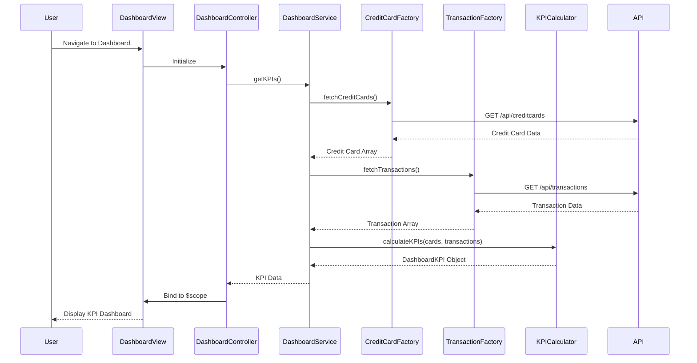

# Low-Level Design: Credit Card Analysis Dashboard

**Epic ID:** QE-4383

---

## a. Architecture Mapping

- **Dashboard Service** → AngularJS Service (dashboardService.js) - orchestrates data fetching and KPI calculation
- **Credit Card Data Service** → AngularJS Factory (creditCardDataFactory.js) - fetches credit card details via REST API
- **Transaction Data Service** → AngularJS Factory (transactionDataFactory.js) - fetches transaction data via REST API
- **KPI Calculator Engine** → AngularJS Service (kpiCalculatorService.js) - computes monthly spend, available credit, outstanding amounts
- **User Interface Dashboard** → AngularJS Controller (dashboardController.js) + View (dashboard.html) - renders KPIs and manages user interactions

**Recommended Folder Structure:**
```
app/
├── modules/
│   └── dashboard/
│       ├── controllers/
│       │   └── dashboardController.js
│       ├── services/
│       │   ├── dashboardService.js
│       │   └── kpiCalculatorService.js
│       ├── factories/
│       │   ├── creditCardDataFactory.js
│       │   └── transactionDataFactory.js
│       └── views/
│           └── dashboard.html
├── assets/
│   └── css/
│       └── dashboard.css
```

---

## b. Component Specifications

| Name | Artifact Type | Responsibility | Key Dependencies |
|------|---------------|----------------|------------------|
| dashboardController | Controller | Manages dashboard view state and user interactions | dashboardService, $scope |
| dashboardService | Service | Orchestrates data retrieval and KPI aggregation | creditCardDataFactory, transactionDataFactory, kpiCalculatorService |
| creditCardDataFactory | Factory | Fetches credit card details from REST API | $http, API_ENDPOINTS |
| transactionDataFactory | Factory | Fetches transaction data from REST API | $http, API_ENDPOINTS |
| kpiCalculatorService | Service | Computes monthly spend, total credit limit, available credit, outstanding amounts | None |
| dashboard.html | View | Renders KPI cards with Bootstrap responsive layout | dashboardController |

---

## c. Data Model

**CreditCard Model:**
```javascript
{
  cardId: String,
  cardNumber: String,
  cardHolderName: String,
  creditLimit: Number,
  outstandingAmount: Number,
  availableCredit: Number
}
```

**Transaction Model:**
```javascript
{
  transactionId: String,
  cardId: String,
  amount: Number,
  transactionDate: Date,
  description: String,
  category: String
}
```

**DashboardKPI Model:**
```javascript
{
  totalCreditLimit: Number,
  totalAvailableCredit: Number,
  totalOutstanding: Number,
  monthlySpend: Number,
  cards: Array<CreditCard>
}
```

---

## d. Data Flow

User navigates to dashboard → dashboard.html loads and dashboardController initializes → Controller calls dashboardService.getKPIs() → Service fetches credit card data via creditCardDataFactory and transaction data via transactionDataFactory in parallel → Raw data is passed to kpiCalculatorService which aggregates monthly spend, sums credit limits, calculates available credit, and computes outstanding amounts → Computed DashboardKPI object is returned to dashboardService → Service resolves promise to controller → Controller binds KPI data to $scope → View updates with KPI cards displaying all metrics using Bootstrap responsive grid.

---

## e. Primary Sequence Diagram



---

## f. Implementation Notes

- Use AngularJS module pattern with dependency injection for all services and factories
- Implement ES6 Promises ($q service) for asynchronous API calls with parallel data fetching using $q.all()
- Apply MVC separation: Controllers manage view logic only, Services handle business logic, Factories handle data access
- Use Bootstrap grid system (col-md-3, col-sm-6) for responsive KPI card layout across devices
- Implement REST API calls via $http service with centralized API_ENDPOINTS constant for base URLs

---

## g. Error Handling

HTTP interceptor-based error handling with user-friendly toast notifications for API failures and try/catch blocks in KPI calculation logic.

---

## h. Security Notes

Requires token-based authentication via existing SSO; API calls include auth token in headers.