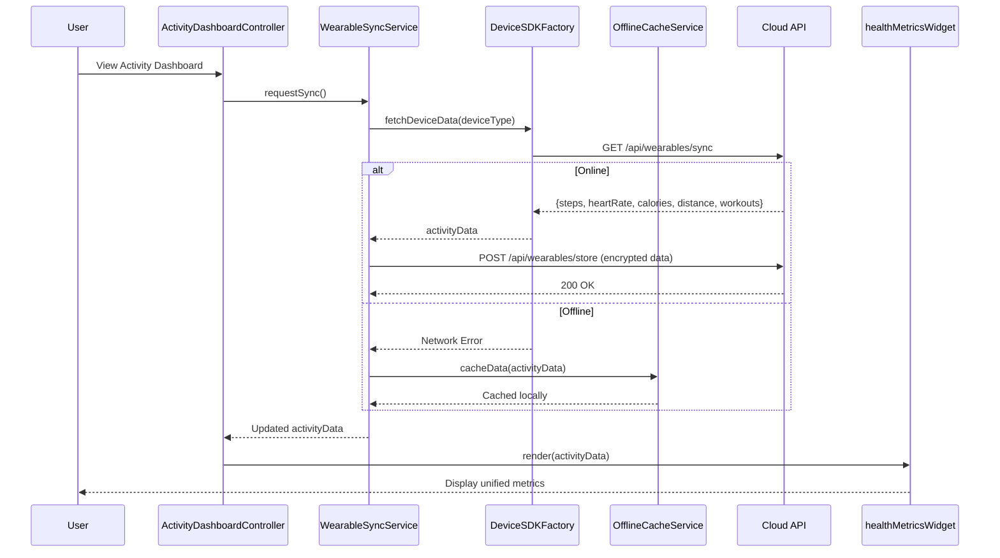

# Low-Level Design: Wearable Device Integration

**Epic ID:** QE-4394

## a. Architecture Mapping

- **Wearable Device Integration Module** → AngularJS Module (`app.wearables`)
- **Device Pairing Controller** → AngularJS Controller (`DevicePairingController`)
- **Sync Service** → AngularJS Service (`WearableSyncService`)
- **Activity Dashboard Controller** → AngularJS Controller (`ActivityDashboardController`)
- **Device SDK Adapter** → AngularJS Factory (`DeviceSDKFactory`)
- **Offline Cache Manager** → AngularJS Service (`OfflineCacheService`)
- **Health Data Directive** → AngularJS Directive (`healthMetricsWidget`)

**Recommended Folder Structure:**
```
/app
  /wearables
    /controllers
      - device-pairing.controller.js
      - activity-dashboard.controller.js
    /services
      - wearable-sync.service.js
      - offline-cache.service.js
    /factories
      - device-sdk.factory.js
    /directives
      - health-metrics-widget.directive.js
    /models
      - activity-data.model.js
    /views
      - device-pairing.html
      - activity-dashboard.html
```

## b. Component Specifications

| Component Name | Artifact Type | Responsibility | Key Dependencies |
|----------------|---------------|----------------|------------------|
| DevicePairingController | Controller | Manages device pairing flow and OAuth authentication for wearables | DeviceSDKFactory, WearableSyncService, $scope |
| ActivityDashboardController | Controller | Displays unified activity metrics from all connected devices | WearableSyncService, OfflineCacheService, $scope |
| WearableSyncService | Service | Orchestrates background sync, handles API calls, manages sync intervals | $http, $interval, DeviceSDKFactory, OfflineCacheService |
| DeviceSDKFactory | Factory | Provides abstraction layer for Apple Health, Google Health Connect, Fitbit, Garmin, Wear OS SDKs | $q, $window |
| OfflineCacheService | Service | Manages local storage of health data when offline, handles retry logic | $window.localStorage, $q |
| healthMetricsWidget | Directive | Renders real-time health metrics (steps, heart rate, calories, distance) with visual charts | ActivityDashboardController |

## c. Data Model

**ActivityData Model:**
```javascript
{
  userId: String,
  deviceId: String,
  deviceType: String, // 'apple', 'fitbit', 'garmin', 'wearos'
  timestamp: Date,
  steps: Number,
  heartRate: Number, // bpm
  caloriesBurned: Number,
  distance: Number, // meters
  workoutSessions: Array, // [{type: String, duration: Number, startTime: Date, endTime: Date}]
  syncStatus: String, // 'synced', 'pending', 'failed'
  lastSyncTime: Date
}
```

**DeviceConnection Model:**
```javascript
{
  deviceId: String,
  deviceType: String,
  deviceName: String,
  isConnected: Boolean,
  authToken: String,
  lastSyncTime: Date,
  syncInterval: Number // seconds
}
```

## d. Data Flow

User initiates device pairing from the Activity Dashboard view, which triggers DevicePairingController to call DeviceSDKFactory for OAuth authentication with the selected wearable SDK (Apple Health, Fitbit, etc.). Upon successful authentication, WearableSyncService starts background synchronization using $interval, polling device data every 60 seconds. Health metrics (steps, heart rate, calories, distance, workouts) are fetched via REST API calls to the Cloud API endpoint, encrypted and stored. If offline, OfflineCacheService caches data locally in localStorage with retry logic. Once synced, ActivityDashboardController receives updated data and the healthMetricsWidget directive re-renders the unified dashboard with real-time metrics from all connected devices.

## e. Primary Sequence Diagram



## f. Implementation Notes

- Use AngularJS Dependency Injection to inject WearableSyncService and DeviceSDKFactory into controllers for testability
- Implement $interval in WearableSyncService for background sync with 60-second polling; cancel interval on $scope.$destroy to prevent memory leaks
- Use ES6 Promises ($q) in DeviceSDKFactory to handle asynchronous SDK calls with .then()/.catch() chaining
- REST API integration via $http service with interceptors for adding auth tokens and handling 401/403 responses
- Apply Bootstrap grid system and responsive design for activity dashboard to support mobile and desktop views

## g. Error Handling

HTTP interceptor-based error handling for API failures with user-friendly toast notifications; try/catch blocks in sync service for SDK errors with automatic retry logic (3 attempts with exponential backoff).

## h. Security Notes

Requires OAuth 2.0 token-based authentication for wearable device SDKs; all health data encrypted in transit (HTTPS) and at rest; GDPR-compliant data handling with user consent management.