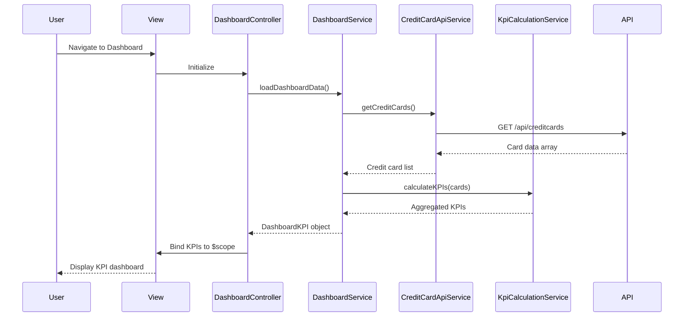

# Low-Level Design: QE-4400 - Dashboard KPIs and Credit Card Overview

## a. Architecture Mapping

**Component to Artifact Mapping:**
- User Interface - Dashboard → `DashboardController` + `views/dashboard.html`
- Dashboard Service → `DashboardService` (Factory)
- Credit Card Data API → `CreditCardApiService` (Service)
- KPI Calculation Engine → `KpiCalculationService` (Service)

**Recommended Folder Structure:**
```
app/
  dashboard/
    dashboard.module.js
    dashboard.controller.js
    dashboard.service.js
    dashboard.routes.js
    views/dashboard.html
  shared/
    services/
      creditCardApi.service.js
      kpiCalculation.service.js
    interceptors/
```

## b. Component Specifications

| Name | Artifact Type | Responsibility | Key Dependencies |
|------|---------------|----------------|------------------|
| DashboardController | Controller | Orchestrates dashboard view, binds KPI data to UI, handles user interactions | DashboardService, $scope |
| DashboardService | Factory | Coordinates data retrieval and KPI calculations, maintains dashboard state | CreditCardApiService, KpiCalculationService |
| CreditCardApiService | Service | Fetches credit card details, balances, and limits from backend REST API | $http |
| KpiCalculationService | Service | Computes aggregated KPIs (total credit limit, available credit, outstanding amounts, monthly spend) | None |
| dashboard.html | View | Renders KPI cards with responsive Bootstrap layout for multi-card portfolio display | DashboardController |

## c. Data Model

```js
CreditCard = {
  cardId: String,
  cardNumber: String,
  cardType: String,
  creditLimit: Number,
  outstandingAmount: Number,
  availableCredit: Number,
  monthlySpend: Number
}

DashboardKPI = {
  totalCreditLimit: Number,
  totalOutstanding: Number,
  totalAvailableCredit: Number,
  totalMonthlySpend: Number,
  cards: Array<CreditCard>
}
```

## d. Data Flow

User navigates to dashboard → `dashboard.html` loads and `DashboardController` initializes → Controller calls `DashboardService.loadDashboardData()` → Service invokes `CreditCardApiService.getCreditCards()` to fetch card data via REST API → API response returns card details → `KpiCalculationService` aggregates KPIs (sums credit limits, outstanding amounts, calculates available credit) → Service returns computed `DashboardKPI` object → Controller binds data to `$scope` → View renders KPI cards with Bootstrap responsive layout showing monthly spend, total credit limit, available credit, and outstanding amounts across all cards.

## e. Primary Sequence Diagram



## f. Implementation Notes

- Use constructor injection with `$inject` array for minification-safe DI in all controllers and services
- All API calls centralized in `CreditCardApiService` using `$http` with promise-based responses
- KPI calculations use ES6 `reduce()` for aggregation: `cards.reduce((sum, card) => sum + card.creditLimit, 0)`
- Dashboard state cached in `DashboardService` (Factory singleton) with configurable TTL for near real-time refresh
- Bootstrap grid system (`col-md-3`) for responsive KPI card layout across devices

## g. Error Handling

API errors handled via `$http` interceptor with fallback to cached data and user notification toast for service unavailability.

## h. Security Notes

Token-based authentication via existing SSO; card numbers masked in UI display (show last 4 digits only).