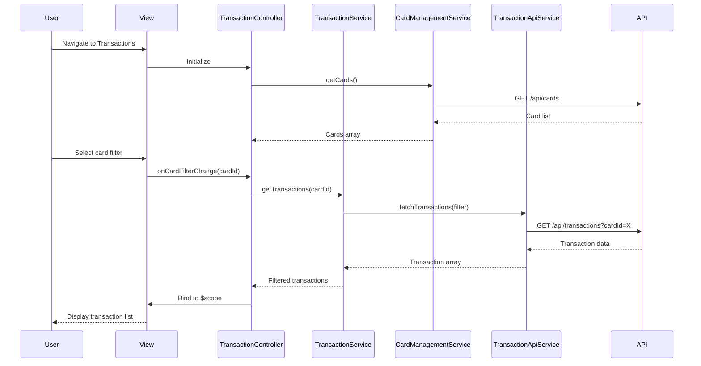

# Low-Level Design: QE-4401 - Transaction Management and Monitoring

## a. Architecture Mapping

**Component to Artifact Mapping:**
- User Interface - Transaction View → `TransactionController` + `views/transactions.html`
- Transaction Service → `TransactionService` (Service)
- Card Management Module → `CardManagementService` (Service)
- Transaction Data Feed → `TransactionApiService` (Service)

**Recommended Folder Structure:**
```
app/
  transactions/
    transactions.module.js
    transactions.controller.js
    transactions.service.js
    transactions.routes.js
    views/transactions.html
  shared/
    services/
      transactionApi.service.js
      cardManagement.service.js
    directives/
      transactionList.directive.js
```

## b. Component Specifications

| Name | Artifact Type | Responsibility | Key Dependencies |
|------|---------------|----------------|------------------|
| TransactionController | Controller | Manages transaction view, handles card filtering, pagination controls | TransactionService, CardManagementService, $scope |
| TransactionService | Service | Retrieves and filters transaction data, manages transaction state | TransactionApiService |
| TransactionApiService | Service | Fetches transaction history from backend REST API with query parameters | $http |
| CardManagementService | Service | Provides card list for filtering, retrieves card-specific transaction data | $http |
| transactionList.directive | Directive | Reusable component for rendering transaction list with sorting and filtering UI | None |
| transactions.html | View | Displays transaction history table with card filter dropdown and responsive layout | TransactionController |

## c. Data Model

```js
Transaction = {
  transactionId: String,
  cardId: String,
  transactionDate: Date,
  merchant: String,
  amount: Number,
  category: String,
  description: String,
  status: String
}

TransactionFilter = {
  cardId: String,
  startDate: Date,
  endDate: Date,
  pageNumber: Number,
  pageSize: Number
}
```

## d. Data Flow

User navigates to transaction view → `transactions.html` loads and `TransactionController` initializes → Controller calls `CardManagementService.getCards()` to populate filter dropdown → User selects card from dropdown → Controller invokes `TransactionService.getTransactions(cardId)` → Service calls `TransactionApiService.fetchTransactions(filter)` with card filter → API returns paginated transaction list → Service processes and returns transaction array → Controller binds data to `$scope.transactions` → `transactionList.directive` renders transaction table with merchant, date, amount, category columns → User views detailed transaction history for selected card.

## e. Primary Sequence Diagram



## f. Implementation Notes

- Use `$inject` annotation for all services and controllers to ensure minification safety
- Transaction API calls centralized in `TransactionApiService` with query parameter builder for flexible filtering
- Implement client-side pagination using `ng-repeat` with `limitTo` filter and page controls
- Card filter dropdown uses `ng-options` bound to `CardManagementService` data
- Transaction list uses Bootstrap table (`table-responsive`) for mobile-friendly display

## g. Error Handling

API failures caught in `TransactionService` with `$q` promise rejection, user notified via error banner, retry option provided.

## h. Security Notes

Requires token-based auth via existing SSO; transaction data fetched with user-scoped authorization headers.