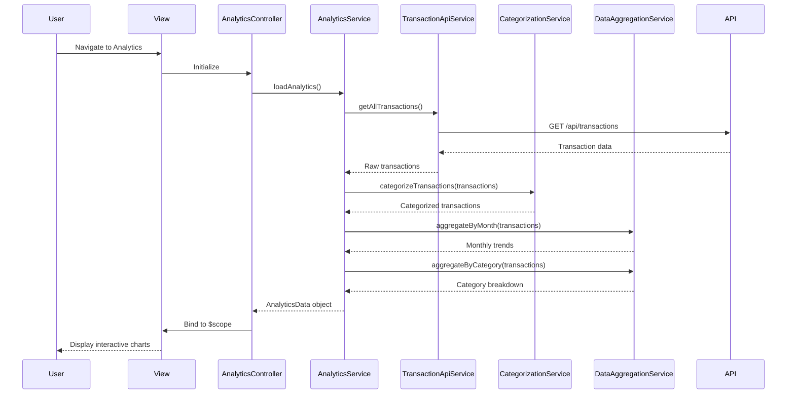

# Low-Level Design: QE-4402 - Spending Analytics and Insights

## a. Architecture Mapping

**Component to Artifact Mapping:**
- User Interface - Analytics Dashboard → `AnalyticsController` + `views/analytics.html`
- Analytics Service → `AnalyticsService` (Service)
- Transaction Data Source → `TransactionApiService` (Service, reused from QE-4401)
- Categorization Engine → `CategorizationService` (Service)
- Data Aggregation Service → `DataAggregationService` (Service)
- Visualization Component → `spendingChart.directive` (Directive)

**Recommended Folder Structure:**
```
app/
  analytics/
    analytics.module.js
    analytics.controller.js
    analytics.service.js
    analytics.routes.js
    views/analytics.html
  shared/
    services/
      dataAggregation.service.js
      categorization.service.js
    directives/
      spendingChart.directive.js
```

## b. Component Specifications

| Name | Artifact Type | Responsibility | Key Dependencies |
|------|---------------|----------------|------------------|
| AnalyticsController | Controller | Manages analytics view, handles user interactions for trend/category selection | AnalyticsService, $scope |
| AnalyticsService | Service | Orchestrates analytics data retrieval, coordinates aggregation and categorization | TransactionApiService, DataAggregationService, CategorizationService |
| DataAggregationService | Service | Aggregates transaction data for monthly trends, card-wise totals, category breakdowns | None |
| CategorizationService | Service | Maps transactions to predefined categories (Food & Dining, Fuel, Shopping, Travel, Entertainment, Utilities, Healthcare, Education, Miscellaneous) | None |
| spendingChart.directive | Directive | Renders interactive charts (line for trends, pie/bar for categories) using Chart.js or D3 | None |
| analytics.html | View | Displays analytics dashboard with trend charts, card-wise breakdown, category spending visualizations | AnalyticsController |

## c. Data Model

```js
SpendingTrend = {
  month: String,
  totalSpend: Number,
  cardBreakdown: Array<{cardId: String, spend: Number}>
}

CategorySpending = {
  category: String,
  amount: Number,
  percentage: Number,
  transactionCount: Number
}

AnalyticsData = {
  monthlyTrends: Array<SpendingTrend>,
  cardWiseSpending: Array<{cardId: String, totalSpend: Number}>,
  categoryBreakdown: Array<CategorySpending>
}
```

## d. Data Flow

User navigates to analytics dashboard → `analytics.html` loads and `AnalyticsController` initializes → Controller calls `AnalyticsService.loadAnalytics()` → Service invokes `TransactionApiService.getAllTransactions()` to fetch raw transaction data → `CategorizationService.categorizeTransactions(transactions)` maps each transaction to one of nine predefined categories → `DataAggregationService.aggregateByMonth(transactions)` and `aggregateByCategory(transactions)` compute monthly trends and category totals → Service returns `AnalyticsData` object → Controller binds data to `$scope` → `spendingChart.directive` renders interactive line chart for monthly trends and pie chart for category breakdown → User interacts with charts to drill down into specific months or categories.

## e. Primary Sequence Diagram



## f. Implementation Notes

- Use `$inject` array for DI in all controllers and services for minification compatibility
- `spendingChart.directive` wraps Chart.js library with AngularJS two-way binding for dynamic updates
- Category mapping uses ES6 `Map` with merchant code/name patterns: `categoryMap.get(merchantCode) || 'Miscellaneous'`
- Monthly aggregation uses `Array.reduce()` with date grouping: `transactions.reduce((acc, tx) => { acc[month] = (acc[month] || 0) + tx.amount; return acc; }, {})`
- Chart interactivity handled via directive's `link` function with event listeners for drill-down navigation

## g. Error Handling

Transaction fetch errors caught via `$http` interceptor with fallback to empty state message and retry button in analytics view.

## h. Security Notes

Standard input validation and secure API calls assumed; analytics data scoped to authenticated user's cards only.