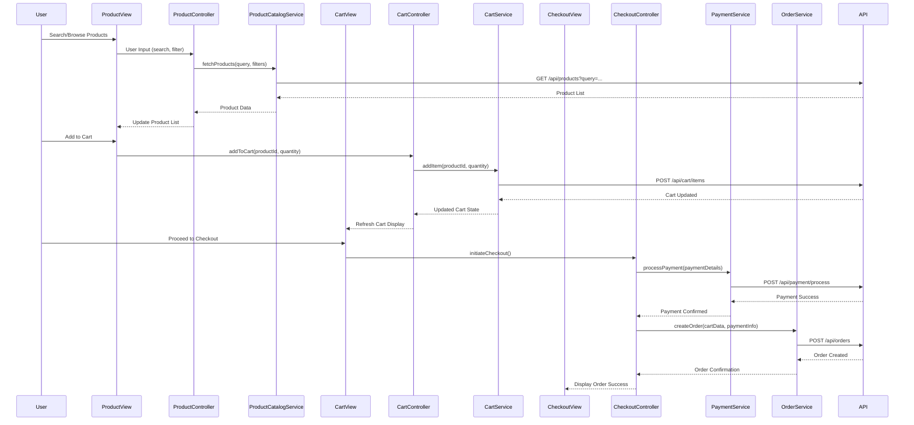

# Low-Level Design: Online Shopping Platform

**Epic ID:** QE-4403

## a. Architecture Mapping

- **Consumer Web/Mobile Client** → AngularJS Module (`app.shopping`), Controllers, Views (HTML5/CSS3/Bootstrap)
- **Authentication Service** → AngularJS Service (`AuthService`), HTTP interceptor for token management
- **Product Catalog Service** → AngularJS Service (`ProductCatalogService`), Controller (`ProductController`)
- **Shopping Cart Service** → AngularJS Service (`CartService`), Controller (`CartController`), Factory (`CartFactory`)
- **Payment Gateway Integration** → AngularJS Service (`PaymentService`), Directive (`paymentForm`)
- **Order Management Service** → AngularJS Service (`OrderService`), Controller (`OrderController`)
- **Notification Service** → AngularJS Service (`NotificationService`), real-time updates via polling/WebSocket

**Recommended Folder Structure:**
```
/app
  /modules
    /auth
    /products
    /cart
    /checkout
    /orders
    /reviews
  /services
  /controllers
  /directives
  /factories
  /models
  /assets (CSS, images)
```

## b. Component Specifications

| Component Name | Artifact Type | Responsibility | Key Dependencies |
|----------------|---------------|----------------|------------------|
| AuthService | Service | Handle user registration, login, logout, token storage | $http, $window (localStorage) |
| AuthInterceptor | HTTP Interceptor | Attach auth tokens to API requests, handle 401 errors | AuthService, $q |
| ProductCatalogService | Service | Fetch products, search, filter, sort, manage reviews/ratings/wishlist | $http, $q |
| ProductController | Controller | Bind product data to view, handle search/filter/sort UI interactions | ProductCatalogService, $scope |
| CartService | Service | Add/remove items, update quantities, persist cart state | $http, CartFactory |
| CartController | Controller | Display cart, handle item updates, calculate totals | CartService, $scope |
| CartFactory | Factory | Manage in-memory cart state, sync with backend | - |
| PaymentService | Service | Integrate with payment gateway API, process payments | $http, $q |
| paymentForm | Directive | Render secure payment form UI, validate payment inputs | PaymentService |
| CheckoutController | Controller | Orchestrate checkout flow, handle payment submission | CartService, PaymentService, OrderService, $scope |
| OrderService | Service | Create orders, fetch order history, track order status, handle cancellations/refunds | $http, $q |
| OrderController | Controller | Display order details, tracking info, handle cancellation requests | OrderService, $scope |
| NotificationService | Service | Poll or listen for order status updates, display notifications | $http, $interval/$timeout |
| ReviewController | Controller | Handle review/rating submission UI | ProductCatalogService, $scope |

## c. Data Model

**User:**
```javascript
{
  userId: String,
  email: String,
  name: String,
  phone: String,
  address: Object { street, city, state, zip, country },
  authToken: String
}
```

**Product:**
```javascript
{
  productId: String,
  name: String,
  description: String,
  price: Number,
  category: String,
  imageUrl: String,
  stock: Number,
  ratings: Array<Rating>,
  averageRating: Number
}
```

**CartItem:**
```javascript
{
  productId: String,
  quantity: Number,
  price: Number,
  productName: String
}
```

**Cart:**
```javascript
{
  userId: String,
  items: Array<CartItem>,
  totalAmount: Number
}
```

**Order:**
```javascript
{
  orderId: String,
  userId: String,
  items: Array<CartItem>,
  totalAmount: Number,
  paymentStatus: String,
  orderStatus: String,
  shippingAddress: Object,
  trackingNumber: String,
  createdAt: Date,
  updatedAt: Date
}
```

**Review:**
```javascript
{
  reviewId: String,
  productId: String,
  userId: String,
  rating: Number,
  comment: String,
  createdAt: Date
}
```

**WishlistItem:**
```javascript
{
  userId: String,
  productId: String,
  addedAt: Date
}
```

## d. Data Flow

User searches for products via ProductController, which calls ProductCatalogService to fetch filtered/sorted results from the Product Catalog API; selected products are added to cart via CartController invoking CartService, which persists cart state to backend; during checkout, CheckoutController coordinates with PaymentService to submit payment details to the Payment Gateway API, and upon successful payment response, calls OrderService to create the order record via Order Management API; OrderService returns order confirmation to UI, triggering NotificationService to poll for status updates; order tracking and post-purchase actions (reviews, wishlist) follow similar controller → service → API → UI update pattern.

## e. Primary Sequence Diagram



## f. Implementation Notes

- Use AngularJS module pattern with dependency injection for all services, controllers, and directives
- Implement ES6 classes for service definitions where appropriate; use arrow functions for callbacks
- Use $http service with promise-based API calls; centralize API base URL in a constant
- Implement HTTP interceptor for automatic token attachment and global error handling
- Use Bootstrap grid system and components for responsive UI; ensure WCAG 2.1 AA compliance with ARIA labels and keyboard navigation

## g. Error Handling

HTTP interceptor-based error handling with try/catch blocks in services; user-friendly error notifications displayed via NotificationService for API failures and validation errors.

## h. Security Notes

Requires token-based authentication via AuthService with secure token storage; payment processing delegated to PCI DSS-compliant third-party gateway; all API calls over HTTPS with input validation on client and server sides.