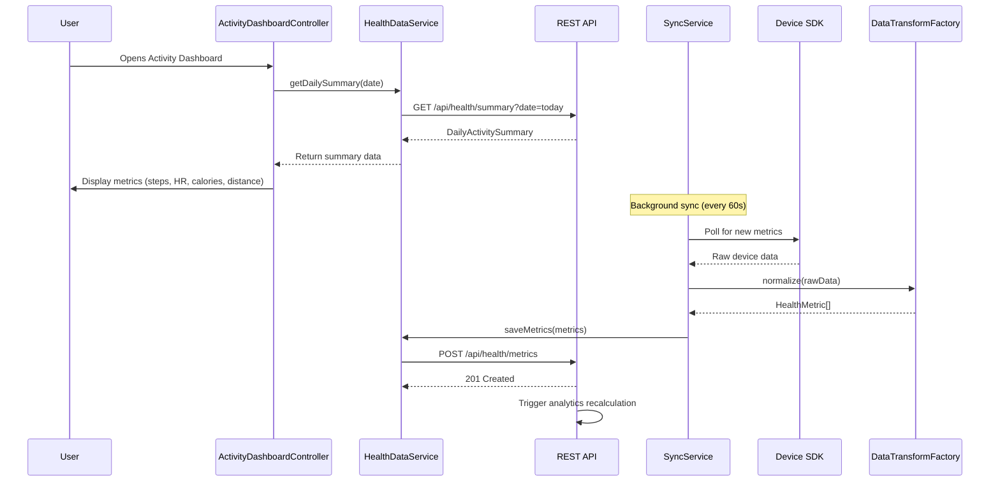

# Low-Level Design: QE-4406

## a. Architecture Mapping

- **WearableIntegrationModule** → AngularJS Module hosting all wearable integration components
- **DeviceConnectionController** → Controller managing device pairing and authorization flows
- **SyncService** → Factory service handling background data synchronization with device SDKs
- **ActivityDashboardController** → Controller orchestrating dashboard view and data display
- **HealthDataService** → Service interfacing with REST API for persisting and retrieving health metrics
- **DataTransformFactory** → Factory normalizing raw device data into unified application format
- **ActivitySummaryDirective** → Directive rendering consolidated daily activity metrics widget

**Recommended Folder Structure:**
```
/app
  /modules
    /wearable-integration
      /controllers
        device-connection.controller.js
        activity-dashboard.controller.js
      /services
        sync.service.js
        health-data.service.js
      /factories
        data-transform.factory.js
      /directives
        activity-summary.directive.js
      wearable-integration.module.js
  /assets
  /styles
```

## b. Component Specifications

| Component Name | Artifact Type | Responsibility | Key Dependencies |
|----------------|---------------|----------------|------------------|
| WearableIntegrationModule | Module | Root module for wearable device integration features | ngRoute, ngResource |
| DeviceConnectionController | Controller | Manages device pairing, OAuth flows, and permission requests | SyncService, HealthDataService, $scope |
| SyncService | Factory | Polls device SDKs, schedules background sync, handles token refresh | $http, $interval, DataTransformFactory |
| ActivityDashboardController | Controller | Fetches aggregated metrics and binds to dashboard view | HealthDataService, $scope, $filter |
| HealthDataService | Service | Wraps REST API calls for CRUD operations on health metrics | $resource, API_ENDPOINT |
| DataTransformFactory | Factory | Normalizes heterogeneous device data formats into unified schema | None |
| ActivitySummaryDirective | Directive | Renders daily activity card with steps, heart rate, calories, distance | None |

## c. Data Model

**HealthMetric (unified model)**
```javascript
{
  userId: String,
  deviceType: String, // 'apple_watch', 'fitbit', 'garmin', 'wear_os'
  metricType: String, // 'steps', 'heart_rate', 'calories', 'distance', 'workout'
  value: Number,
  unit: String, // 'count', 'bpm', 'kcal', 'km', 'minutes'
  timestamp: Date,
  syncedAt: Date,
  source: String // SDK identifier
}
```

**DailyActivitySummary (aggregated model)**
```javascript
{
  userId: String,
  date: Date,
  totalSteps: Number,
  avgHeartRate: Number,
  totalCalories: Number,
  totalDistance: Number,
  workoutMinutes: Number,
  devicesSynced: Array<String>
}
```

## d. Data Flow

User opens the Activity Dashboard → ActivityDashboardController initializes and calls HealthDataService.getDailySummary() → HealthDataService sends GET request to REST API endpoint /api/health/summary?date=today → API returns aggregated DailyActivitySummary from analytics engine → Controller binds data to $scope.dailySummary → ActivitySummaryDirective renders the metrics in the view. In parallel, SyncService runs in background using $interval, polling device SDKs every 60 seconds → raw metrics are transformed by DataTransformFactory → HealthDataService.saveMetrics() posts HealthMetric objects to /api/health/metrics → API persists data and triggers analytics engine recalculation → updated summary is available for next dashboard refresh.

## e. Primary Sequence Diagram



## f. Implementation Notes

- Use AngularJS Dependency Injection to inject SyncService and HealthDataService into controllers; register all services/factories in WearableIntegrationModule
- Leverage $resource for RESTful API interactions with base URL configured via constant API_ENDPOINT; use $http interceptors for auth token injection
- Implement SyncService using $interval for periodic polling (60s); cancel interval on $scope.$destroy to prevent memory leaks
- Use ES6 classes for service definitions where appropriate; transpile with Babel if targeting older browsers
- DataTransformFactory applies strategy pattern to handle device-specific data formats (Apple Health, Fitbit, Garmin, Wear OS) and outputs unified HealthMetric objects

## g. Error Handling

HTTP interceptor captures API errors (4xx/5xx), logs to console, and displays user-friendly notifications via a global toast service; SyncService wraps SDK calls in try/catch with retry logic (max 3 attempts).

## h. Security Notes

Requires OAuth 2.0 token-based authentication for device SDK access; tokens stored securely in sessionStorage with automatic refresh; all API calls use HTTPS with encrypted health data payloads.