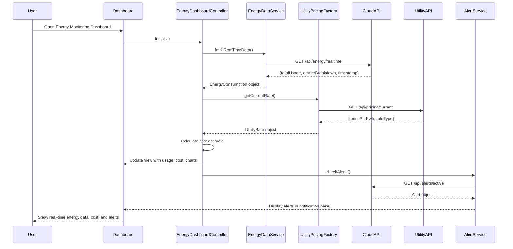

# Low-Level Design: Real-Time Energy Monitoring Solution

**Epic ID**: QE-4414

---

## a. Architecture Mapping

- **IoT Gateway Integration**: AngularJS Service (EnergyDataService) - handles real-time data ingestion from Cloud API
- **Dashboard Controller**: AngularJS Controller (EnergyDashboardController) - orchestrates view logic and data binding
- **Analytics Visualization**: AngularJS Directive (energyChartDirective) - renders consumption charts using D3.js/Chart.js
- **Alert Management**: AngularJS Service (AlertService) - manages peak usage and anomaly notifications
- **Utility Pricing Integration**: AngularJS Factory (UtilityPricingFactory) - fetches and caches pricing data
- **Device Management**: AngularJS Controller (DeviceListController) - displays device-level consumption

**Recommended Folder Structure**:
```
/app
  /modules
    /energy-monitoring
      /controllers
      /services
      /directives
      /factories
  /models
  /assets
```

---

## b. Component Specifications

| Name | Artifact Type | Responsibility | Key Dependencies |
|------|---------------|----------------|------------------|
| EnergyMonitoringModule | Module | Root module for energy monitoring feature | ngRoute, ngResource |
| EnergyDashboardController | Controller | Manages dashboard state, fetches real-time and historical data, handles user interactions | EnergyDataService, AlertService, UtilityPricingFactory |
| DeviceListController | Controller | Displays device-level consumption list and details | EnergyDataService |
| EnergyDataService | Service | Fetches consumption data from Cloud API (real-time, historical, device-level) | $http, $q |
| AlertService | Service | Retrieves and manages peak usage and anomaly alerts | $http, $interval |
| UtilityPricingFactory | Factory | Fetches utility pricing data, caches rates, calculates cost estimates | $http, $cacheFactory |
| energyChartDirective | Directive | Renders interactive consumption charts (daily/weekly/monthly views) | Chart.js/D3.js |
| deviceConsumptionDirective | Directive | Displays individual device consumption widget | EnergyDataService |

---

## c. Data Model

**EnergyConsumption**
- `timestamp`: Date - consumption reading time
- `totalUsage`: Number - aggregate household consumption in kWh
- `cost`: Number - estimated cost in currency units
- `deviceBreakdown`: Array<DeviceConsumption> - device-level data

**DeviceConsumption**
- `deviceId`: String - unique device identifier
- `deviceName`: String - user-friendly device name
- `usage`: Number - device consumption in kWh
- `status`: String - online/offline/error

**Alert**
- `alertId`: String - unique alert identifier
- `type`: String - peak_usage/anomaly
- `message`: String - alert description
- `timestamp`: Date - alert generation time
- `severity`: String - low/medium/high

**UtilityRate**
- `rateId`: String - pricing tier identifier
- `pricePerKwh`: Number - cost per kilowatt-hour
- `effectiveTime`: Date - rate validity period
- `rateType`: String - standard/time_of_use

---

## d. Data Flow

User opens the dashboard → EnergyDashboardController initializes and calls EnergyDataService to fetch real-time consumption data from Cloud API REST endpoint → EnergyDataService returns aggregated and device-level consumption → Controller invokes UtilityPricingFactory to retrieve current utility rates → Cost estimates are calculated and bound to view models → energyChartDirective renders interactive charts displaying daily/weekly/monthly trends → AlertService polls for new peak usage or anomaly alerts via $interval → Alerts are displayed in notification panel → User selects a device from DeviceListController → deviceConsumptionDirective fetches and displays device-specific consumption history → All updates propagate to the view via AngularJS two-way data binding.

---

## e. Primary Sequence Diagram



---

## f. Implementation Notes

- Use AngularJS dependency injection to inject EnergyDataService, AlertService, and UtilityPricingFactory into controllers for testability and modularity
- Implement $http interceptors for authentication token injection and global error handling across all Cloud API and Utility API calls
- Use $interval service in AlertService to poll for new alerts every 30 seconds; cancel interval on scope destruction to prevent memory leaks
- Leverage Chart.js or D3.js within energyChartDirective for responsive, interactive time-series visualizations with daily/weekly/monthly filters
- Apply ES6 arrow functions and const/let for service and factory implementations; use AngularJS 1.5+ component architecture where applicable for better migration path

---

## g. Error Handling

HTTP interceptor-based error handling with try/catch blocks in services; user-friendly toast notifications for API failures and fallback to cached data when available.

---

## h. Security Notes

Requires token-based authentication via existing SSO; all API calls use HTTPS with encrypted payloads; GDPR/CCPA-compliant data handling enforced at API layer.