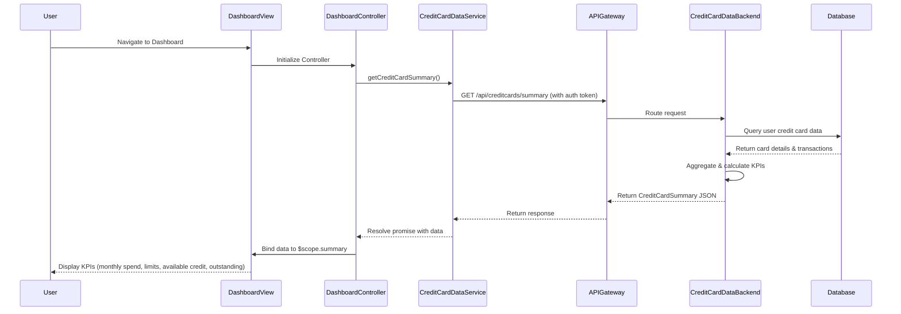

# Low-Level Design: Credit Card Analysis Dashboard

**Epic ID:** QE-4419

---

## a. Architecture Mapping

- **Dashboard Module** → AngularJS Module (`creditCardDashboardModule`)
- **Dashboard UI Component** → AngularJS Controller (`DashboardController`) + HTML View (`dashboard.html`)
- **Credit Card Data Service** → AngularJS Service (`CreditCardDataService`) for REST API integration
- **Authentication** → AngularJS Factory (`AuthFactory`) for session/token management
- **KPI Display Components** → AngularJS Directives (`kpiCard`, `creditSummary`) for reusable UI widgets

**Recommended Folder Structure:**
```
app/
├── modules/
│   └── creditCardDashboard/
│       ├── controllers/
│       │   └── DashboardController.js
│       ├── services/
│       │   └── CreditCardDataService.js
│       ├── directives/
│       │   ├── kpiCard.js
│       │   └── creditSummary.js
│       ├── views/
│       │   └── dashboard.html
│       └── creditCardDashboardModule.js
├── shared/
│   └── factories/
│       └── AuthFactory.js
└── assets/
    └── css/
        └── dashboard.css
```

---

## b. Component Specifications

| Name | Artifact Type | Responsibility | Key Dependencies |
|------|---------------|----------------|------------------|
| `creditCardDashboardModule` | Module | Register dashboard components and configure routing | `ngRoute`, `AuthFactory` |
| `DashboardController` | Controller | Fetch and expose credit card KPI data to the view | `CreditCardDataService`, `$scope` |
| `CreditCardDataService` | Service | Retrieve consolidated credit card data from REST API | `$http`, `AuthFactory` |
| `AuthFactory` | Factory | Manage user authentication tokens and session state | `$http`, `$window` |
| `kpiCard` | Directive | Render individual KPI metric cards (spend, limit, available, outstanding) | None |
| `creditSummary` | Directive | Display aggregated summary of all credit cards | None |
| `dashboard.html` | View | Present KPIs in responsive Bootstrap grid layout | `DashboardController`, `kpiCard`, `creditSummary` |

---

## c. Data Model

**CreditCardSummary (JavaScript Object):**
```javascript
{
  userId: String,
  cards: Array<CreditCard>,
  totalCreditLimit: Number,
  totalAvailableCredit: Number,
  totalOutstandingAmount: Number,
  monthlySpend: Number,
  lastUpdated: Date
}
```

**CreditCard (JavaScript Object):**
```javascript
{
  cardId: String,
  cardNumber: String (masked),
  cardType: String,
  creditLimit: Number,
  availableCredit: Number,
  outstandingAmount: Number,
  currentMonthSpend: Number
}
```

---

## d. Data Flow

User authenticates and navigates to the dashboard view, triggering `DashboardController` initialization. The controller invokes `CreditCardDataService.getCreditCardSummary()`, which sends an authenticated GET request to `/api/creditcards/summary` via the API Gateway. The backend Credit Card Data Service aggregates data from multiple cards, calculates KPIs (monthly spend, total credit limit, available credit, outstanding amount), and returns a `CreditCardSummary` JSON object. The service resolves the promise, and the controller binds the data to `$scope.summary`. AngularJS data binding updates the view, rendering KPI cards via `kpiCard` and `creditSummary` directives in a responsive Bootstrap layout.

---

## e. Primary Sequence Diagram



---

## f. Implementation Notes

- Use AngularJS dependency injection to inject `CreditCardDataService` into `DashboardController` for testability and modularity
- Implement ES6 Promises or `$q` service for asynchronous API calls with proper error handling in service layer
- Use `$http` interceptor pattern to automatically attach authentication tokens to all outgoing API requests
- Leverage Bootstrap grid system (col-md-3, col-sm-6, col-xs-12) for responsive KPI card layout across devices
- Implement AngularJS `$interval` or manual refresh button to periodically update dashboard data for near real-time accuracy

---

## g. Error Handling

HTTP interceptor-based approach with `$http` interceptors to catch API errors, display user-friendly notifications via Bootstrap alerts, and handle authentication failures by redirecting to login.

---

## h. Security Notes

Requires token-based authentication via existing SSO; all API calls include Bearer token in Authorization header; card numbers displayed in masked format.