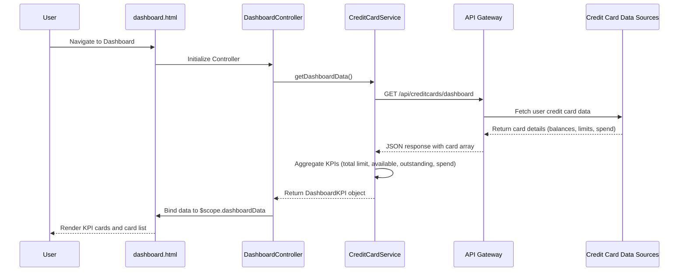

# Low-Level Design: Credit Card Analysis Dashboard

## Epic ID: QE-4426

---

## a. Architecture Mapping

- **Dashboard Module** → AngularJS Module (`creditCardDashboard`)
- **Dashboard View** → HTML5 template with Bootstrap grid (`dashboard.html`)
- **Dashboard Controller** → AngularJS Controller (`DashboardController`)
- **Credit Card Service** → AngularJS Service/Factory (`CreditCardService`)
- **API Integration Layer** → AngularJS HTTP Service with REST endpoint wrappers
- **KPI Aggregation Logic** → Service-level business logic in `CreditCardService`

**Recommended Folder Structure:**
```
app/
├── modules/
│   └── creditCardDashboard/
│       ├── controllers/
│       │   └── DashboardController.js
│       ├── services/
│       │   └── CreditCardService.js
│       ├── views/
│       │   └── dashboard.html
│       └── creditCardDashboard.module.js
├── shared/
│   ├── interceptors/
│   └── models/
└── assets/
    └── css/
```

---

## b. Component Specifications

| Component Name | Artifact Type | Responsibility | Key Dependencies |
|---|---|---|---|
| `creditCardDashboard` | Module | Root module for credit card dashboard feature | `ngRoute`, `CreditCardService` |
| `DashboardController` | Controller | Manages dashboard view state, triggers data load, exposes KPIs to view | `CreditCardService`, `$scope` |
| `CreditCardService` | Service | Fetches credit card data from API, aggregates KPIs (total limit, available credit, monthly spend, outstanding) | `$http`, `$q` |
| `dashboard.html` | View/Template | Displays consolidated KPI cards using Bootstrap grid, shows multiple credit card summaries | `DashboardController`, Bootstrap CSS |
| `httpInterceptor` | Factory | Handles authentication tokens, error responses, loading states | `$httpProvider` |

---

## c. Data Model

**CreditCard Model:**
```javascript
{
  cardId: String,
  cardNumber: String,        // masked, e.g., "****1234"
  cardType: String,          // e.g., "Visa", "MasterCard"
  creditLimit: Number,
  availableCredit: Number,
  outstandingAmount: Number,
  monthlySpend: Number,
  lastUpdated: Date
}
```

**DashboardKPI Model:**
```javascript
{
  totalCreditLimit: Number,
  totalAvailableCredit: Number,
  totalOutstanding: Number,
  totalMonthlySpend: Number,
  creditUtilizationPercent: Number,
  cards: Array<CreditCard>
}
```

---

## d. Data Flow

User navigates to dashboard route → AngularJS router loads `dashboard.html` and instantiates `DashboardController` → Controller calls `CreditCardService.getDashboardData()` → Service makes HTTP GET request to `/api/creditcards/dashboard` via API Gateway → Backend returns array of credit card objects with balances, limits, and spend data → Service aggregates KPIs (sums credit limits, available credit, outstanding amounts, monthly spend across all cards; calculates utilization percentage) → Service returns `DashboardKPI` object to Controller → Controller binds data to `$scope` → View renders KPI summary cards and individual card details using Bootstrap responsive grid.

---

## e. Primary Sequence Diagram



---

## f. Implementation Notes

- Use AngularJS 1.x Dependency Injection to inject `CreditCardService` into `DashboardController` via constructor parameters
- Implement ES6 classes for Service and Controller; use `angular.module().service()` and `.controller()` for registration
- Use `$http` service with Promises (`$q`) for REST API calls; handle success/error callbacks with `.then()` and `.catch()`
- Apply Bootstrap 3/4 grid system (`col-md-*`, `col-sm-*`) for responsive KPI card layout across desktop, tablet, and mobile
- Implement HTTP interceptor to attach authentication tokens to outgoing requests and handle 401/403 responses globally

---

## g. Error Handling

HTTP interceptor captures API errors; Controller displays user-friendly error messages via Bootstrap alert components on dashboard view.

---

## h. Security Notes

Requires token-based authentication via existing SSO; all API calls include Authorization header with JWT token.