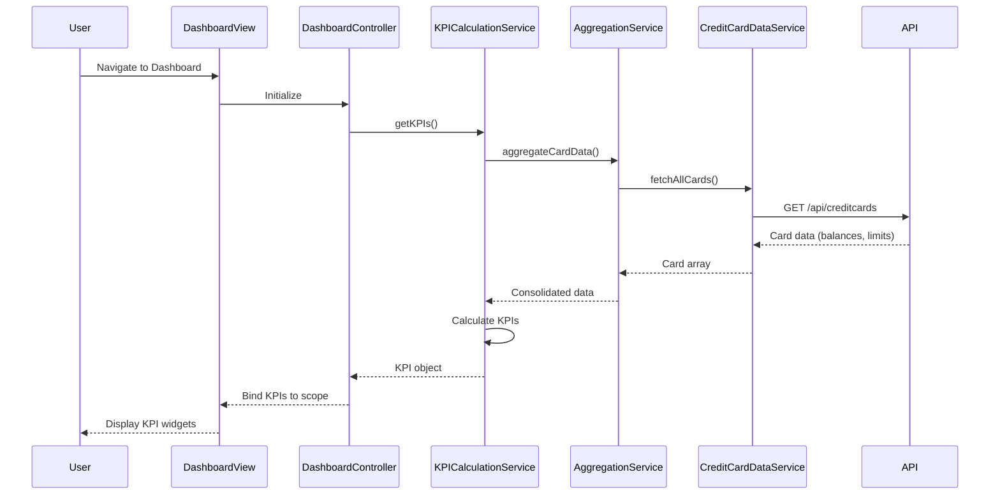

# Low-Level Design: QE-4433

## a. Architecture Mapping

- **AngularJS Module**: `creditCardDashboardModule` - Main module for dashboard functionality
- **Controller**: `DashboardController` - Manages dashboard view state and KPI presentation
- **Service**: `KPICalculationService` - Computes monthly spend, available credit, outstanding amounts
- **Service**: `CreditCardDataService` - Retrieves credit card data from REST API
- **Service**: `AggregationService` - Consolidates data across multiple credit cards
- **Directive**: `kpiWidgetDirective` - Reusable KPI display component

**Folder Structure**:
```
app/
├── modules/
│   └── dashboard/
│       ├── controllers/
│       │   └── DashboardController.js
│       ├── services/
│       │   ├── KPICalculationService.js
│       │   ├── CreditCardDataService.js
│       │   └── AggregationService.js
│       ├── directives/
│       │   └── kpiWidgetDirective.js
│       └── views/
│           └── dashboard.html
```

## b. Component Specifications

| Name | Artifact Type | Responsibility | Key Dependencies |
|------|---------------|----------------|------------------|
| creditCardDashboardModule | Module | Bootstrap dashboard feature with routing and DI configuration | angular, angular-route |
| DashboardController | Controller | Orchestrate KPI data retrieval and bind to view model | KPICalculationService, $scope |
| KPICalculationService | Service | Calculate monthly spend, total limit, available credit, outstanding amounts | AggregationService |
| CreditCardDataService | Service | Fetch credit card details, balances, limits via REST API | $http, API_ENDPOINT |
| AggregationService | Service | Consolidate data from multiple credit cards into unified dataset | CreditCardDataService |
| kpiWidgetDirective | Directive | Render individual KPI with label, value, and responsive styling | None |

## c. Data Model

```javascript
// CreditCard Model
const CreditCard = {
  cardId: String,
  cardNumber: String,
  cardType: String,
  creditLimit: Number,
  currentBalance: Number,
  availableCredit: Number,
  outstandingAmount: Number
};

// KPI Model
const DashboardKPI = {
  monthlySpend: Number,
  totalCreditLimit: Number,
  totalAvailableCredit: Number,
  totalOutstanding: Number,
  cardCount: Number
};
```

## d. Data Flow

User navigates to dashboard view → DashboardController initializes and calls KPICalculationService → KPICalculationService invokes AggregationService to consolidate card data → AggregationService uses CreditCardDataService to fetch card details via REST API → API returns card balances and limits → AggregationService consolidates data across cards → KPICalculationService computes monthly spend, total limits, available credit, and outstanding amounts → Computed KPIs are bound to $scope → View renders KPI widgets using kpiWidgetDirective with Bootstrap responsive grid → User sees consolidated dashboard with real-time financial indicators.

## e. Primary Sequence Diagram



## f. Implementation Notes

- Use AngularJS dependency injection to inject services into DashboardController and maintain testability
- Implement KPICalculationService as a factory returning calculation methods using ES6 arrow functions and array reduce for aggregation
- Use $http service with promise-based API calls; cache card data with appropriate TTL to minimize API calls
- Apply Bootstrap grid system (col-md-3, col-sm-6, col-xs-12) in dashboard.html for responsive KPI widget layout
- Implement kpiWidgetDirective with isolated scope and two-way binding for dynamic KPI updates

## g. Error Handling

HTTP interceptor captures API errors; display user-friendly error messages via toast notification service with retry option.

## h. Security Notes

Requires token-based auth via existing SSO; API endpoints validate user session and return only authorized credit card data.