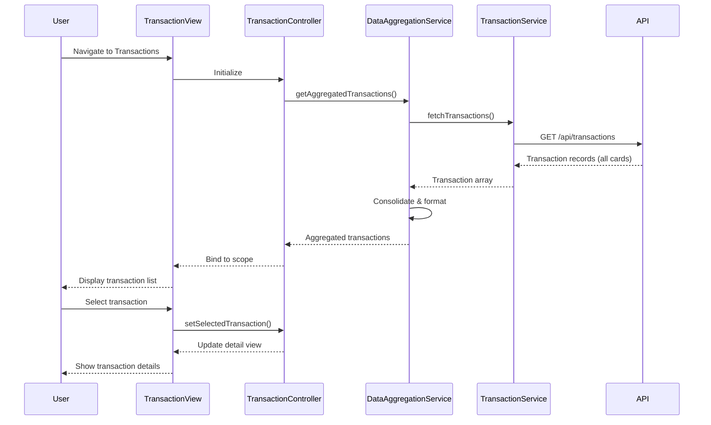

# Low-Level Design: QE-4434

## a. Architecture Mapping

- **AngularJS Module**: `transactionModule` - Main module for transaction viewing functionality
- **Controller**: `TransactionController` - Manages transaction list view and detail view state
- **Service**: `TransactionService` - Retrieves transaction data via REST API
- **Service**: `DataAggregationService` - Consolidates transactions across multiple credit cards
- **Directive**: `transactionListDirective` - Renders transaction history table with sorting and filtering
- **Directive**: `transactionDetailDirective` - Displays individual transaction details

**Folder Structure**:
```
app/
├── modules/
│   └── transactions/
│       ├── controllers/
│       │   └── TransactionController.js
│       ├── services/
│       │   ├── TransactionService.js
│       │   └── DataAggregationService.js
│       ├── directives/
│       │   ├── transactionListDirective.js
│       │   └── transactionDetailDirective.js
│       └── views/
│           ├── transaction-list.html
│           └── transaction-detail.html
```

## b. Component Specifications

| Name | Artifact Type | Responsibility | Key Dependencies |
|------|---------------|----------------|------------------|
| transactionModule | Module | Bootstrap transaction feature with routing and DI | angular, angular-route |
| TransactionController | Controller | Orchestrate transaction data retrieval and manage view state | TransactionService, DataAggregationService, $scope |
| TransactionService | Service | Fetch transaction records from REST API endpoint | $http, API_ENDPOINT |
| DataAggregationService | Service | Consolidate and format transactions from multiple cards | TransactionService |
| transactionListDirective | Directive | Render transaction history table with sort/filter capabilities | None |
| transactionDetailDirective | Directive | Display detailed view of selected transaction | None |

## c. Data Model

```javascript
// Transaction Model
const Transaction = {
  transactionId: String,
  cardId: String,
  cardNumber: String,
  transactionDate: Date,
  merchantName: String,
  category: String,
  amount: Number,
  currency: String,
  status: String,
  description: String
};

// Aggregated Transaction View Model
const TransactionViewModel = {
  transactions: Array,
  totalCount: Number,
  filters: Object,
  sortBy: String,
  sortOrder: String
};
```

## d. Data Flow

User navigates to transaction view → TransactionController initializes and calls DataAggregationService → DataAggregationService invokes TransactionService to fetch transaction records via REST API → API returns transaction data for all user credit cards → DataAggregationService consolidates and formats transactions into unified array → Aggregated data is bound to $scope in TransactionController → transactionListDirective renders transaction history table with Bootstrap responsive styling → User selects transaction → TransactionController updates scope with selected transaction → transactionDetailDirective displays detailed transaction information → User can sort, filter, and navigate transaction history across all cards.

## e. Primary Sequence Diagram



## f. Implementation Notes

- Use AngularJS $http service with promise chaining for API calls; implement response transformation for date formatting
- Implement TransactionService as factory with ES6 class pattern for maintainability and method encapsulation
- Apply Bootstrap table-responsive class and custom CSS for transaction list; use ng-repeat with track by transactionId for performance
- Implement client-side sorting and filtering using AngularJS orderBy and filter; consider server-side pagination for large datasets
- Use $routeParams or ui-router state params to handle transaction detail view navigation

## g. Error Handling

HTTP interceptor with try/catch blocks; display error notifications using toast service and provide retry mechanism for failed API calls.

## h. Security Notes

Requires token-based auth via existing SSO; API validates user authorization and returns only transactions for user's credit cards.