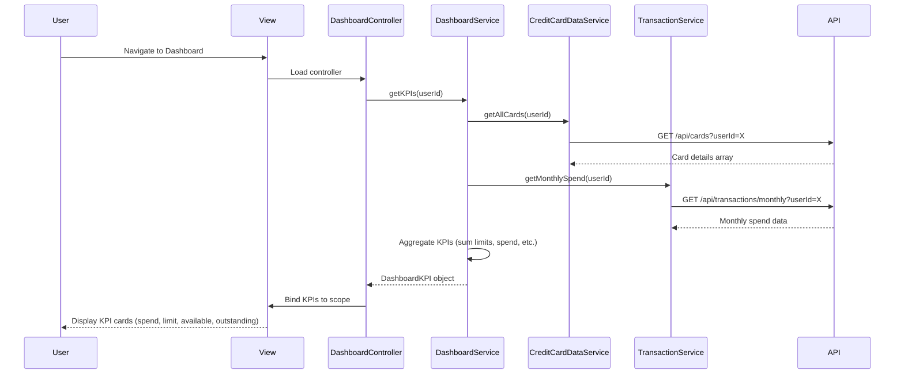

# Low-Level Design: QE-4444 - Dashboard KPIs and Credit Card Overview

## a. Architecture Mapping

**Component → Artifact Mapping:**
- User Interface Dashboard → DashboardController + dashboard.html view
- Dashboard Service (backend) → DashboardService (AngularJS Service for API calls)
- Credit Card Data Service integration → CreditCardDataService (AngularJS Service)
- Transaction Service integration → TransactionService (AngularJS Service)
- KPI Display Components → Directive: appKpiCard (reusable KPI widget)
- Real-time Refresh → DashboardRefreshFactory (singleton for polling/push state)
- Module → app.dashboard

**Folder Structure:**
```
app/
  dashboard/
    dashboard.module.js
    dashboard.controller.js
    dashboard.service.js
    dashboard.routes.js
    views/dashboard.html
  shared/
    services/
      creditCardData.service.js
      transaction.service.js
    directives/
      kpiCard.directive.js
    interceptors/
      http.interceptor.js
```

## b. Component Specifications

| Name | Artifact Type | Responsibility | Key Dependencies |
|------|---------------|----------------|------------------|
| DashboardController | Controller | Orchestrates dashboard view, loads KPI data, handles refresh | DashboardService, $scope, $interval |
| DashboardService | Service | Aggregates KPI data from backend APIs, manages caching | $http, CreditCardDataService, TransactionService |
| CreditCardDataService | Service | Fetches card details, balances, credit limits from Credit Card Data API | $http, $q |
| TransactionService | Service | Retrieves monthly spend aggregations from Transaction API | $http, $q |
| appKpiCard | Directive | Renders individual KPI widget (spend, limit, available, outstanding) | None |
| DashboardRefreshFactory | Factory | Manages auto-refresh state and polling interval (30-60s) | $interval, $rootScope |
| dashboard.html | View | Displays consolidated multi-card KPI dashboard with responsive layout | Bootstrap grid |

## c. Data Model

```js
DashboardKPI = {
  userId: String,
  totalCreditLimit: Number,
  totalAvailableCredit: Number,
  totalOutstanding: Number,
  monthlySpend: Number,
  cards: Array<CreditCard>,
  lastUpdated: Date
}

CreditCard = {
  cardId: String,
  cardNumber: String,
  cardType: String,
  creditLimit: Number,
  availableCredit: Number,
  outstanding: Number,
  monthlySpend: Number
}
```

## d. Data Flow

User navigates to dashboard view → dashboard.html loads → DashboardController initializes and calls DashboardService.getKPIs() → DashboardService invokes CreditCardDataService.getAllCards() and TransactionService.getMonthlySpend() in parallel → Services make REST API calls via $http → Backend APIs return card details and spend data → DashboardService aggregates totals (sum of limits, available credit, outstanding, spend) → Aggregated KPI object returned to Controller → Controller binds data to $scope → View renders KPI cards using appKpiCard directive with Bootstrap responsive grid → DashboardRefreshFactory polls every 30-60s and triggers refresh cycle.

## e. Primary Sequence Diagram



## f. Implementation Notes

- DI: Constructor injection with `$inject` array annotation for minification safety (e.g., `DashboardController.$inject = ['$scope', 'DashboardService', '$interval']`)
- API calls: All REST calls centralized in DashboardService, CreditCardDataService, TransactionService; Controllers never call $http directly
- Caching: DashboardService caches aggregated KPI data for 30s to meet 2-second load requirement; cache invalidated on manual refresh
- Real-time refresh: DashboardRefreshFactory uses $interval to poll every 30-60s; configurable via app settings
- Responsive design: Bootstrap grid system (col-xs/sm/md/lg) ensures dashboard adapts to all device types

## g. Error Handling

Centralized $http interceptor catches API failures; user-facing errors surfaced via shared NotificationService displaying Bootstrap alerts.

## h. Security Notes

Standard input validation and secure API calls assumed; userId passed securely via existing SSO token in API request headers.