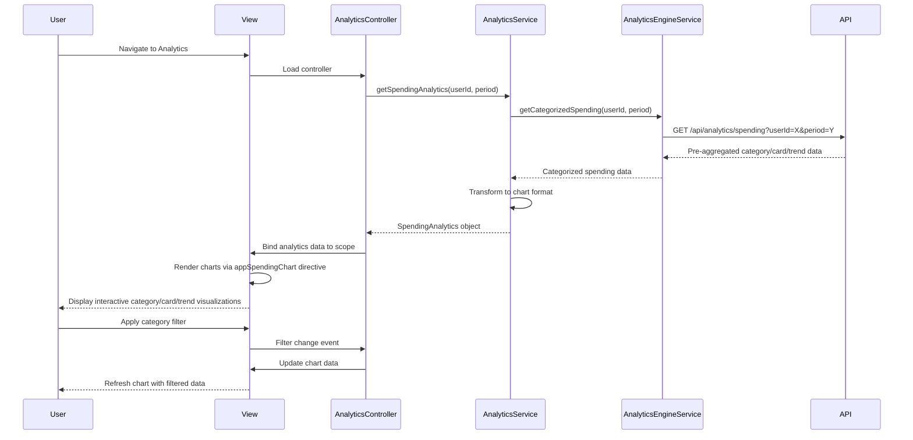

# Low-Level Design: QE-4445 - Spending Analytics and Visualization

## a. Architecture Mapping

**Component → Artifact Mapping:**
- User Interface Analytics → AnalyticsController + analytics.html view
- Analytics Service (backend) → AnalyticsService (AngularJS Service for API calls)
- Transaction Service integration → TransactionService (AngularJS Service)
- Analytics Engine integration → AnalyticsEngineService (AngularJS Service)
- Interactive Charts → Directive: appSpendingChart (wraps charting library, e.g., Chart.js)
- Category Filter → Directive: appCategoryFilter (multi-select dropdown)
- Module → app.analytics

**Folder Structure:**
```
app/
  analytics/
    analytics.module.js
    analytics.controller.js
    analytics.service.js
    analytics.routes.js
    views/analytics.html
  shared/
    services/
      transaction.service.js
      analyticsEngine.service.js
    directives/
      spendingChart.directive.js
      categoryFilter.directive.js
    interceptors/
      http.interceptor.js
```

## b. Component Specifications

| Name | Artifact Type | Responsibility | Key Dependencies |
|------|---------------|----------------|------------------|
| AnalyticsController | Controller | Manages analytics view, loads spending data, handles filter/date range changes | AnalyticsService, $scope |
| AnalyticsService | Service | Fetches pre-aggregated spending analytics from backend APIs | $http, TransactionService, AnalyticsEngineService |
| TransactionService | Service | Retrieves raw transaction data for analysis | $http, $q |
| AnalyticsEngineService | Service | Fetches categorized spending data across 9 categories from Analytics Engine API | $http, $q |
| appSpendingChart | Directive | Renders interactive charts (bar/pie/line) using Chart.js; supports category and card-wise views | Chart.js library |
| appCategoryFilter | Directive | Multi-select filter for 9 spending categories (Food, Fuel, Shopping, Travel, Entertainment, Utilities, Healthcare, Education, Misc) | None |
| analytics.html | View | Displays category-wise spending visualizations, monthly trends, card-wise analysis with responsive layout | Bootstrap grid, Chart.js |

## c. Data Model

```js
SpendingAnalytics = {
  userId: String,
  period: String,
  totalSpend: Number,
  categoryBreakdown: Array<CategorySpend>,
  cardWiseSpend: Array<CardSpend>,
  monthlyTrends: Array<MonthlyTrend>
}

CategorySpend = {
  category: String,
  amount: Number,
  percentage: Number,
  transactionCount: Number
}

CardSpend = {
  cardId: String,
  cardNumber: String,
  totalSpend: Number,
  categoryBreakdown: Array<CategorySpend>
}

MonthlyTrend = {
  month: String,
  totalSpend: Number,
  categoryBreakdown: Array<CategorySpend>
}
```

## d. Data Flow

User navigates to analytics view → analytics.html loads → AnalyticsController initializes and calls AnalyticsService.getSpendingAnalytics(userId, period) → AnalyticsService invokes AnalyticsEngineService.getCategorizedSpending() to fetch pre-aggregated data → Service makes REST API call via $http to Analytics Engine → API returns categorized spending data across 9 categories, card-wise breakdowns, and monthly trends → AnalyticsService transforms data into chart-ready format → Data returned to Controller → Controller binds to $scope → View renders interactive charts using appSpendingChart directive (Chart.js) with responsive layout → User interacts with filters (category, card, date range) → Controller updates data and re-renders charts.

## e. Primary Sequence Diagram



## f. Implementation Notes

- DI: Constructor injection with `$inject` array annotation (e.g., `AnalyticsController.$inject = ['$scope', 'AnalyticsService']`)
- API calls: All REST calls centralized in AnalyticsService and AnalyticsEngineService; Controllers never call $http directly
- Chart library: appSpendingChart directive wraps Chart.js; supports responsive, interactive bar/pie/line charts with click events
- Pre-aggregation: Backend Analytics Engine pre-aggregates data to meet sub-1-second rendering for up to 10,000 transactions
- ES6 usage: Arrow functions for callbacks, `let`/`const` for variables, template literals for dynamic strings

## g. Error Handling

Centralized $http interceptor catches API failures; user-facing errors surfaced via shared NotificationService displaying Bootstrap alerts.

## h. Security Notes

Standard input validation and secure API calls assumed; userId passed securely via existing SSO token in API request headers.