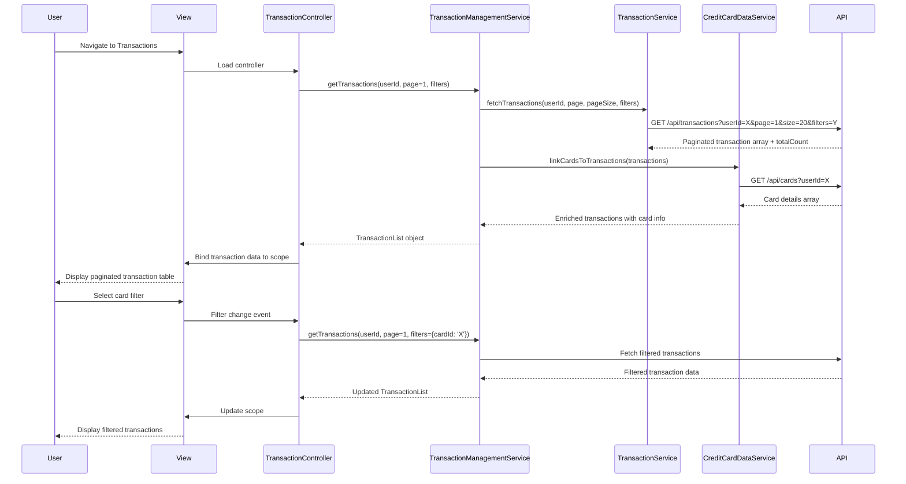

# Low-Level Design: QE-4446 - Transaction Management and Card Operations

## a. Architecture Mapping

**Component → Artifact Mapping:**
- User Interface Transactions → TransactionController + transactions.html view
- Transaction Management Service (backend) → TransactionManagementService (AngularJS Service for API calls)
- Transaction Service integration → TransactionService (AngularJS Service)
- Credit Card Data Service integration → CreditCardDataService (AngularJS Service)
- Transaction List Display → Directive: appTransactionList (paginated table)
- Card Filter → Directive: appCardFilter (dropdown for card-wise filtering)
- Module → app.transactions

**Folder Structure:**
```
app/
  transactions/
    transactions.module.js
    transactions.controller.js
    transactionManagement.service.js
    transactions.routes.js
    views/transactions.html
  shared/
    services/
      transaction.service.js
      creditCardData.service.js
    directives/
      transactionList.directive.js
      cardFilter.directive.js
    interceptors/
      http.interceptor.js
```

## b. Component Specifications

| Name | Artifact Type | Responsibility | Key Dependencies |
|------|---------------|----------------|------------------|
| TransactionController | Controller | Manages transaction view, loads transaction list, handles pagination and filtering | TransactionManagementService, $scope |
| TransactionManagementService | Service | Orchestrates transaction data retrieval with filtering, pagination, and card linking | $http, TransactionService, CreditCardDataService |
| TransactionService | Service | Fetches transaction records from Transaction API with pagination support | $http, $q |
| CreditCardDataService | Service | Links transactions to specific cards and validates card ownership | $http, $q |
| appTransactionList | Directive | Renders paginated transaction table with sorting and filtering capabilities | None |
| appCardFilter | Directive | Dropdown filter for selecting specific card or all cards view | None |
| transactions.html | View | Displays transaction list with card-wise filtering, pagination, and transaction details | Bootstrap grid, table components |

## c. Data Model

```js
TransactionList = {
  userId: String,
  transactions: Array<Transaction>,
  totalCount: Number,
  pageSize: Number,
  currentPage: Number,
  filters: TransactionFilter
}

Transaction = {
  transactionId: String,
  cardId: String,
  cardNumber: String,
  merchantName: String,
  category: String,
  amount: Number,
  currency: String,
  transactionDate: Date,
  status: String,
  description: String
}

TransactionFilter = {
  cardId: String,
  startDate: Date,
  endDate: Date,
  category: String,
  minAmount: Number,
  maxAmount: Number
}
```

## d. Data Flow

User navigates to transactions view → transactions.html loads → TransactionController initializes and calls TransactionManagementService.getTransactions(userId, page, filters) → TransactionManagementService invokes TransactionService.fetchTransactions() with pagination params → Service makes REST API call via $http → API returns paginated transaction records → TransactionManagementService calls CreditCardDataService.linkCardsToTransactions() to enrich transaction data with card details → Enriched transaction list returned to Controller → Controller binds to $scope → View renders transactions using appTransactionList directive with Bootstrap table and pagination controls → User applies card filter or navigates pages → Controller updates filters/page and re-fetches data → View updates with new transaction set.

## e. Primary Sequence Diagram



## f. Implementation Notes

- DI: Constructor injection with `$inject` array annotation (e.g., `TransactionController.$inject = ['$scope', 'TransactionManagementService']`)
- API calls: All REST calls centralized in TransactionManagementService, TransactionService, CreditCardDataService; Controllers never call $http directly
- Pagination: Configurable page size (default 20-50 transactions); server-side pagination to handle large volumes efficiently
- Real-time sync: Transaction data refreshed every 5 minutes via polling or manual refresh button
- ES6 usage: Arrow functions for callbacks, `let`/`const` for variables, template literals for dynamic query strings

## g. Error Handling

Centralized $http interceptor catches API failures; user-facing errors surfaced via shared NotificationService displaying Bootstrap alerts.

## h. Security Notes

Standard input validation and secure API calls assumed; userId and cardId validated server-side to ensure user owns requested cards.