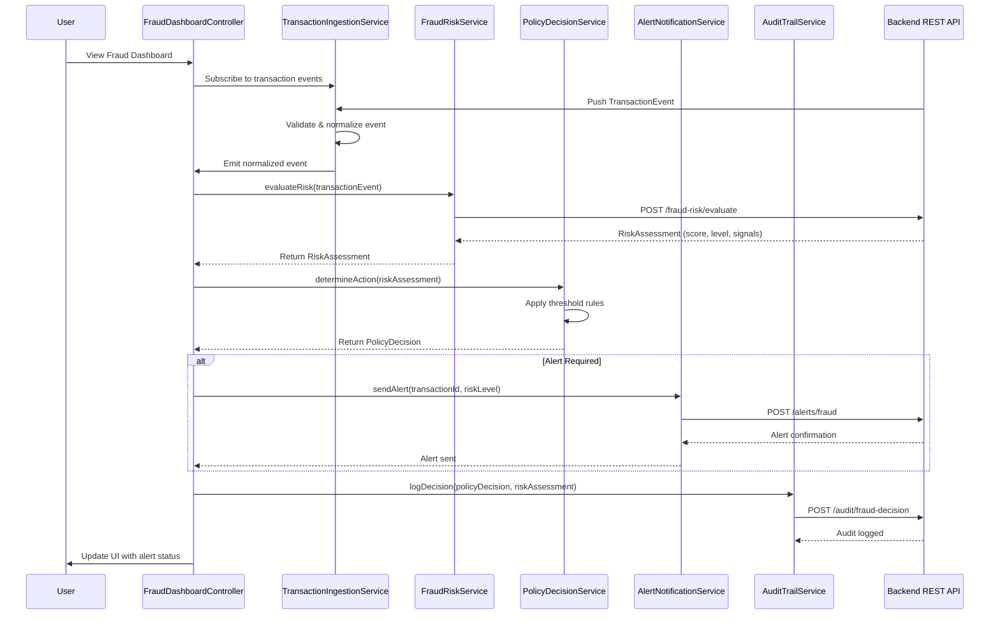

# Low-Level Design: QE-4447 - Credit Card Fraud Alert System

## a. Architecture Mapping

- **Transaction Event Ingestion** → AngularJS Module: `fraudAlert.ingestion` + Service: `TransactionIngestionService`
- **Fraud Risk Engine** → Service: `FraudRiskService` (REST API client)
- **Policy Decision Engine** → Service: `PolicyDecisionService` + Factory: `RiskThresholdFactory`
- **Alert Service** → Service: `AlertNotificationService` (REST API client)
- **Audit Trail Store** → Service: `AuditTrailService` (REST API client)
- **UI Dashboard** → Module: `fraudAlert.dashboard` + Controller: `FraudDashboardController` + View: `fraud-dashboard.html`
- **Configuration Management** → Controller: `ThresholdConfigController` + Service: `ConfigService`

**Recommended Folder Structure:**
```
/app
  /modules
    /fraud-alert
      /controllers
      /services
      /factories
      /directives
      /views
      /models
  /shared
    /services
    /interceptors
```

## b. Component Specifications

| Component Name | Artifact Type | Responsibility | Key Dependencies |
|----------------|---------------|----------------|------------------|
| FraudDashboardController | Controller | Manages fraud alert dashboard view, displays real-time alerts and risk metrics | FraudRiskService, AlertNotificationService, $scope |
| TransactionIngestionService | Service | Receives and validates transaction events from backend, normalizes data | $http, $q, AuditTrailService |
| FraudRiskService | Service | Calls fraud-risk engine API with transaction details, returns risk score and classification | $http, $q, API_ENDPOINTS |
| PolicyDecisionService | Service | Applies configurable risk thresholds to determine alert actions (no alert/send/escalate) | RiskThresholdFactory, $q |
| RiskThresholdFactory | Factory | Provides and caches configurable risk threshold values (low/medium/high/confirmed) | ConfigService |
| AlertNotificationService | Service | Sends fraud alerts to customers via backend alert service API | $http, $q, AuditTrailService |
| AuditTrailService | Service | Logs all risk decisions, model versions, and policy applications to audit backend | $http, $q |
| ConfigService | Service | Manages threshold configuration CRUD operations | $http, $q |
| ThresholdConfigController | Controller | Handles threshold configuration UI and updates | ConfigService, RiskThresholdFactory, $scope |
| TransactionEventDirective | Directive | Displays individual transaction event details with risk indicators | None |

## c. Data Model

**TransactionEvent (JavaScript Object):**
```javascript
{
  transactionId: String,
  cardNumber: String (masked),
  amount: Number,
  currency: String,
  merchantId: String,
  merchantName: String,
  merchantCategory: String,
  transactionTimestamp: Date,
  location: { latitude: Number, longitude: Number, country: String },
  authorizationStatus: String, // 'approved', 'declined'
  cardCompromisedFlag: Boolean,
  eventVersion: String
}
```

**RiskAssessment (JavaScript Object):**
```javascript
{
  transactionId: String,
  riskScore: Number, // 0-100
  riskLevel: String, // 'low', 'medium', 'high', 'confirmed_fraud'
  signals: {
    unusualAmount: Boolean,
    suspiciousMerchant: Boolean,
    geographicAnomaly: Boolean,
    velocityViolation: Boolean,
    authorizationFailure: Boolean,
    compromisedCard: Boolean
  },
  modelVersion: String,
  evaluatedAt: Date
}
```

**PolicyDecision (JavaScript Object):**
```javascript
{
  transactionId: String,
  riskLevel: String,
  action: String, // 'no_alert', 'send_alert', 'escalate'
  thresholdApplied: { low: Number, medium: Number, high: Number },
  decisionTimestamp: Date
}
```

**RiskThreshold (JavaScript Object):**
```javascript
{
  thresholdId: String,
  low: Number,
  medium: Number,
  high: Number,
  confirmedFraud: Number,
  updatedBy: String,
  updatedAt: Date
}
```

## d. Data Flow

When a credit card transaction occurs, the backend pushes a transaction event to the UI via WebSocket or polling mechanism, which is captured by TransactionIngestionService. The FraudDashboardController receives the normalized event and invokes FraudRiskService to call the fraud-risk engine REST API with transaction details. The API evaluates multiple risk signals (amount patterns, merchant reputation, geographic anomalies, velocity metrics, authorization failures, compromised card indicators) and returns a RiskAssessment object containing risk score and classification. PolicyDecisionService applies the current risk thresholds from RiskThresholdFactory to determine the appropriate action. If an alert is required, AlertNotificationService calls the backend alert API to trigger customer notification. Simultaneously, AuditTrailService logs the complete risk decision, model version, and policy application to the audit backend. The FraudDashboardController updates the view to display the alert status and risk metrics in real-time.

## e. Primary Sequence Diagram



## f. Implementation Notes

- Use AngularJS 1.x module pattern with dependency injection for all services, controllers, and factories
- Implement ES6 classes for service definitions with arrow functions for callbacks to maintain lexical scope
- Use $http service with interceptors for REST API calls; configure base URL via constants (API_ENDPOINTS)
- Implement idempotency by including transactionId in all API requests and checking for duplicate processing client-side
- Use $q promises for asynchronous operations with proper error propagation and chaining

## g. Error Handling

HTTP interceptor-based error handling with user-friendly notifications via toast/modal; try/catch blocks in services with fallback to cached thresholds if config API fails.

## h. Security Notes

Requires token-based authentication via existing SSO; all API calls include auth headers; card numbers masked in UI; audit logs capture user identity for compliance.