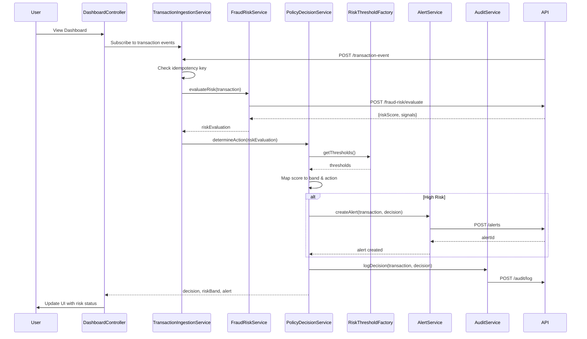

# Low-Level Design: QE-4454

## a. Architecture Mapping

- **Transaction Event Ingestion** → AngularJS Module (`fraudAlert.ingestion`) + Service (`TransactionIngestionService`)
- **Fraud Risk Engine** → Service (`FraudRiskService`) calling REST API endpoint for risk scoring
- **Policy Decision Engine** → Service (`PolicyDecisionService`) + Factory (`RiskThresholdFactory`) for configurable thresholds
- **Alert Service** → Service (`AlertService`) + Controller (`AlertController`) for alert display
- **Audit & Analytics** → Service (`AuditService`) for logging decisions and events
- **UI Dashboard** → Module (`fraudAlert.dashboard`) + Controller (`DashboardController`) + View (dashboard.html)

**Recommended Folder Structure:**
```
/app
  /modules
    /fraud-alert
      /controllers
      /services
      /directives
      /views
      /factories
      fraud-alert.module.js
  /shared
    /services
    /interceptors
```

## b. Component Specifications

| Component Name | Artifact Type | Responsibility | Key Dependencies |
|----------------|---------------|----------------|------------------|
| TransactionIngestionService | Service | Receives transaction events, deduplicates using idempotency keys, forwards to risk engine | $http, FraudRiskService, AuditService |
| FraudRiskService | Service | Calls fraud-risk scoring API with transaction data, returns risk score and signals | $http, $q, API_CONFIG |
| PolicyDecisionService | Service | Maps risk score to risk band (low/medium/high), determines action (approve/alert/step-up/hold/decline) | RiskThresholdFactory, AlertService, AuditService |
| RiskThresholdFactory | Factory | Provides configurable threshold values for risk band classification | $http, CONFIG_API |
| AlertService | Service | Creates and triggers alerts for high-risk transactions | $http, $rootScope, ALERT_API |
| AuditService | Service | Records all transaction events, risk decisions, and actions for compliance | $http, AUDIT_API |
| DashboardController | Controller | Manages dashboard view, displays transaction status, risk bands, and alerts | $scope, TransactionIngestionService, PolicyDecisionService, AlertService |
| AlertController | Controller | Handles alert display and user interaction for step-up verification | $scope, AlertService, $uibModal |
| AuthInterceptor | Service (Interceptor) | Adds authentication tokens to all API requests | $q, $injector, AuthService |

## c. Data Model

**Transaction Model:**
```javascript
{
  transactionId: String,
  idempotencyKey: String,
  cardNumber: String (masked),
  amount: Number,
  currency: String,
  merchantId: String,
  merchantName: String,
  merchantCategory: String,
  transactionTimestamp: Date,
  location: {
    country: String,
    city: String,
    latitude: Number,
    longitude: Number
  },
  deviceId: String,
  ipAddress: String,
  channel: String
}
```

**RiskEvaluation Model:**
```javascript
{
  transactionId: String,
  riskScore: Number,
  riskBand: String, // 'low', 'medium', 'high'
  signals: {
    amountPattern: String,
    merchantBehavior: String,
    geographicRisk: String,
    velocityRisk: String,
    deviceRisk: String
  },
  decision: String, // 'approve', 'alert', 'step-up', 'hold', 'decline'
  timestamp: Date
}
```

**Alert Model:**
```javascript
{
  alertId: String,
  transactionId: String,
  customerId: String,
  alertType: String,
  message: String,
  status: String, // 'pending', 'acknowledged', 'resolved'
  createdAt: Date
}
```

## d. Data Flow

User views the fraud alert dashboard → DashboardController loads transaction data via TransactionIngestionService → Service receives real-time transaction events from authorization platform API → TransactionIngestionService checks idempotency and calls FraudRiskService → FraudRiskService posts transaction data to fraud-risk scoring REST API → API returns risk score and signals → PolicyDecisionService evaluates score against thresholds from RiskThresholdFactory, classifies into risk band, and determines action → For high-risk transactions, AlertService creates alert via REST API and broadcasts event → DashboardController updates UI with risk band, decision, and alert status → AuditService logs all events and decisions to audit API for compliance.

## e. Primary Sequence Diagram



## f. Implementation Notes

- Use AngularJS dependency injection for all services, controllers, and factories to ensure testability and modularity
- Implement ES6 classes for services with arrow functions for API callbacks to maintain lexical `this` context
- Use `$http` interceptors for authentication token injection and global error handling across all API calls
- Leverage Angular promises (`$q`) for asynchronous risk evaluation and chaining multiple service calls
- Store idempotency keys in browser sessionStorage to prevent duplicate transaction processing on client side

## g. Error Handling

HTTP interceptor-based error handling with try/catch blocks in services; user notifications via Bootstrap modal for critical failures; fail-safe policy (default to 'hold' action) when risk engine is unavailable.

## h. Security Notes

Requires token-based authentication via existing SSO; all API calls use HTTPS; card numbers are masked in UI; least-privilege access enforced via role-based API authorization.