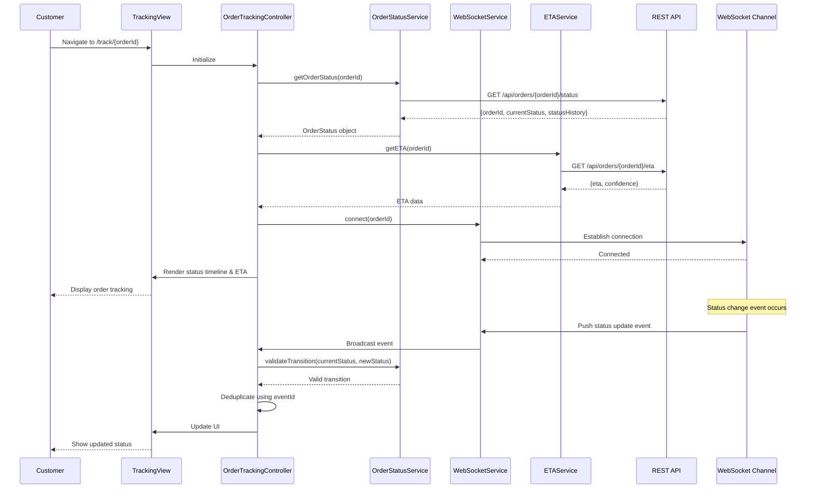

# Low-Level Design: Real-Time Order Status Tracking

**Epic ID:** QE-4461

---

## a. Architecture Mapping

- **Order Tracking Module** → AngularJS Module (`orderTracking`)
- **Tracking View Controller** → AngularJS Controller (`OrderTrackingController`)
- **Order Status Service** → AngularJS Service (`OrderStatusService`) - manages state and API calls
- **Real-Time Updates** → AngularJS Service (`WebSocketService`) - handles WebSocket/SSE connections
- **ETA Service** → AngularJS Service (`ETAService`) - retrieves and updates delivery time estimates
- **Status Timeline Directive** → AngularJS Directive (`statusTimeline`) - renders visual progress indicator
- **Auth Interceptor** → AngularJS Factory (`AuthInterceptor`) - manages authentication tokens

**Recommended Folder Structure:**
```
app/
├── modules/
│   └── order-tracking/
│       ├── controllers/
│       │   └── order-tracking.controller.js
│       ├── services/
│       │   ├── order-status.service.js
│       │   ├── websocket.service.js
│       │   └── eta.service.js
│       ├── directives/
│       │   └── status-timeline.directive.js
│       ├── views/
│       │   └── order-tracking.html
│       └── order-tracking.module.js
├── shared/
│   └── interceptors/
│       └── auth.interceptor.js
└── app.js
```

---

## b. Component Specifications

| Component Name | Artifact Type | Responsibility | Key Dependencies |
|----------------|---------------|----------------|------------------|
| `orderTracking` | Module | Main module for order tracking feature | `ngRoute`, `ngAnimate` |
| `OrderTrackingController` | Controller | Manages tracking view state, coordinates services, handles UI updates | `OrderStatusService`, `WebSocketService`, `ETAService`, `$scope` |
| `OrderStatusService` | Service | Fetches order state from REST API, validates state transitions, persists status | `$http`, `$q`, `AuthInterceptor` |
| `WebSocketService` | Service | Establishes and manages WebSocket/SSE connection for real-time updates | `$rootScope`, `$window` |
| `ETAService` | Service | Retrieves ETA from API, handles refresh intervals (2-5 min) | `$http`, `$interval` |
| `statusTimeline` | Directive | Renders visual progress timeline with status indicators | None |
| `AuthInterceptor` | Factory | Injects auth tokens into API requests, handles 401 responses | `$q`, `$window` |

---

## c. Data Model

**OrderStatus (JavaScript Object):**
```javascript
{
  orderId: String,
  customerId: String,
  currentStatus: String, // 'confirmed', 'preparing', 'ready', 'picked_up', 'delivered', 'cancelled'
  statusHistory: Array, // [{status: String, timestamp: Date, eventId: String}]
  restaurantId: String,
  eta: Date,
  lastUpdated: Date,
  isActive: Boolean
}
```

**StatusEvent (JavaScript Object):**
```javascript
{
  eventId: String,
  orderId: String,
  status: String,
  timestamp: Date,
  source: String // 'order_mgmt', 'restaurant', 'delivery'
}
```

---

## d. Data Flow

Customer navigates to tracking page → View loads and `OrderTrackingController` initializes → Controller calls `OrderStatusService.getOrderStatus(orderId)` which sends authenticated GET request to `/api/orders/{orderId}/status` → API returns current order state and status history → `ETAService.getETA(orderId)` fetches delivery estimate → `WebSocketService.connect(orderId)` establishes real-time channel → Status timeline directive renders visual progress → As status events occur (preparing, ready, picked up, delivered), WebSocket pushes updates → Controller receives event, validates transition via `OrderStatusService.validateTransition()`, deduplicates using eventId, updates `$scope.orderStatus` → View auto-updates with new status and ETA → Analytics events captured for operational insights.

---

## e. Primary Sequence Diagram



---

## f. Implementation Notes

- Use AngularJS Dependency Injection for all services and controllers to ensure testability and modularity
- Implement WebSocket reconnection logic with exponential backoff in `WebSocketService` for connection failures
- Use `$http` interceptors via `AuthInterceptor` factory to attach JWT tokens to all API requests
- Deduplicate status events using `eventId` and timestamp comparison; store processed eventIds in service-level cache
- Leverage `$scope.$apply()` carefully when handling WebSocket callbacks to trigger digest cycles safely

---

## g. Error Handling

Use HTTP interceptor for API errors with fallback to last known cached status; WebSocket failures trigger reconnection with user notification via toast.

---

## h. Security Notes

Requires token-based authentication via existing SSO; customers can only access their own orders enforced by API-level authorization checks.