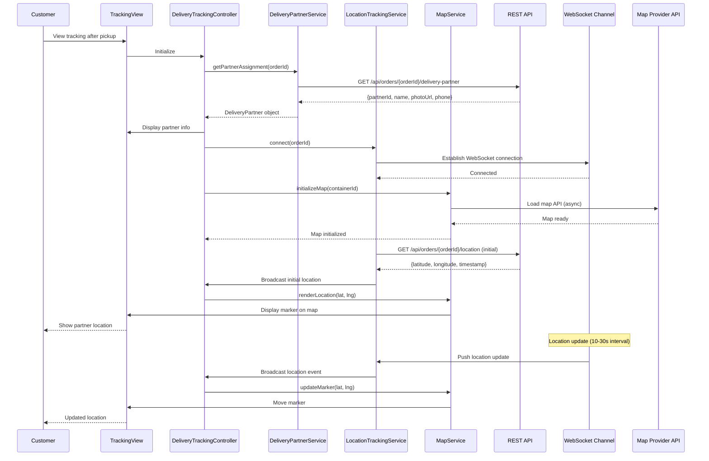

# Low-Level Design: Delivery Partner Tracking

**Epic ID:** QE-4462

---

## a. Architecture Mapping

- **Delivery Tracking Module** → AngularJS Module (`deliveryTracking`)
- **Delivery Tracking Controller** → AngularJS Controller (`DeliveryTrackingController`)
- **Delivery Partner Service** → AngularJS Service (`DeliveryPartnerService`) - fetches partner details and assignment
- **Location Tracking Service** → AngularJS Service (`LocationTrackingService`) - manages real-time location updates
- **Map Integration Service** → AngularJS Service (`MapService`) - integrates with map provider API
- **Partner Info Directive** → AngularJS Directive (`partnerInfo`) - displays partner name, photo, contact
- **Live Map Directive** → AngularJS Directive (`liveMap`) - renders map with real-time location

**Recommended Folder Structure:**
```
app/
├── modules/
│   └── delivery-tracking/
│       ├── controllers/
│       │   └── delivery-tracking.controller.js
│       ├── services/
│       │   ├── delivery-partner.service.js
│       │   ├── location-tracking.service.js
│       │   └── map.service.js
│       ├── directives/
│       │   ├── partner-info.directive.js
│       │   └── live-map.directive.js
│       ├── views/
│       │   └── delivery-tracking.html
│       └── delivery-tracking.module.js
└── app.js
```

---

## b. Component Specifications

| Component Name | Artifact Type | Responsibility | Key Dependencies |
|----------------|---------------|----------------|------------------|
| `deliveryTracking` | Module | Main module for delivery partner tracking feature | `ngRoute`, `orderTracking` |
| `DeliveryTrackingController` | Controller | Manages delivery view state, coordinates partner info and location updates | `DeliveryPartnerService`, `LocationTrackingService`, `MapService`, `$scope` |
| `DeliveryPartnerService` | Service | Fetches partner assignment, profile (name, photo), and contact info from REST API | `$http`, `$q` |
| `LocationTrackingService` | Service | Establishes WebSocket/SSE for real-time location updates (10-30s intervals) | `$rootScope`, `$window` |
| `MapService` | Service | Integrates with map provider API, renders location and route, handles map initialization | `$q`, `$window` |
| `partnerInfo` | Directive | Displays partner name, photo, and contact information | None |
| `liveMap` | Directive | Renders interactive map with partner location marker and delivery route | `MapService` |

---

## c. Data Model

**DeliveryPartner (JavaScript Object):**
```javascript
{
  partnerId: String,
  name: String,
  photoUrl: String,
  phone: String, // masked for privacy
  vehicleType: String,
  rating: Number,
  assignedAt: Date
}
```

**LocationUpdate (JavaScript Object):**
```javascript
{
  partnerId: String,
  orderId: String,
  latitude: Number,
  longitude: Number,
  timestamp: Date,
  accuracy: Number, // meters
  heading: Number // degrees
}
```

**DeliveryRoute (JavaScript Object):**
```javascript
{
  origin: {lat: Number, lng: Number},
  destination: {lat: Number, lng: Number},
  currentLocation: {lat: Number, lng: Number},
  polyline: String // encoded route path
}
```

---

## d. Data Flow

Customer views tracking page after order pickup → `DeliveryTrackingController` initializes → Controller calls `DeliveryPartnerService.getPartnerAssignment(orderId)` which sends GET request to `/api/orders/{orderId}/delivery-partner` → API returns partner details (name, photo, contact) filtered by privacy rules → `partnerInfo` directive renders partner information → Controller calls `LocationTrackingService.connect(orderId)` to establish WebSocket/SSE connection → `MapService.initializeMap()` loads map provider API asynchronously (non-blocking) → Initial location rendered on map → Location updates stream every 10-30 seconds via WebSocket → `LocationTrackingService` broadcasts updates → Controller updates `$scope.currentLocation` → `liveMap` directive updates marker position and route → If location unavailable, display last known location with timestamp or graceful message.

---

## e. Primary Sequence Diagram



---

## f. Implementation Notes

- Use AngularJS Dependency Injection for all services; inject `MapService` only when map container is visible to avoid blocking
- Implement lazy loading for map provider API using `$q` promises to ensure non-blocking initialization
- Store last known location in `LocationTrackingService` cache; display with timestamp if real-time updates fail
- Apply privacy filters in `DeliveryPartnerService` before exposing partner phone (mask digits, provide in-app call option)
- Use `$scope.$applyAsync()` for high-frequency location updates to optimize digest cycle performance

---

## g. Error Handling

Use HTTP interceptor for API failures with fallback to cached partner data; WebSocket disconnections trigger reconnection with user notification; map load failures show static partner info.

---

## h. Security Notes

Requires token-based auth via existing SSO; location data follows privacy and retention rules; customers can only access delivery info for their own active orders.