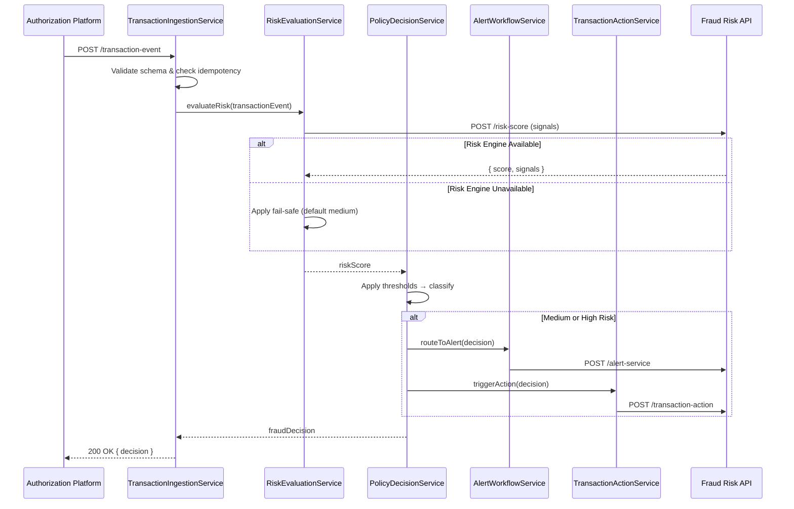

# Low-Level Design: QE-4468 - Real-Time Fraud Detection and Risk Scoring

## a. Architecture Mapping

**HLD Component → AngularJS Artifact Mapping:**
- Transaction Event Ingestion → `fraudDetection.module.js` + `TransactionIngestionService` (Factory)
- Fraud Risk Engine Integration → `RiskEvaluationService` (Service)
- Policy Decision Engine → `PolicyDecisionService` (Service)
- Alert Workflow Trigger → `AlertWorkflowService` (Service)
- Transaction Action Service → `TransactionActionService` (Service)
- Risk Dashboard/Monitoring → `RiskDashboardController` + `views/risk-dashboard.html`
- Idempotency Handler → `IdempotencyInterceptor` (Interceptor)

**Recommended Folder Structure:**
```
app/
  fraud-detection/
    fraud-detection.module.js
    risk-dashboard.controller.js
    transaction-ingestion.service.js
    risk-evaluation.service.js
    policy-decision.service.js
    alert-workflow.service.js
    transaction-action.service.js
    fraud-detection.routes.js
    views/risk-dashboard.html
  shared/
    interceptors/idempotency.interceptor.js
```

## b. Component Specifications

| Component Name | Artifact Type | Responsibility | Key Dependencies |
|---|---|---|---|
| `fraudDetection.module` | Module | Groups fraud detection feature components | `ngRoute`, `ui.router` |
| `RiskDashboardController` | Controller | Displays risk metrics, transaction classifications, and threshold configuration UI | `RiskEvaluationService`, `PolicyDecisionService` |
| `TransactionIngestionService` | Factory | Receives transaction events from authorization platform, validates schema, ensures idempotency | `$http`, `IdempotencyInterceptor` |
| `RiskEvaluationService` | Service | Calls fraud-risk engine API with transaction signals, handles fail-safe defaults | `$http`, `$q` |
| `PolicyDecisionService` | Service | Applies configurable thresholds to risk scores, maps to low/medium/high classification | `RiskEvaluationService` |
| `AlertWorkflowService` | Service | Routes high/medium-risk decisions to downstream alert service | `$http` |
| `TransactionActionService` | Service | Triggers transaction intervention actions based on risk classification | `$http` |
| `IdempotencyInterceptor` | Interceptor | Attaches idempotency keys to API requests, prevents duplicate fraud case creation | `$httpProvider` |

## c. Data Model

```js
TransactionEvent = {
  transactionId: String,
  cardId: String,
  amount: Number,
  merchantName: String,
  merchantCategory: String,
  location: Object, // { latitude: Number, longitude: Number, country: String }
  timestamp: String, // ISO 8601
  eventVersion: Number
}

RiskScore = {
  transactionId: String,
  score: Number, // 0-100
  signals: Array<String>, // ['unusual_amount', 'geographic_anomaly', 'velocity_spike']
  classification: String, // 'low' | 'medium' | 'high'
  evaluatedAt: String // ISO 8601
}

PolicyThreshold = {
  id: String,
  lowRiskMax: Number,
  mediumRiskMax: Number,
  highRiskMin: Number,
  active: Boolean
}

FraudDecision = {
  transactionId: String,
  riskClassification: String,
  action: String, // 'alert' | 'block' | 'allow_with_monitoring'
  routedTo: Array<String> // ['alert-service', 'transaction-action-service']
}
```

## d. Data Flow

User (authorization platform) publishes transaction event → `TransactionIngestionService` receives and validates event → `RiskEvaluationService` calls fraud-risk engine API with transaction signals (amount, merchant, location, velocity) → Risk engine returns score and signals → `PolicyDecisionService` applies configurable thresholds to classify risk as low/medium/high → For medium/high risk, `AlertWorkflowService` routes decision to alert service and `TransactionActionService` triggers intervention actions → UI updates via `RiskDashboardController` displaying real-time risk metrics and classification counts.

## e. Primary Sequence Diagram



## f. Implementation Notes

- DI: Use `$inject` array annotation for all controllers/services to ensure minification safety
- API calls: Centralize all fraud-risk engine and downstream service calls in dedicated Services; Controllers never call `$http` directly
- Idempotency: Implement custom `IdempotencyInterceptor` that attaches `X-Idempotency-Key` header using composite key (transactionId + eventVersion)
- Fail-safe: `RiskEvaluationService` wraps risk engine call in `$q` promise with timeout; on failure/timeout, returns default medium-risk classification
- Thresholds: `PolicyDecisionService` loads active threshold configuration from API on module init, caches in Factory singleton for performance

## g. Error Handling

HTTP interceptor captures API failures, applies retry logic for transient errors (503, timeout), logs to analytics service, and returns fail-safe defaults for risk evaluation failures.

## h. Security Notes

Requires token-based authentication via existing SSO; all API calls include bearer token in Authorization header; secrets (API keys) managed via environment config, never hardcoded.