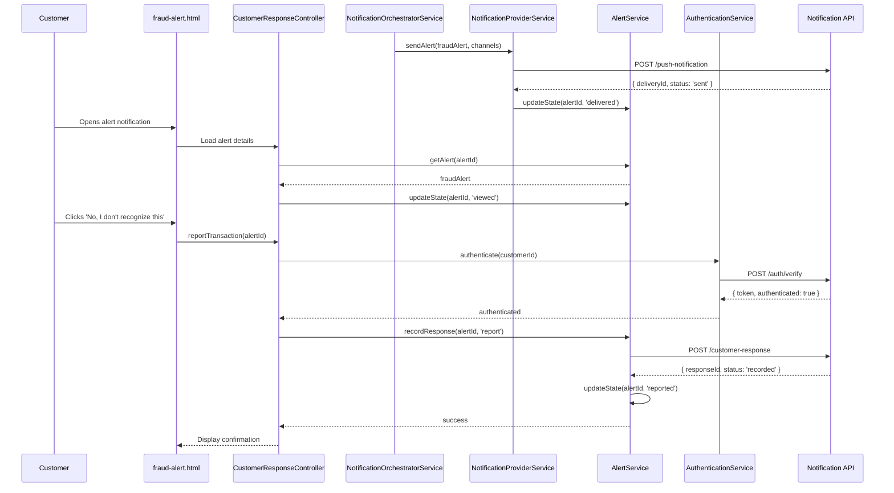

# Low-Level Design: QE-4469 - Customer Fraud Alert Notification and Response

## a. Architecture Mapping

**HLD Component → AngularJS Artifact Mapping:**
- Alert Service → `AlertService` (Factory for state management)
- Notification Orchestrator → `NotificationOrchestratorService` (Service)
- Push/SMS/Email/In-App Providers → `NotificationProviderService` (Service with provider adapters)
- Customer Response Capture → `CustomerResponseController` + `views/fraud-alert.html`
- Authentication → `AuthenticationService` (Service) + `AuthInterceptor` (Interceptor)
- Alert Lifecycle State Management → `AlertStateService` (Factory)
- Alert Grouping Logic → `AlertGroupingService` (Service)
- Notification Preferences → `NotificationPreferenceService` (Service)

**Recommended Folder Structure:**
```
app/
  fraud-alert/
    fraud-alert.module.js
    customer-response.controller.js
    alert.service.js
    notification-orchestrator.service.js
    notification-provider.service.js
    alert-state.service.js
    alert-grouping.service.js
    notification-preference.service.js
    fraud-alert.routes.js
    views/fraud-alert.html
    views/alert-history.html
  shared/
    services/authentication.service.js
    interceptors/auth.interceptor.js
```

## b. Component Specifications

| Component Name | Artifact Type | Responsibility | Key Dependencies |
|---|---|---|---|
| `fraudAlert.module` | Module | Groups fraud alert notification and response components | `ngRoute`, `ui.router` |
| `CustomerResponseController` | Controller | Displays alert details (amount, merchant, location, masked card), captures customer confirmation or report actions | `AlertService`, `AuthenticationService`, `AlertStateService` |
| `AlertService` | Factory | Manages canonical alert records, provides CRUD operations, maintains singleton alert cache | `$http`, `AlertStateService` |
| `NotificationOrchestratorService` | Service | Selects notification channels based on preferences and security overrides, implements fallback logic | `NotificationProviderService`, `NotificationPreferenceService` |
| `NotificationProviderService` | Service | Abstracts push, SMS, email, in-app delivery via provider-specific adapters, tracks delivery status | `$http`, `$q` |
| `AlertStateService` | Factory | Tracks alert lifecycle states (queued, delivered, viewed, confirmed, reported, protected, resolved, expired) | None |
| `AlertGroupingService` | Service | Groups multiple suspicious transactions to prevent alert fatigue, applies time-window and count thresholds | `AlertService` |
| `NotificationPreferenceService` | Service | Retrieves customer notification preferences, applies security overrides for high-risk transactions | `$http` |
| `AuthenticationService` | Service | Validates customer identity before fraud-response actions, handles token refresh | `$http`, `AuthInterceptor` |
| `AuthInterceptor` | Interceptor | Attaches authentication tokens to API requests, handles 401 responses | `$httpProvider` |

## c. Data Model

```js
FraudAlert = {
  alertId: String,
  transactionId: String,
  customerId: String,
  amount: Number,
  merchantName: String,
  timestamp: String, // ISO 8601
  location: String,
  maskedCardNumber: String, // e.g., '****1234'
  riskMessage: String, // Plain-language description
  state: String, // 'queued' | 'delivered' | 'viewed' | 'confirmed' | 'reported' | 'protected' | 'resolved' | 'expired'
  createdAt: String,
  deliveredAt: String,
  viewedAt: String,
  respondedAt: String
}

NotificationChannel = {
  type: String, // 'push' | 'sms' | 'email' | 'in_app'
  address: String, // Phone, email, device token
  priority: Number,
  status: String // 'pending' | 'sent' | 'delivered' | 'failed'
}

CustomerResponse = {
  alertId: String,
  customerId: String,
  action: String, // 'confirm' | 'report'
  respondedAt: String,
  authenticated: Boolean
}

NotificationPreference = {
  customerId: String,
  pushEnabled: Boolean,
  smsEnabled: Boolean,
  emailEnabled: Boolean,
  securityOverride: Boolean // True for high-risk transactions
}
```

## d. Data Flow

User receives suspicious transaction alert → `NotificationOrchestratorService` retrieves customer preferences via `NotificationPreferenceService` and applies security overrides → Selects primary channel (push) and fallback channels (SMS, email) → `NotificationProviderService` sends alert with transaction details (amount, merchant, location, masked card) and risk message → Customer views alert in app → `CustomerResponseController` displays alert details → Customer authenticates via `AuthenticationService` → Customer selects 'Yes, this was me' (confirm) or 'No, I don't recognize this' (report) → `AlertService` updates alert state and persists response via API → UI displays confirmation message.

## e. Primary Sequence Diagram



## f. Implementation Notes

- DI: Use `$inject` array annotation for all controllers/services to ensure minification safety
- API calls: Centralize all notification provider and alert API calls in Services; Controllers never call `$http` directly
- Fallback logic: `NotificationOrchestratorService` implements retry with exponential backoff for failed primary channel, automatically switches to fallback channels
- Alert grouping: `AlertGroupingService` applies 15-minute time window and 3-transaction count threshold to group alerts; presents as single notification with transaction list
- Deep links: Notification payloads include secure deep links with rate-limited tokens; `CustomerResponseController` validates token before displaying alert details

## g. Error Handling

HTTP interceptor captures notification delivery failures, retries transient errors (503, timeout) up to 3 attempts, logs failed deliveries to analytics, and triggers fallback channel selection.

## h. Security Notes

Requires token-based authentication via existing SSO before fraud-response actions; notification links include rate-limited tokens with 1-hour expiration; never display full card numbers (always masked).