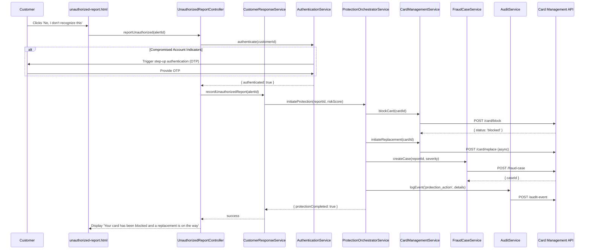

# Low-Level Design: QE-4470 - Account Protection and Fraud Case Management

## a. Architecture Mapping

**HLD Component → AngularJS Artifact Mapping:**
- Customer Response Service → `CustomerResponseService` (Service)
- Authentication Service → `AuthenticationService` (Service) + `StepUpAuthDirective` (Directive)
- Protection Orchestrator → `ProtectionOrchestratorService` (Service)
- Card Management Service Integration → `CardManagementService` (Service)
- Fraud Case Management → `FraudCaseService` (Service)
- Audit Service → `AuditService` (Factory)
- Operations Dashboard → `OperationsDashboardController` + `views/operations-dashboard.html`
- Unauthorized Report Workflow → `UnauthorizedReportController` + `views/unauthorized-report.html`

**Recommended Folder Structure:**
```
app/
  account-protection/
    account-protection.module.js
    unauthorized-report.controller.js
    operations-dashboard.controller.js
    customer-response.service.js
    protection-orchestrator.service.js
    card-management.service.js
    fraud-case.service.js
    audit.service.js
    account-protection.routes.js
    views/unauthorized-report.html
    views/operations-dashboard.html
  shared/
    services/authentication.service.js
    directives/step-up-auth.directive.js
```

## b. Component Specifications

| Component Name | Artifact Type | Responsibility | Key Dependencies |
|---|---|---|---|
| `accountProtection.module` | Module | Groups account protection and fraud case management components | `ngRoute`, `ui.router` |
| `UnauthorizedReportController` | Controller | Captures customer unauthorized transaction report, triggers authentication, initiates protection workflow | `CustomerResponseService`, `AuthenticationService`, `ProtectionOrchestratorService` |
| `OperationsDashboardController` | Controller | Displays fraud cases, alert outcomes, investigation details, and audit trails for fraud analysts | `FraudCaseService`, `AuditService` |
| `CustomerResponseService` | Service | Records customer 'No, I don't recognize this' action, validates authentication, initiates protection orchestration | `$http`, `AuthenticationService` |
| `ProtectionOrchestratorService` | Service | Coordinates card blocking, replacement workflows, fraud case creation, and audit logging in a single transaction | `CardManagementService`, `FraudCaseService`, `AuditService` |
| `CardManagementService` | Service | Calls card-management API to block cards synchronously, initiate replacement workflows asynchronously | `$http`, `$q` |
| `FraudCaseService` | Service | Creates fraud cases with severity derived from risk score and customer action, provides investigation visibility | `$http` |
| `AuditService` | Factory | Records all lifecycle events (alert creation, delivery, customer response, protection actions) with durable persistence | `$http` |
| `AuthenticationService` | Service | Validates customer identity, triggers step-up authentication for compromised accounts | `$http`, `StepUpAuthDirective` |
| `StepUpAuthDirective` | Directive | Reusable UI component for step-up authentication (OTP, biometric) when compromised account indicators detected | `AuthenticationService` |

## c. Data Model

```js
UnauthorizedReport = {
  reportId: String,
  alertId: String,
  transactionId: String,
  customerId: String,
  reportedAt: String, // ISO 8601
  authenticated: Boolean,
  stepUpRequired: Boolean
}

ProtectionAction = {
  actionId: String,
  reportId: String,
  cardId: String,
  actionType: String, // 'block' | 'replace'
  status: String, // 'initiated' | 'completed' | 'failed'
  completedAt: String
}

FraudCase = {
  caseId: String,
  reportId: String,
  customerId: String,
  severity: String, // 'low' | 'medium' | 'high' (derived from risk score)
  status: String, // 'open' | 'investigating' | 'resolved' | 'closed'
  protectionActions: Array<String>, // ['card_blocked', 'replacement_initiated']
  createdAt: String,
  assignedTo: String // Analyst ID
}

AuditEvent = {
  eventId: String,
  eventType: String, // 'alert_created' | 'alert_delivered' | 'customer_response' | 'protection_action' | 'case_created'
  entityId: String, // Alert ID, Report ID, Case ID
  customerId: String,
  timestamp: String,
  actor: String, // 'customer' | 'system' | 'analyst'
  details: Object // Event-specific metadata
}
```

## d. Data Flow

User (customer) selects 'No, I don't recognize this' on fraud alert → `UnauthorizedReportController` captures action → `AuthenticationService` validates identity, triggers step-up authentication if compromised account indicators detected → `CustomerResponseService` records unauthorized report → `ProtectionOrchestratorService` coordinates protection workflow: calls `CardManagementService` to block card synchronously, initiates replacement asynchronously, calls `FraudCaseService` to create fraud case with severity derived from risk score, calls `AuditService` to log all lifecycle events → `OperationsDashboardController` displays fraud case with investigation details and audit trail for fraud analysts → UI updates with protection confirmation message.

## e. Primary Sequence Diagram



## f. Implementation Notes

- DI: Use `$inject` array annotation for all controllers/services to ensure minification safety
- API calls: Centralize all card management, fraud case, and audit API calls in Services; Controllers never call `$http` directly
- Protection orchestration: `ProtectionOrchestratorService` uses `$q.all()` to coordinate blocking (synchronous) and case creation (synchronous) in parallel, then initiates replacement (asynchronous) after confirmation
- Edge cases: Handle confirm-after-block scenario by checking card status before displaying confirmation; multiple suspicious transactions trigger single protection workflow with grouped transaction list
- Audit retention: `AuditService` tags events with retention policy metadata; deletion enforced by backend service per regulatory requirements

## g. Error Handling

HTTP interceptor captures card blocking failures, retries transient errors (503, timeout) up to 2 attempts, logs critical failures to security event service, and displays user-friendly error message with support contact.

## h. Security Notes

Requires token-based authentication via existing SSO with step-up authentication for compromised accounts; least-privilege access enforced via role-based authorization (customers see own reports, analysts see assigned cases); all security events logged without storing full card numbers.