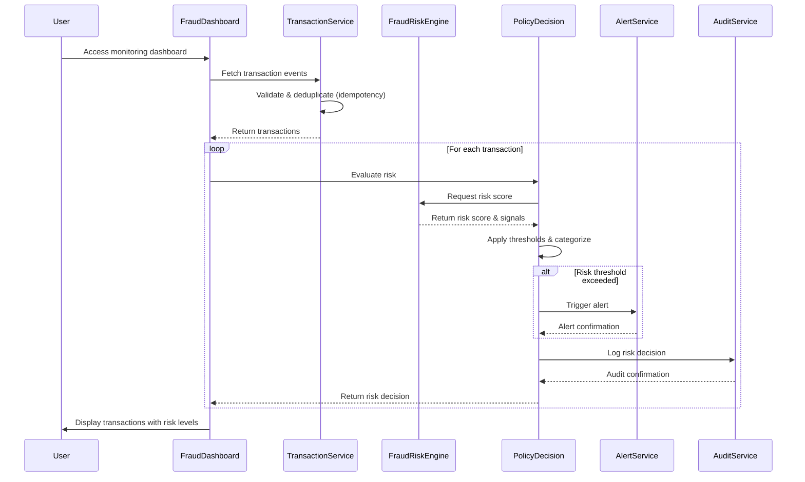

# Low-Level Design: QE-4473 - Real-Time Fraud Detection System

## a. Architecture Mapping

- **Transaction Event Ingestion** → AngularJS Service (`transactionIngestionService`) for API communication
- **Fraud Risk Engine Integration** → AngularJS Factory (`fraudRiskEngineFactory`) for risk scoring API calls
- **Policy Decision Engine** → AngularJS Service (`policyDecisionService`) for threshold evaluation logic
- **Alert Service Integration** → AngularJS Service (`alertService`) for triggering notifications
- **Audit Infrastructure** → AngularJS Service (`auditService`) for logging risk decisions
- **Dashboard UI** → AngularJS Controller (`fraudDashboardController`) with View templates
- **Transaction Monitoring View** → AngularJS Directive (`transactionMonitor`) for real-time display

**Recommended Folder Structure:**
```
/app
  /modules
    /fraud-detection
      /controllers
        - fraudDashboardController.js
      /services
        - transactionIngestionService.js
        - policyDecisionService.js
        - alertService.js
        - auditService.js
      /factories
        - fraudRiskEngineFactory.js
      /directives
        - transactionMonitor.js
      /views
        - fraud-dashboard.html
      /models
        - transactionModel.js
        - riskDecisionModel.js
```

## b. Component Specifications

| Component Name | Artifact Type | Responsibility | Key Dependencies |
|----------------|---------------|----------------|------------------|
| fraudDashboardController | Controller | Orchestrates fraud monitoring UI, displays transactions and risk decisions | transactionIngestionService, policyDecisionService, $scope |
| transactionIngestionService | Service | Fetches transaction events from authorization platform API, handles validation and deduplication | $http, $q, auditService |
| fraudRiskEngineFactory | Factory | Communicates with fraud-risk engine API to obtain risk scores for transactions | $http, $q |
| policyDecisionService | Service | Applies configurable thresholds to risk scores, categorizes transactions into risk levels | fraudRiskEngineFactory, alertService, auditService |
| alertService | Service | Triggers alert notifications when thresholds are exceeded | $http, $q |
| auditService | Service | Logs all risk decisions and actions to audit infrastructure | $http, $log |
| transactionMonitor | Directive | Real-time transaction display component with risk level indicators | policyDecisionService |
| transactionModel | Model/Factory | Defines transaction data structure with validation | - |
| riskDecisionModel | Model/Factory | Defines risk decision data structure including score and category | - |

## c. Data Model

**Transaction Model:**
```javascript
{
  transactionId: String,
  cardNumber: String (masked),
  amount: Number,
  currency: String,
  merchantId: String,
  merchantName: String,
  location: Object { latitude: Number, longitude: Number, country: String },
  deviceFingerprint: String,
  timestamp: Date,
  idempotencyKey: String
}
```

**Risk Decision Model:**
```javascript
{
  transactionId: String,
  riskScore: Number,
  riskLevel: String, // 'low', 'medium', 'high', 'confirmed_fraud'
  riskSignals: Object {
    amountAnomaly: Boolean,
    geographicInconsistency: Boolean,
    merchantReputation: String,
    velocityPattern: String,
    deviceRisk: String
  },
  alertTriggered: Boolean,
  timestamp: Date,
  decisionReason: String
}
```

## d. Data Flow

User accesses the fraud monitoring dashboard, which triggers the fraudDashboardController to invoke transactionIngestionService to fetch transaction events from the Card Authorization Platform API. For each transaction, the policyDecisionService calls fraudRiskEngineFactory to submit transaction data to the fraud-risk engine API and receive a risk score with signal analysis. The policyDecisionService then evaluates the score against configurable thresholds to categorize the transaction into a risk level (low/medium/high/confirmed fraud). If the threshold is exceeded, alertService is invoked to trigger customer notifications. All risk decisions are logged via auditService to the audit infrastructure. The UI updates in real-time via the transactionMonitor directive, displaying transactions with color-coded risk indicators.

## e. Primary Sequence Diagram



## f. Implementation Notes

- Use AngularJS Dependency Injection for all services, factories, and controllers to ensure testability and modularity
- Implement ES6 classes for service definitions with arrow functions for callbacks to maintain lexical scope
- Use $http interceptors for authentication token injection, error handling, and retry logic for API calls
- Apply Promise chaining with $q for asynchronous fraud-risk engine and alert service calls
- Implement idempotency using client-side caching (e.g., localStorage or in-memory Map) to track processed transaction IDs

## g. Error Handling

HTTP interceptor-based error handling with try/catch blocks in service methods, user notifications via toaster/modal for API failures, and fail-safe fallback to default risk level when fraud engine is unavailable.

## h. Security Notes

Requires token-based authentication via existing SSO for API access; sensitive transaction data (card numbers) must be masked in UI; secure HTTPS communication for all REST API calls.