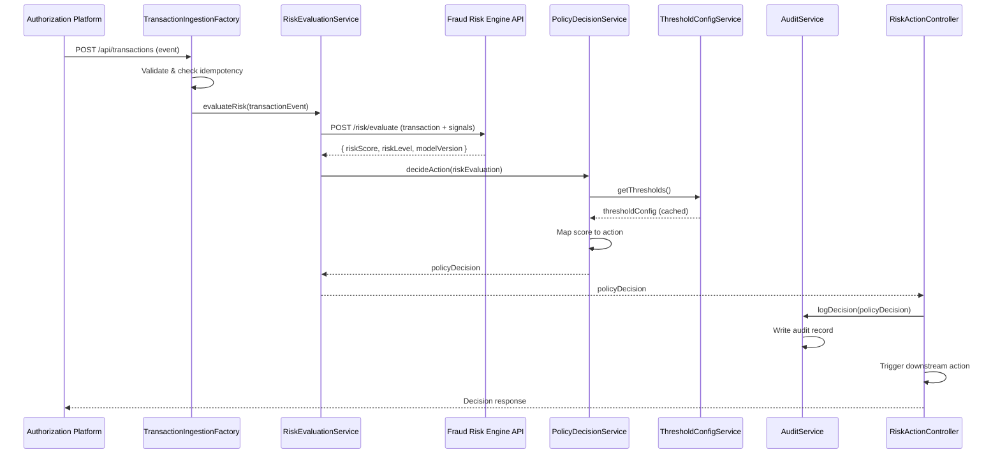

# Low-Level Design: QE-4478 - Real-Time Fraud Detection and Risk Evaluation

## a. Architecture Mapping

**Component → Artifact Mapping:**
- Transaction Event Ingestion → `FraudDetectionService` (Service) + `TransactionIngestionFactory` (Factory)
- Fraud Risk Engine Integration → `RiskEvaluationService` (Service)
- Policy Decision Engine → `PolicyDecisionService` (Service)
- Risk Decision Actions → `RiskActionController` (Controller)
- Audit Trail → `AuditInterceptor` (Interceptor) + `AuditService` (Service)
- Threshold Management → `ThresholdConfigService` (Service)
- Admin Interface → `ThresholdAdminController` (Controller) + View

**Folder Structure:**
```
app/
  fraud-detection/
    fraud-detection.module.js
    transaction-ingestion.service.js
    risk-evaluation.service.js
    policy-decision.service.js
    threshold-config.service.js
    risk-action.controller.js
    threshold-admin.controller.js
    fraud-detection.routes.js
    views/
      risk-dashboard.html
      threshold-admin.html
  shared/
    services/
      audit.service.js
    interceptors/
      audit.interceptor.js
```

## b. Component Specifications

| Name | Artifact Type | Responsibility | Key Dependencies |
|------|---------------|----------------|------------------|
| FraudDetectionModule | Module | Groups fraud detection features and registers routes | ui-router, shared services |
| TransactionIngestionFactory | Factory | Receives and validates transaction events from authorization platform, ensures idempotency | $http, AuditService |
| RiskEvaluationService | Service | Calls fraud-risk engine API with transaction data and multiple risk signals, returns risk score and level | $http, $q, TransactionIngestionFactory |
| PolicyDecisionService | Service | Maps risk score to action (approve/alert/hold/decline) based on configurable thresholds and policy rules | ThresholdConfigService, RiskEvaluationService |
| ThresholdConfigService | Service | Manages configurable alert thresholds with version control, caches threshold config | $http, $cacheFactory |
| RiskActionController | Controller | Orchestrates risk evaluation workflow, displays risk decisions, triggers downstream actions | RiskEvaluationService, PolicyDecisionService, AuditService |
| ThresholdAdminController | Controller | Provides admin UI for threshold configuration, version history, and audit trail | ThresholdConfigService, AuditService |
| AuditInterceptor | Interceptor | Intercepts all fraud-related API calls, logs request/response for audit trail | $httpProvider, AuditService |
| AuditService | Service | Writes durable audit records for risk decisions, threshold changes, and model versions | $http |

## c. Data Model

```javascript
TransactionEvent = {
  transactionId: String,
  cardId: String,
  amount: Number,
  merchantId: String,
  merchantName: String,
  merchantCategory: String,
  timestamp: Date,
  location: { latitude: Number, longitude: Number, country: String },
  eventVersion: String,
  idempotencyKey: String
}

RiskSignals = {
  amountAnomaly: Boolean,
  merchantBehavior: String,
  geographicInconsistency: Boolean,
  velocityPattern: Number,
  compromisedCardIndicator: Boolean
}

RiskEvaluation = {
  transactionId: String,
  riskScore: Number,
  riskLevel: String, // 'low' | 'medium' | 'high' | 'confirmed_fraud'
  signals: RiskSignals,
  modelVersion: String,
  evaluatedAt: Date
}

PolicyDecision = {
  transactionId: String,
  action: String, // 'approve' | 'alert' | 'hold' | 'decline'
  riskEvaluation: RiskEvaluation,
  thresholdVersion: String,
  decidedAt: Date
}

ThresholdConfig = {
  version: String,
  lowThreshold: Number,
  mediumThreshold: Number,
  highThreshold: Number,
  confirmedFraudThreshold: Number,
  updatedBy: String,
  updatedAt: Date
}
```

## d. Data Flow

When a transaction event arrives from the authorization platform, the TransactionIngestionFactory validates and deduplicates it using the idempotency key, then passes it to RiskEvaluationService. The service calls the fraud-risk engine REST API with transaction data and risk signals (amount, merchant, geography, velocity, compromised-card indicators), receiving a risk score and level. PolicyDecisionService retrieves the current threshold configuration from ThresholdConfigService (cached) and maps the risk score to an action (approve/alert/hold/decline). RiskActionController receives the policy decision, triggers the appropriate downstream action (e.g., alert creation for 'alert' action), and updates the UI dashboard. AuditInterceptor logs all API calls, and AuditService writes durable audit records including transaction ID, risk score, decision, model version, and threshold version for compliance and monitoring.

## e. Primary Sequence Diagram



## f. Implementation Notes

- DI: Use `$inject` array annotation for all controllers and services to ensure minification safety
- API calls: All fraud-risk engine and policy engine calls centralized in RiskEvaluationService and PolicyDecisionService; controllers never call APIs directly
- Idempotency: TransactionIngestionFactory maintains in-memory cache (with TTL) of processed idempotency keys; duplicate events return cached result
- Fail-safe: If risk engine API unavailable, PolicyDecisionService applies default safe policy (e.g., 'hold' action) and logs failure for manual review
- Caching: ThresholdConfigService caches threshold configuration with cache invalidation on admin updates; reduces latency for high-volume transaction processing

## g. Error Handling

Centralized `$http` interceptor (AuditInterceptor) catches API failures; risk evaluation errors trigger fail-safe policy execution; user-facing errors surfaced via shared notification service with retry guidance.

## h. Security Notes

Requires token-based authentication via existing SSO; least privilege access enforced for threshold admin endpoints; all fraud and customer data encrypted in transit (HTTPS) and at rest; audit logs exclude sensitive PII.