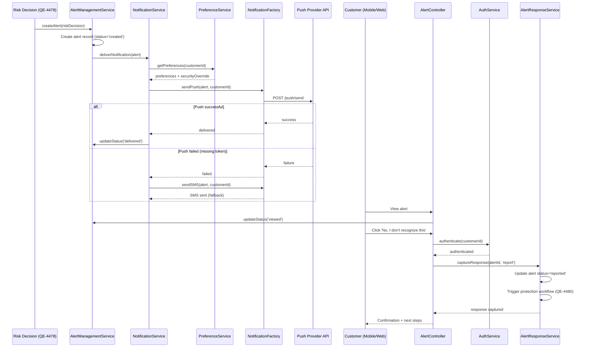

# Low-Level Design: QE-4479 - Customer Alert Notification and Response Management

## a. Architecture Mapping

**Component → Artifact Mapping:**
- Alert Record Creation → `AlertManagementService` (Service)
- Multi-Channel Notification Delivery → `NotificationService` (Service) + `NotificationFactory` (Factory)
- Customer Mobile/Web Client → `AlertController` (Controller) + Views
- Authentication Service Integration → `AuthService` (Service)
- Response Capture → `AlertResponseService` (Service)
- Alert State Management → `AlertStateFactory` (Factory)
- Notification Preferences → `PreferenceService` (Service)

**Folder Structure:**
```
app/
  fraud-alert/
    fraud-alert.module.js
    alert-management.service.js
    notification.service.js
    notification.factory.js
    alert-response.service.js
    alert-state.factory.js
    preference.service.js
    alert.controller.js
    alert-list.controller.js
    fraud-alert.routes.js
    views/
      alert-detail.html
      alert-list.html
  shared/
    services/
      auth.service.js
    directives/
      app-masked-card.directive.js
```

## b. Component Specifications

| Name | Artifact Type | Responsibility | Key Dependencies |
|------|---------------|----------------|------------------|
| FraudAlertModule | Module | Groups fraud alert notification and response features, registers routes | ui-router, shared services |
| AlertManagementService | Service | Creates alert records from risk decisions, manages alert lifecycle states (created/delivered/viewed/confirmed/reported/resolved) | $http, AlertStateFactory |
| NotificationService | Service | Orchestrates multi-channel notification delivery (push/SMS/email/in-app), handles fallback channel logic and retry | NotificationFactory, PreferenceService |
| NotificationFactory | Factory | Singleton managing notification provider integrations, delivery status tracking, and rate-limiting | $http, $q |
| AlertController | Controller | Displays alert detail with transaction context (amount, merchant, time, location, masked card), captures customer confirm/report actions | AlertManagementService, AlertResponseService, AuthService |
| AlertListController | Controller | Displays customer's alert history, filters by status, supports alert expiration display | AlertManagementService |
| AlertResponseService | Service | Captures authenticated customer responses (confirm legitimate / report unrecognized), triggers downstream workflows | $http, AuthService |
| AlertStateFactory | Factory | Maintains alert state transitions, enforces state rules, prevents duplicate alerts for same transaction | $cacheFactory |
| PreferenceService | Service | Retrieves customer notification preferences, applies security policy overrides when required | $http |
| AuthService | Service | Validates customer authentication before sensitive alert actions, enforces strong auth requirements | $http, $window |
| appMaskedCard | Directive | Reusable directive to display masked card number (e.g., ****1234) consistently across alert views | None |

## c. Data Model

```javascript
Alert = {
  alertId: String,
  transactionId: String,
  customerId: String,
  cardId: String,
  status: String, // 'created' | 'delivered' | 'viewed' | 'confirmed' | 'reported' | 'resolved' | 'expired'
  transaction: {
    amount: Number,
    currency: String,
    merchantName: String,
    timestamp: Date,
    location: String,
    maskedCard: String
  },
  riskMessage: String,
  createdAt: Date,
  deliveredAt: Date,
  viewedAt: Date,
  respondedAt: Date,
  expiresAt: Date
}

NotificationDelivery = {
  alertId: String,
  channel: String, // 'push' | 'sms' | 'email' | 'in-app'
  provider: String,
  status: String, // 'pending' | 'sent' | 'delivered' | 'failed'
  attemptCount: Number,
  sentAt: Date,
  deliveredAt: Date,
  failureReason: String
}

CustomerResponse = {
  alertId: String,
  customerId: String,
  action: String, // 'confirm' | 'report'
  authenticatedAt: Date,
  respondedAt: Date,
  deviceInfo: String
}

NotificationPreference = {
  customerId: String,
  channels: Array, // ['push', 'sms', 'email']
  securityOverride: Boolean,
  updatedAt: Date
}
```

## d. Data Flow

When a risk decision triggers an alert, AlertManagementService creates an alert record with transaction context and sets status to 'created'. NotificationService retrieves customer preferences via PreferenceService, applies security policy overrides if needed, and calls NotificationFactory to deliver notifications through selected channels (push, SMS, email, in-app). If primary channel (e.g., push) fails due to missing token, NotificationService automatically retries via fallback channel (SMS or email). Customer views the alert on mobile/web client, triggering status update to 'viewed'. When customer taps 'Yes, this is me' or 'No, I don't recognize this', AlertController authenticates the user via AuthService, then calls AlertResponseService to capture the response. AlertResponseService updates alert status to 'confirmed' or 'reported', triggers downstream workflows (for 'reported', initiates account protection workflow from Epic QE-4480), and returns confirmation to the UI. AlertStateFactory prevents duplicate alerts for the same transaction and enforces state transition rules throughout the lifecycle.

## e. Primary Sequence Diagram



## f. Implementation Notes

- DI: Use `$inject` array annotation for all services and controllers to ensure minification safety
- API calls: All notification provider and alert management APIs centralized in NotificationFactory and AlertManagementService; controllers never call external APIs directly
- Fallback logic: NotificationService implements channel fallback waterfall (push → SMS → email) with configurable retry delays; each channel attempt tracked in NotificationDelivery records
- Accessibility: Alert views use ARIA labels, semantic HTML5, and keyboard navigation support; appMaskedCard directive includes screen-reader-friendly text
- Rate-limiting: NotificationFactory enforces per-customer rate limits (e.g., max 5 alerts per hour) to prevent abuse and notification fatigue

## g. Error Handling

Centralized `$http` interceptor catches notification API failures; failed deliveries retry via fallback channels; user-facing errors surfaced via shared notification service with customer support contact info.

## h. Security Notes

Requires strong authentication via AuthService before capturing customer responses; notification deep links include time-limited tokens to prevent unauthorized access; never display full card numbers (use appMaskedCard directive); rate-limiting enforced to prevent abuse.