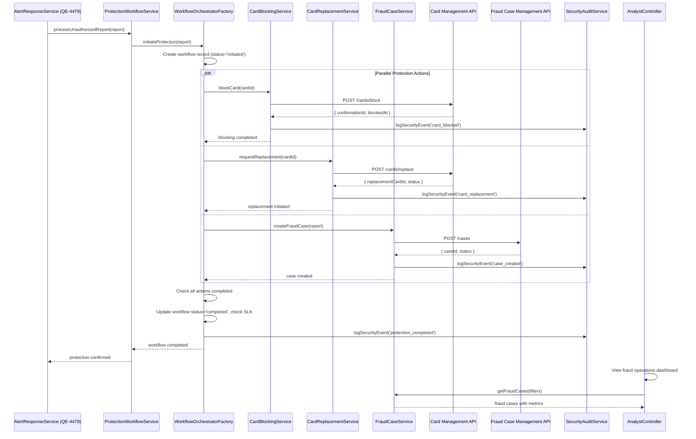

# Low-Level Design: QE-4480 - Account Protection and Fraud Case Workflow

## a. Architecture Mapping

**Component → Artifact Mapping:**
- Unauthorized Transaction Report Processing → `ProtectionWorkflowService` (Service)
- Protection Workflow Orchestrator → `WorkflowOrchestratorFactory` (Factory)
- Card Blocking → `CardBlockingService` (Service)
- Card Replacement → `CardReplacementService` (Service)
- Fraud Case Management → `FraudCaseService` (Service)
- Operations Analyst Tools → `AnalystController` (Controller) + Views
- Audit and Security Logging → `SecurityAuditService` (Service) + `SecurityInterceptor` (Interceptor)
- Step-up Authentication → `StepUpAuthService` (Service)

**Folder Structure:**
```
app/
  account-protection/
    account-protection.module.js
    protection-workflow.service.js
    workflow-orchestrator.factory.js
    card-blocking.service.js
    card-replacement.service.js
    fraud-case.service.js
    step-up-auth.service.js
    analyst.controller.js
    protection-status.controller.js
    account-protection.routes.js
    views/
      analyst-dashboard.html
      fraud-case-detail.html
      protection-status.html
  shared/
    services/
      security-audit.service.js
    interceptors/
      security.interceptor.js
```

## b. Component Specifications

| Name | Artifact Type | Responsibility | Key Dependencies |
|------|---------------|----------------|------------------|
| AccountProtectionModule | Module | Groups account protection and fraud case features, registers routes with security guards | ui-router, shared services |
| ProtectionWorkflowService | Service | Receives unauthorized transaction reports from alert response (QE-4479), initiates protection workflow orchestration | WorkflowOrchestratorFactory, SecurityAuditService |
| WorkflowOrchestratorFactory | Factory | Singleton orchestrating parallel protection actions (card blocking, replacement, case creation), tracks completion status, enforces SLA monitoring | CardBlockingService, CardReplacementService, FraudCaseService, $q |
| CardBlockingService | Service | Calls card-management API to block compromised card, returns synchronous confirmation | $http, SecurityAuditService |
| CardReplacementService | Service | Triggers card replacement workflow via card-management API, tracks replacement status | $http, SecurityAuditService |
| FraudCaseService | Service | Creates fraud case in case-management system, manages case states (created/investigation/dispute/resolved), provides analyst query interface | $http, SecurityAuditService |
| StepUpAuthService | Service | Enforces step-up authentication for compromised accounts before sensitive operations, integrates with identity service | $http, $window |
| AnalystController | Controller | Provides fraud operations analyst dashboard, displays fraud cases, alert outcomes, customer response patterns, protection workflow metrics | FraudCaseService, SecurityAuditService |
| ProtectionStatusController | Controller | Displays protection workflow status to authorized users, shows card blocking/replacement progress, case creation confirmation | ProtectionWorkflowService, StepUpAuthService |
| SecurityAuditService | Service | Writes security event logs for all protection actions, applies legal/security-approved retention policies, excludes unnecessary sensitive data | $http |
| SecurityInterceptor | Interceptor | Intercepts all security-critical API calls, enforces authentication/authorization, logs security events | $httpProvider, SecurityAuditService |

## c. Data Model

```javascript
UnauthorizedReport = {
  alertId: String,
  transactionId: String,
  customerId: String,
  cardId: String,
  reportedAt: Date,
  authenticatedBy: String,
  deviceInfo: String
}

ProtectionWorkflow = {
  workflowId: String,
  unauthorizedReport: UnauthorizedReport,
  status: String, // 'initiated' | 'in-progress' | 'completed' | 'failed'
  actions: {
    cardBlocking: { status: String, completedAt: Date },
    cardReplacement: { status: String, completedAt: Date },
    fraudCase: { caseId: String, status: String, createdAt: Date }
  },
  initiatedAt: Date,
  completedAt: Date,
  slaTarget: Date,
  slaMet: Boolean
}

CardBlockingAction = {
  cardId: String,
  blockReason: String,
  blockedAt: Date,
  blockedBy: String,
  confirmationId: String
}

CardReplacementAction = {
  cardId: String,
  replacementCardId: String,
  requestedAt: Date,
  status: String, // 'requested' | 'in-production' | 'shipped' | 'delivered'
  trackingNumber: String
}

FraudCase = {
  caseId: String,
  transactionId: String,
  customerId: String,
  cardId: String,
  status: String, // 'created' | 'investigation' | 'dispute' | 'resolved'
  assignedAnalyst: String,
  createdAt: Date,
  investigationNotes: Array,
  resolution: String,
  resolvedAt: Date
}

SecurityEvent = {
  eventId: String,
  eventType: String, // 'unauthorized_report' | 'card_blocked' | 'case_created' | 'step_up_auth'
  userId: String,
  resourceId: String,
  timestamp: Date,
  outcome: String,
  retentionExpiresAt: Date
}
```

## d. Data Flow

When a customer reports an unauthorized transaction via AlertResponseService (QE-4479), the response triggers ProtectionWorkflowService which creates a ProtectionWorkflow record and invokes WorkflowOrchestratorFactory. The orchestrator initiates three parallel protection actions using `$q.all()`: CardBlockingService calls the card-management API to block the compromised card and receives synchronous confirmation; CardReplacementService triggers the replacement workflow and tracks status; FraudCaseService creates a fraud case in the case-management system with transaction details and customer report. Each service logs its action via SecurityAuditService. WorkflowOrchestratorFactory monitors completion of all three actions, updates workflow status to 'completed' when all succeed (or 'failed' if any critical action fails), and checks SLA compliance. AnalystController provides fraud operations analysts with a dashboard to view fraud cases, investigate alert outcomes, and track protection workflow success rates. StepUpAuthService enforces additional authentication for compromised accounts before allowing sensitive operations. SecurityInterceptor logs all security-critical API calls and enforces authentication/authorization policies throughout the workflow.

## e. Primary Sequence Diagram



## f. Implementation Notes

- DI: Use `$inject` array annotation for all services and controllers to ensure minification safety
- API calls: All card-management and case-management APIs centralized in CardBlockingService, CardReplacementService, and FraudCaseService; controllers never call external APIs directly
- Parallel execution: WorkflowOrchestratorFactory uses `$q.all()` to execute card blocking, replacement, and case creation in parallel, reducing total workflow time while tracking individual action success/failure
- SLA monitoring: Orchestrator calculates SLA target time on workflow initiation, tracks completion time, sets `slaMet` flag, and surfaces SLA violations to operational dashboards
- Step-up authentication: StepUpAuthService enforces additional authentication (e.g., OTP, biometric) for compromised accounts before allowing access to sensitive protection status or case details

## g. Error Handling

Centralized `$http` interceptor (SecurityInterceptor) catches protection API failures; critical action failures (card blocking) trigger immediate retry with exponential backoff; workflow marked 'failed' if retries exhausted; user-facing errors surfaced via shared notification service with customer support escalation.

## h. Security Notes

Requires strong authentication and step-up authentication for compromised accounts via StepUpAuthService; least privilege access enforced for analyst tools and protection endpoints; all protection actions encrypted in transit (HTTPS) and at rest; security event logs apply legal/security-approved retention policies; sensitive payment data excluded from logs.