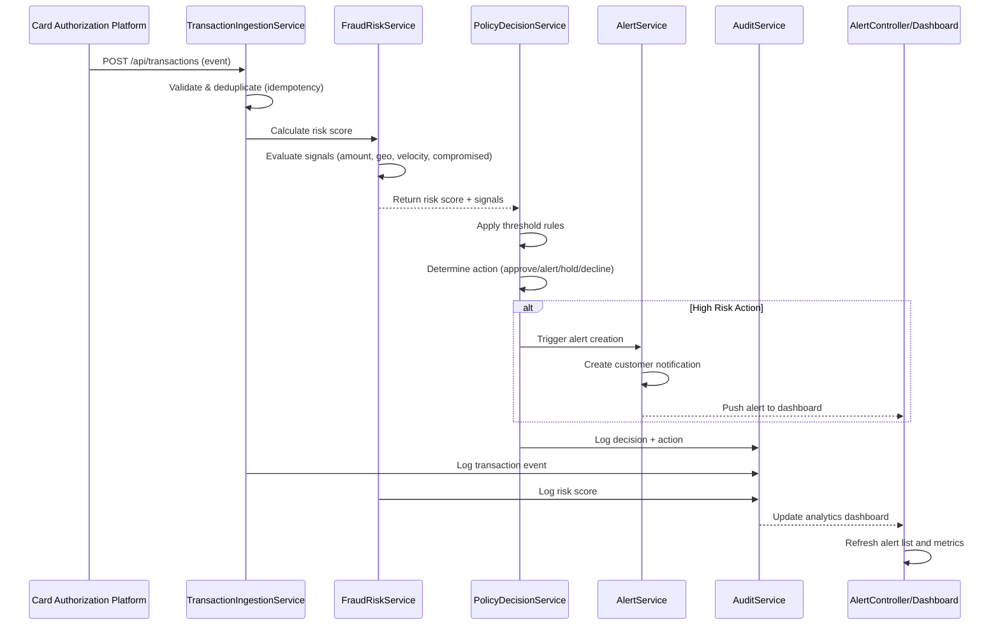

# Low-Level Design: QE-4483

## a. Architecture Mapping

- **Transaction Event Ingestion** → AngularJS Service (TransactionIngestionService) + REST API integration
- **Fraud Risk Engine** → AngularJS Service (FraudRiskService) + Backend API wrapper
- **Policy Decision Engine** → AngularJS Service (PolicyDecisionService) + Configuration Factory
- **Alert Service** → AngularJS Service (AlertService) + Controller (AlertController)
- **Audit and Analytics** → AngularJS Service (AuditService) + Dashboard Controller (AnalyticsDashboardController)
- **Configuration Management** → AngularJS Factory (ThresholdConfigFactory) + Admin Controller (ThresholdAdminController)

**Recommended Folder Structure:**
```
/app
  /modules
    /fraud-detection
      /controllers
      /services
      /directives
      /factories
      /views
  /shared
    /services
    /directives
  /config
```

## b. Component Specifications

| Component Name | Artifact Type | Responsibility | Key Dependencies |
|----------------|---------------|----------------|------------------|
| TransactionIngestionService | Service | Receive and validate transaction events from authorization platform, handle deduplication via idempotency keys | $http, $q, IdempotencyService |
| FraudRiskService | Service | Calculate risk scores by evaluating transaction signals (amount, location, velocity, compromised indicators) | $http, TransactionIngestionService, $q |
| PolicyDecisionService | Service | Apply configurable thresholds to risk scores and map to actions (approve/alert/step-up/hold/decline) | FraudRiskService, ThresholdConfigFactory, $q |
| AlertService | Service | Trigger customer notifications for high-risk transactions | $http, PolicyDecisionService, NotificationService |
| AuditService | Service | Capture all events, risk scores, decisions, and actions for compliance and analytics | $http, $q |
| ThresholdConfigFactory | Factory | Manage and retrieve configurable risk threshold settings | $http, $cacheFactory |
| AlertController | Controller | Handle UI interactions for viewing and managing fraud alerts | AlertService, $scope, $filter |
| ThresholdAdminController | Controller | Manage threshold configuration through admin interface | ThresholdConfigFactory, $scope, PolicyDecisionService |
| AnalyticsDashboardController | Controller | Display fraud analytics, trends, and audit logs | AuditService, $scope, ChartService |
| IdempotencyService | Service | Track processed transaction IDs to prevent duplicate processing | $cacheFactory, StorageService |
| TransactionMonitorDirective | Directive | Real-time transaction monitoring widget for dashboard | TransactionIngestionService, FraudRiskService |

## c. Data Model

**Transaction Event:**
```javascript
{
  transactionId: String,
  cardIdentifier: String,
  amount: Number,
  currency: String,
  merchantName: String,
  merchantCategory: String,
  location: { country: String, city: String, coordinates: Object },
  timestamp: Date,
  deviceInfo: Object,
  authorizationStatus: String
}
```

**Risk Score:**
```javascript
{
  transactionId: String,
  riskScore: Number,
  signals: {
    amountAnomaly: Boolean,
    geoInconsistency: Boolean,
    velocityPattern: String,
    failedAttempts: Number,
    compromisedCard: Boolean
  },
  timestamp: Date
}
```

**Policy Decision:**
```javascript
{
  transactionId: String,
  riskScore: Number,
  action: String, // 'approve', 'alert', 'step-up', 'hold', 'decline'
  threshold: String, // 'low', 'medium', 'high', 'critical'
  timestamp: Date,
  reason: String
}
```

**Threshold Configuration:**
```javascript
{
  thresholdId: String,
  level: String, // 'low', 'medium', 'high', 'critical'
  minScore: Number,
  maxScore: Number,
  action: String,
  enabled: Boolean,
  updatedBy: String,
  updatedAt: Date
}
```

**Alert:**
```javascript
{
  alertId: String,
  transactionId: String,
  customerId: String,
  riskScore: Number,
  action: String,
  status: String, // 'pending', 'sent', 'acknowledged', 'resolved'
  createdAt: Date,
  notificationChannels: Array
}
```

## d. Data Flow

User (system) receives transaction event from card authorization platform → TransactionIngestionService validates and deduplicates the event → FraudRiskService evaluates multiple risk signals (amount anomaly, geographic inconsistency, velocity patterns, failed attempts, compromised-card indicators) and calculates risk score → PolicyDecisionService applies configurable thresholds from ThresholdConfigFactory to map risk score to action → For high-risk decisions, AlertService creates alert and triggers customer notification → AuditService captures all events, scores, decisions, and actions → UI updates via AlertController to display alerts in real-time dashboard, and AnalyticsDashboardController refreshes analytics views with new fraud metrics.

## e. Primary Sequence Diagram



## f. Implementation Notes

- Use AngularJS dependency injection to wire services (TransactionIngestionService, FraudRiskService, PolicyDecisionService, AlertService, AuditService) into controllers
- Implement ES6 classes for service definitions with promise-based async patterns using $q for API calls
- Use $http interceptors for authentication token injection and global error handling across all REST API calls
- Leverage ThresholdConfigFactory with $cacheFactory to cache threshold configurations and reduce API calls
- Implement real-time updates using $interval or WebSocket integration for dashboard refresh of alerts and analytics

## g. Error Handling

HTTP interceptor-based error handling with try/catch blocks in services, user-facing toast notifications via NotificationService, and fallback to fail-safe policy execution for critical fraud decisions.

## h. Security Notes

Requires token-based authentication via existing SSO for all API endpoints; transaction data encryption in transit; role-based access control for threshold configuration admin interface.