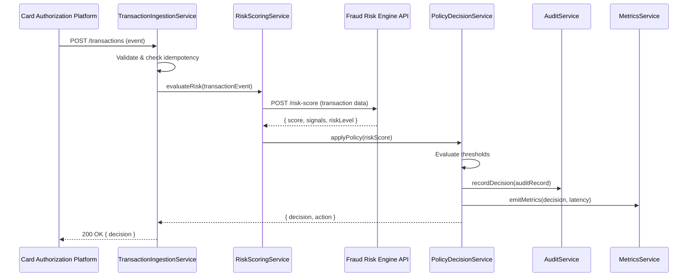

# Low-Level Design: QE-4486 - Real-Time Fraud Detection and Risk Scoring

## a. Architecture Mapping

**Component to Artifact Mapping:**
- Transaction Event Ingestion → `app.fraudDetection` Module + `TransactionIngestionService` (Factory)
- Fraud Risk Scoring Engine → `RiskScoringService` (Service) + `RiskEngineInterceptor` (Interceptor)
- Policy Decision Engine → `PolicyDecisionService` (Service)
- Audit Trail Store → `AuditService` (Factory)
- Monitoring Infrastructure → `MetricsService` (Factory) + `MonitoringInterceptor` (Interceptor)

**Recommended Folder Structure:**
```
app/
  fraud-detection/
    fraud-detection.module.js
    transaction-ingestion.service.js
    risk-scoring.service.js
    policy-decision.service.js
    audit.service.js
    metrics.service.js
    fraud-detection.routes.js
  shared/
    interceptors/
      risk-engine.interceptor.js
      monitoring.interceptor.js
```

## b. Component Specifications

| Component Name | Artifact Type | Responsibility | Key Dependencies |
|---|---|---|---|
| TransactionIngestionService | Factory | Receive and validate transaction events from authorization platform, ensure idempotency via event ID deduplication | $http, $q, AuditService |
| RiskScoringService | Service | Invoke fraud-risk engine API with transaction data, parse risk score and signals, handle engine unavailability with fail-safe policy | $http, $q, PolicyDecisionService, MetricsService |
| PolicyDecisionService | Service | Apply configurable thresholds to risk scores, determine risk level (low/medium/high), trigger appropriate actions | RiskScoringService, AuditService |
| AuditService | Factory | Record all risk decisions and events to audit trail store with durable persistence | $http, $q |
| MetricsService | Factory | Emit performance metrics, model drift indicators, and operational visibility data | $http, $window.performance |
| RiskEngineInterceptor | Interceptor | Handle risk engine API retries, timeouts, and fail-safe fallback when engine unavailable | $q, PolicyDecisionService |
| MonitoringInterceptor | Interceptor | Capture request/response timing, log traces for observability | $q, MetricsService |

## c. Data Model

```js
TransactionEvent = {
  eventId: String,
  transactionId: String,
  cardId: String,
  amount: Number,
  currency: String,
  merchantName: String,
  merchantCategory: String,
  location: { latitude: Number, longitude: Number, country: String },
  timestamp: Date,
  version: Number
}

RiskScore = {
  transactionId: String,
  score: Number,
  riskLevel: String, // 'low' | 'medium' | 'high'
  signals: Array<String>, // ['unusual_amount', 'geo_inconsistency', 'velocity_spike', 'compromised_card']
  timestamp: Date
}

PolicyDecision = {
  transactionId: String,
  riskLevel: String,
  action: String, // 'allow' | 'alert' | 'block'
  thresholdApplied: Number,
  timestamp: Date
}

AuditRecord = {
  eventId: String,
  transactionId: String,
  action: String,
  riskScore: Number,
  decision: String,
  timestamp: Date,
  metadata: Object
}
```

## d. Data Flow

When a transaction event arrives from the card authorization platform, TransactionIngestionService validates the event structure and checks idempotency via eventId. The validated event is passed to RiskScoringService, which calls the fraud-risk engine API synchronously to obtain a risk score and fraud signals. RiskScoringService returns the score to PolicyDecisionService, which evaluates it against configurable thresholds to determine the risk level (low/medium/high) and corresponding action (allow/alert/block). PolicyDecisionService records the decision via AuditService for durable audit trail storage and emits metrics via MetricsService. If the risk engine is unavailable, RiskEngineInterceptor applies the fail-safe policy (default: allow with alert flag). All components use $q promises for asynchronous flow control, and monitoring data is captured by MonitoringInterceptor for operational visibility.

## e. Primary Sequence Diagram



## f. Implementation Notes

- DI: Use constructor injection with `$inject` array annotation for all services and factories to ensure minification safety.
- API calls: All external API interactions (risk engine, audit store) centralized in Services; Controllers never call $http directly.
- Idempotency: TransactionIngestionService maintains in-memory cache (with TTL) or Redis-backed store of processed eventIds to prevent duplicate evaluations.
- Fail-safe policy: RiskEngineInterceptor returns default risk level 'medium' with 'alert' action when engine times out or returns 5xx; configurable via PolicyDecisionService.
- ES6: Use `const`/`let`, arrow functions for callbacks, template literals for API endpoint construction, assuming Babel transpilation.

## g. Error Handling

HTTP errors caught via RiskEngineInterceptor and MonitoringInterceptor; retry logic (exponential backoff, max 3 attempts) for transient failures; fail-safe policy applied on engine unavailability; user-facing errors logged to MetricsService for alerting.

## h. Security Notes

Transaction events validated for required fields and data types; API calls to risk engine secured with JWT tokens in Authorization header; audit records encrypted at rest; no full card numbers logged, only masked identifiers (last 4 digits).