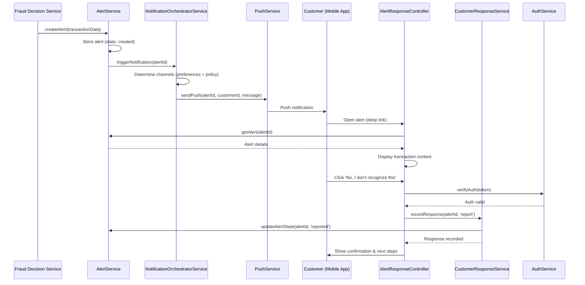

# Low-Level Design: QE-4487 - Customer Fraud Alert Notification and Response

## a. Architecture Mapping

**Component to Artifact Mapping:**
- Alert Service → `app.fraudAlert` Module + `AlertService` (Factory)
- Notification Orchestrator → `NotificationOrchestratorService` (Service)
- Notification Providers → `NotificationProviderFactory` (Factory) + `PushService`, `SmsService`, `EmailService` (Services)
- Customer Response Service → `CustomerResponseService` (Service) + `AlertResponseController` (Controller) + `alert-response.html` (View)
- Customer Authentication Service → `AuthService` (Factory) + `AuthInterceptor` (Interceptor)
- Alert Viewing → `AlertHistoryController` (Controller) + `alert-history.html` (View)

**Recommended Folder Structure:**
```
app/
  fraud-alert/
    fraud-alert.module.js
    alert.service.js
    notification-orchestrator.service.js
    notification-provider.factory.js
    push.service.js
    sms.service.js
    email.service.js
    customer-response.service.js
    alert-response.controller.js
    alert-history.controller.js
    fraud-alert.routes.js
    views/
      alert-response.html
      alert-history.html
  shared/
    services/
      auth.service.js
    interceptors/
      auth.interceptor.js
```

## b. Component Specifications

| Component Name | Artifact Type | Responsibility | Key Dependencies |
|---|---|---|---|
| AlertService | Factory | Manage alert lifecycle (create, update state, retrieve), store canonical alert records, expose alert state transitions | $http, $q |
| NotificationOrchestratorService | Service | Determine delivery channels based on customer preferences and security policy, coordinate multi-channel delivery with fallback logic, track delivery status | AlertService, NotificationProviderFactory, $q |
| NotificationProviderFactory | Factory | Abstract notification provider selection, return appropriate provider (Push/SMS/Email) based on channel type | PushService, SmsService, EmailService |
| PushService | Service | Send push notifications via provider API, handle delivery callbacks, retry on failure | $http, $q |
| SmsService | Service | Send SMS notifications via provider API, handle delivery callbacks, retry on failure | $http, $q |
| EmailService | Service | Send email notifications via provider API, handle delivery callbacks, retry on failure | $http, $q |
| CustomerResponseService | Service | Record customer confirmation or report actions, update alert state, trigger downstream workflows | $http, $q, AlertService, AuthService |
| AlertResponseController | Controller | Present alert details (amount, merchant, time, masked card), capture customer action (confirm/report), enforce authentication | CustomerResponseService, AuthService, $state |
| AlertHistoryController | Controller | Display active and resolved alerts, filter by status, navigate to alert details | AlertService, $state |
| AuthService | Factory | Verify customer authentication tokens, enforce authorization for response actions, manage session state | $http, $q, $window.localStorage |
| AuthInterceptor | Interceptor | Attach JWT tokens to outbound requests, handle 401/403 responses, rate-limit sensitive endpoints | $q, AuthService |

## c. Data Model

```js
Alert = {
  alertId: String,
  transactionId: String,
  customerId: String,
  amount: Number,
  currency: String,
  merchantName: String,
  timestamp: Date,
  maskedCardNumber: String, // e.g., '**** 1234'
  riskLevel: String, // 'low' | 'medium' | 'high'
  state: String, // 'created' | 'queued' | 'delivered' | 'viewed' | 'confirmed' | 'reported' | 'resolved' | 'expired'
  channels: Array<String>, // ['push', 'sms', 'email']
  deliveryStatus: Object // { push: 'delivered', sms: 'failed', email: 'pending' }
}

NotificationPreference = {
  customerId: String,
  preferredChannels: Array<String>, // ['push', 'email']
  securityOverride: Boolean // true if security policy mandates all channels
}

CustomerResponse = {
  alertId: String,
  customerId: String,
  action: String, // 'confirm' | 'report'
  timestamp: Date,
  ipAddress: String,
  userAgent: String
}
```

## d. Data Flow

When a fraud decision service triggers an alert, AlertService creates a new alert record with state 'created'. NotificationOrchestratorService retrieves customer notification preferences and determines delivery channels, applying security policy overrides if required. For each channel, NotificationProviderFactory selects the appropriate provider (PushService, SmsService, or EmailService), which sends the notification and updates deliveryStatus in the alert record. If primary channel delivery fails, NotificationOrchestratorService triggers fallback to secondary channel within configured timeout. When the customer views the alert, AlertResponseController presents transaction context and action buttons. On customer action (confirm/report), AlertResponseController invokes CustomerResponseService, which verifies authentication via AuthService, records the response, updates alert state to 'confirmed' or 'reported', and triggers downstream workflows (e.g., account protection for 'report'). AlertHistoryController retrieves active and resolved alerts from AlertService for customer viewing. All API calls use $q promises, and AuthInterceptor attaches JWT tokens and enforces rate limits.

## e. Primary Sequence Diagram



## f. Implementation Notes

- DI: Constructor injection with `$inject` array for all services, controllers, and factories to ensure minification safety.
- API calls: All notification provider and alert API interactions centralized in Services; Controllers call Services only, never $http directly.
- Fallback logic: NotificationOrchestratorService implements priority-based fallback (push → SMS → email) with configurable timeout (e.g., 30s) per channel attempt.
- Deep links: Notification messages include time-limited, single-use tokens appended to deep link URLs; AuthInterceptor validates token on alert view.
- ES6: Use `const`/`let`, arrow functions, template literals for notification message construction, assuming Babel transpilation.

## g. Error Handling

HTTP errors caught via AuthInterceptor; notification provider failures trigger fallback channel via NotificationOrchestratorService; customer response API errors displayed via toast notification; rate-limit violations return 429 with retry-after header.

## h. Security Notes

JWT tokens in Authorization header for all customer response actions; deep link tokens expire after 24 hours and are single-use; rate limiting (10 requests/minute) on response endpoints via AuthInterceptor; no full card numbers displayed, only masked identifiers.