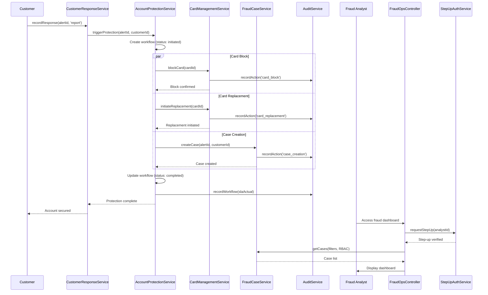

# Low-Level Design: QE-4488 - Account Protection and Fraud Case Management

## a. Architecture Mapping

**Component to Artifact Mapping:**
- Account Protection Orchestrator → `app.accountProtection` Module + `AccountProtectionService` (Service)
- Card Management Service → `CardManagementService` (Service)
- Fraud Case Management System → `FraudCaseService` (Service) + `FraudCaseController` (Controller) + `fraud-case.html` (View)
- Audit Trail Store → `AuditService` (Factory)
- Fraud Operations Portal → `FraudOpsController` (Controller) + `fraud-ops-dashboard.html` (View) + `FraudOpsService` (Service)
- Customer Response Trigger → `CustomerResponseService` (Service, shared from QE-4487)
- Step-up Authentication → `StepUpAuthService` (Service) + `appStepUpAuth` (Directive)

**Recommended Folder Structure:**
```
app/
  account-protection/
    account-protection.module.js
    account-protection.service.js
    card-management.service.js
    fraud-case.service.js
    fraud-case.controller.js
    fraud-ops.service.js
    fraud-ops.controller.js
    step-up-auth.service.js
    account-protection.routes.js
    views/
      fraud-case.html
      fraud-ops-dashboard.html
  shared/
    services/
      audit.service.js
    directives/
      step-up-auth.directive.js
```

## b. Component Specifications

| Component Name | Artifact Type | Responsibility | Key Dependencies |
|---|---|---|---|
| AccountProtectionService | Service | Orchestrate protection workflows (card block, replacement, case creation) triggered by unauthorized reports, execute within operational SLA, track completion status | CardManagementService, FraudCaseService, AuditService, $q |
| CardManagementService | Service | Invoke card blocking API, initiate card replacement process, return synchronous confirmation of protection actions | $http, $q, AuditService |
| FraudCaseService | Service | Create fraud case records, manage case lifecycle (initiated, investigating, resolved), link cases to alerts, expose case status updates | $http, $q, AuditService |
| FraudCaseController | Controller | Display fraud case details for customer view, show protection actions taken, provide dispute initiation pathway | FraudCaseService, $state |
| FraudOpsService | Service | Retrieve fraud cases and alert outcomes for analyst investigation, apply RBAC filters, expose search and filter capabilities | $http, $q |
| FraudOpsController | Controller | Present fraud operations dashboard with case list, alert outcomes, investigation tools, enforce analyst authentication and authorization | FraudOpsService, StepUpAuthService, $state |
| StepUpAuthService | Service | Trigger step-up authentication (OTP, biometric) for sensitive actions, verify step-up token validity, manage step-up session | $http, $q, $window.localStorage |
| appStepUpAuth | Directive | Reusable UI component for step-up authentication prompt, capture OTP or biometric input, invoke StepUpAuthService | StepUpAuthService |
| AuditService | Factory | Record all protection actions, case state changes, and analyst access events with encryption, enforce retention policies | $http, $q |

## c. Data Model

```js
ProtectionWorkflow = {
  workflowId: String,
  alertId: String,
  customerId: String,
  cardId: String,
  triggeredBy: String, // 'customer_report'
  actions: Array<String>, // ['card_block', 'card_replacement', 'case_creation']
  status: String, // 'initiated' | 'in_progress' | 'completed' | 'failed'
  completedAt: Date,
  slaTarget: Number, // milliseconds
  slaActual: Number
}

FraudCase = {
  caseId: String,
  alertId: String,
  customerId: String,
  cardId: String,
  transactionId: String,
  status: String, // 'initiated' | 'investigating' | 'resolved'
  createdAt: Date,
  resolvedAt: Date,
  assignedAnalyst: String,
  notes: Array<Object> // [{ timestamp, analyst, note }]
}

CardAction = {
  actionId: String,
  cardId: String,
  actionType: String, // 'block' | 'replacement'
  executedAt: Date,
  executedBy: String, // 'system' | 'analyst'
  status: String // 'success' | 'failed'
}

AuditRecord = {
  recordId: String,
  entityType: String, // 'workflow' | 'case' | 'card_action' | 'analyst_access'
  entityId: String,
  action: String,
  performedBy: String,
  timestamp: Date,
  metadata: Object,
  encrypted: Boolean
}
```

## d. Data Flow

When a customer selects 'No, I don't recognize this' via CustomerResponseService (from QE-4487), the service triggers AccountProtectionService with the alertId and customerId. AccountProtectionService initiates a ProtectionWorkflow and executes three parallel actions: (1) CardManagementService blocks the card via synchronous API call, (2) CardManagementService initiates card replacement process, and (3) FraudCaseService creates a fraud case record linked to the alert. Each action records its completion status and timestamp. AccountProtectionService tracks SLA compliance by comparing actual completion time against target. All protection actions are logged to AuditService with encryption. For fraud analyst access, FraudOpsController authenticates the analyst and invokes StepUpAuthService for sensitive operations (e.g., viewing full case details). FraudOpsService retrieves case data with RBAC filters applied, and FraudOpsController presents the dashboard. Analysts can add investigation notes via FraudCaseService, which updates case status and logs the action to AuditService. All API calls use $q promises for async flow control.

## e. Primary Sequence Diagram



## f. Implementation Notes

- DI: Constructor injection with `$inject` array for all services, controllers, directives, and factories to ensure minification safety.
- API calls: All card management, case management, and audit API interactions centralized in Services; Controllers never call $http directly.
- SLA tracking: AccountProtectionService uses `$window.performance.now()` to measure workflow execution time and compare against configurable SLA targets (e.g., 30 seconds).
- RBAC: FraudOpsService applies role-based filters server-side; analyst roles ('viewer', 'investigator', 'admin') determine data visibility and action permissions.
- ES6: Use `const`/`let`, arrow functions, template literals for API endpoint construction, assuming Babel transpilation.

## g. Error Handling

HTTP errors caught via service-level try/catch with $q.reject; card blocking failures trigger retry (max 2 attempts) then alert fraud operations team; case creation failures logged to AuditService for manual intervention; step-up authentication failures return user to login.

## h. Security Notes

JWT tokens with elevated privileges required for card blocking and case creation; step-up authentication (OTP) enforced for fraud analyst access to sensitive case details; all audit records encrypted at rest; masked card numbers (last 4 digits) displayed in UI; data retention (7 years) and deletion policies enforced via scheduled jobs.