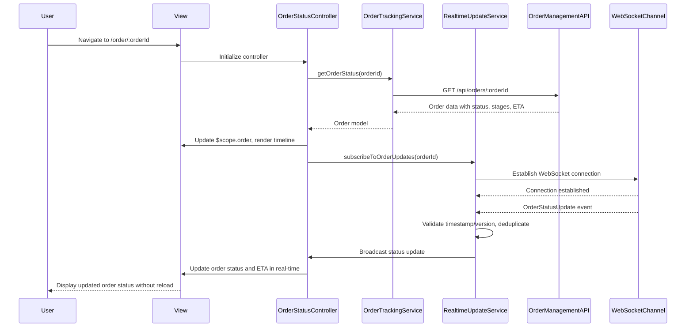

# Low-Level Design: QE-4492 - Real-Time Order Status and Timeline Management

## a. Architecture Mapping

**Component to Artifact Mapping:**
- Customer Web/Mobile Client → OrderTrackingModule + OrderStatusController + orderStatus.html view
- Order Tracking Service integration → OrderTrackingService (Service)
- Real-time Channel (WebSocket/SSE) → RealtimeUpdateService (Factory singleton) + WebSocketInterceptor
- Order status timeline display → orderTimeline Directive
- Authentication/Authorization → AuthInterceptor ($httpProvider.interceptors)
- State persistence and recovery → OrderStateCacheFactory (Factory singleton)
- Analytics integration → AnalyticsService (Service)

**Recommended Folder Structure:**
```
app/
  orderTracking/
    orderTracking.module.js
    orderStatus.controller.js
    orderTracking.service.js
    realtimeUpdate.service.js
    orderStateCache.factory.js
    orderTracking.routes.js
    views/orderStatus.html
  shared/
    services/analytics.service.js
    directives/orderTimeline.directive.js
    interceptors/auth.interceptor.js
    interceptors/websocket.interceptor.js
```

## b. Component Specifications

| Name | Artifact Type | Responsibility | Key Dependencies |
|------|---------------|----------------|------------------|
| OrderTrackingModule | Module | Groups order tracking features and declares dependencies | ui.router, ngResource |
| OrderStatusController | Controller | Manages order status view state, handles user interactions, coordinates timeline updates | OrderTrackingService, RealtimeUpdateService, OrderStateCacheFactory, $scope |
| OrderTrackingService | Service | Fetches order status, ETA, and fulfillment stages from Order Management, Restaurant, and ETA services via REST | $http, $q, API_CONFIG |
| RealtimeUpdateService | Factory | Establishes and manages WebSocket/SSE connection for live status updates, handles reconnection logic | $rootScope, $window, OrderStateCacheFactory |
| OrderStateCacheFactory | Factory | Persists order state to localStorage, provides last known state on network failure, deduplicates events by timestamp | $window.localStorage |
| orderTimeline | Directive | Renders visual timeline showing completed, current, and upcoming fulfillment stages | None |
| AuthInterceptor | Interceptor | Attaches authentication tokens to API requests, enforces account/session-based access control | $q, AuthService |
| WebSocketInterceptor | Interceptor | Handles WebSocket connection errors and retry logic | $q, RealtimeUpdateService |
| AnalyticsService | Service | Sends tracking events to analytics pipeline for product and operational metrics | $http, ANALYTICS_CONFIG |

## c. Data Model

```js
Order = {
  orderId: String,
  customerId: String,
  status: String,
  currentStage: String,
  estimatedDeliveryTime: Date,
  createdAt: Date,
  updatedAt: Date,
  timeline: Array<TimelineStage>
}

TimelineStage = {
  stage: String,
  status: String,
  timestamp: Date,
  message: String
}

OrderStatusUpdate = {
  orderId: String,
  status: String,
  stage: String,
  eta: Date,
  timestamp: Number,
  version: Number
}
```

## d. Data Flow

User navigates to order tracking page → orderStatus.html view loads and OrderStatusController initializes → Controller calls OrderTrackingService.getOrderStatus(orderId) → Service sends GET request to Order Management Service API, fetches ETA from ETA Service, and retrieves restaurant preparation status → Service returns aggregated Order model to Controller → Controller updates $scope.order and renders timeline via orderTimeline directive → RealtimeUpdateService establishes WebSocket/SSE connection and listens for OrderStatusUpdate events → On receiving update, service validates timestamp/version for deduplication, updates OrderStateCacheFactory, and broadcasts event to Controller → Controller updates view with new status and ETA without page reload.

## e. Primary Sequence Diagram



## f. Implementation Notes

- Use `$inject` array annotation for all Controllers/Services to ensure minification safety
- Centralize all REST API calls in OrderTrackingService; Controllers never call $http directly
- Implement WebSocket reconnection with exponential backoff in RealtimeUpdateService using $timeout
- Use ES6 arrow functions, const/let, and template literals throughout (Babel transpilation assumed)
- Deduplicate incoming events by comparing timestamp and version fields; discard stale updates

## g. Error Handling

HTTP interceptor catches API failures and displays user-friendly error messages; WebSocket disconnections trigger automatic reconnection with last known state from OrderStateCacheFactory.

## h. Security Notes

Requires token-based authentication via AuthInterceptor; account/session-based access control enforced by backend API to ensure customers view only their own orders.