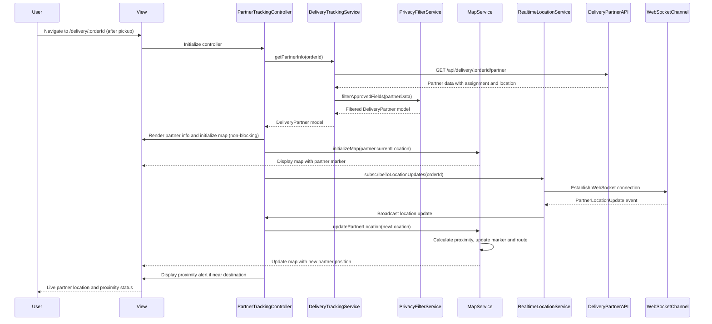

# Low-Level Design: QE-4493 - Delivery Partner Tracking and Live Location

## a. Architecture Mapping

**Component to Artifact Mapping:**
- Customer Web/Mobile Client → DeliveryTrackingModule + PartnerTrackingController + partnerTracking.html view
- Delivery Tracking Service integration → DeliveryTrackingService (Service)
- Map Provider API integration → MapService (Service)
- Real-time location updates → RealtimeLocationService (Factory singleton)
- Partner information display with privacy controls → partnerInfo Directive
- Live map rendering → deliveryMap Directive
- Privacy & Access Control → PrivacyFilterService (Service)

**Recommended Folder Structure:**
```
app/
  deliveryTracking/
    deliveryTracking.module.js
    partnerTracking.controller.js
    deliveryTracking.service.js
    map.service.js
    realtimeLocation.service.js
    privacyFilter.service.js
    deliveryTracking.routes.js
    views/partnerTracking.html
  shared/
    directives/partnerInfo.directive.js
    directives/deliveryMap.directive.js
    interceptors/auth.interceptor.js
```

## b. Component Specifications

| Name | Artifact Type | Responsibility | Key Dependencies |
|------|---------------|----------------|------------------|
| DeliveryTrackingModule | Module | Groups delivery partner tracking features and declares dependencies | ui.router, ngResource |
| PartnerTrackingController | Controller | Manages partner tracking view state, coordinates map updates, handles proximity alerts | DeliveryTrackingService, RealtimeLocationService, MapService, $scope |
| DeliveryTrackingService | Service | Fetches partner assignment, pickup status, and approved partner information via REST | $http, $q, PrivacyFilterService, API_CONFIG |
| MapService | Service | Integrates with Map Provider API for rendering partner location, routes, and proximity calculations | $http, MAP_PROVIDER_CONFIG |
| RealtimeLocationService | Factory | Manages WebSocket/SSE connection for live partner location updates at configurable intervals (10-30s) | $rootScope, $window |
| PrivacyFilterService | Service | Filters partner data to expose only approved fields per privacy and access control rules | PRIVACY_CONFIG |
| partnerInfo | Directive | Displays approved partner information (name, photo, contact options) with privacy-compliant rendering | PrivacyFilterService |
| deliveryMap | Directive | Renders interactive map with partner location marker and route polyline, handles non-blocking load | MapService |

## c. Data Model

```js
DeliveryPartner = {
  partnerId: String,
  name: String,
  photoUrl: String,
  approvedContactMethods: Array<String>,
  assignedAt: Date,
  pickupStatus: String,
  currentLocation: Location
}

Location = {
  latitude: Number,
  longitude: Number,
  timestamp: Date,
  accuracy: Number
}

PartnerLocationUpdate = {
  partnerId: String,
  orderId: String,
  location: Location,
  proximityStatus: String,
  timestamp: Number
}

MapConfig = {
  center: Location,
  zoom: Number,
  markers: Array<Marker>,
  polyline: Array<Location>
}
```

## d. Data Flow

User navigates to delivery tracking page after order pickup → partnerTracking.html view loads and PartnerTrackingController initializes → Controller calls DeliveryTrackingService.getPartnerInfo(orderId) → Service fetches partner assignment and approved information from Delivery Partner Service, applies PrivacyFilterService to filter sensitive fields → Service returns filtered DeliveryPartner model to Controller → Controller updates $scope.partner and renders partnerInfo directive → Controller initializes deliveryMap directive with non-blocking load → RealtimeLocationService establishes WebSocket connection and subscribes to partner location updates → On receiving PartnerLocationUpdate event, service updates $scope.partner.currentLocation → MapService recalculates route and proximity, updates map marker → Controller displays proximity alert when partner is near destination.

## e. Primary Sequence Diagram



## f. Implementation Notes

- Use `$inject` array annotation for minification safety across all Controllers/Services
- Map loading is asynchronous and non-blocking; show partner info and status immediately, map loads progressively
- When location data is unavailable, gracefully degrade by hiding map and showing status/ETA text only
- Location refresh interval configurable via MAP_PROVIDER_CONFIG (default 15s), balance real-time accuracy with API cost
- PrivacyFilterService enforces whitelist of approved partner fields; reject any fields not in PRIVACY_CONFIG

## g. Error Handling

HTTP interceptor handles API failures with user-friendly messages; missing location data triggers graceful degradation (hide map, show status only); WebSocket reconnection with exponential backoff.

## h. Security Notes

Privacy and access control enforced via PrivacyFilterService; only approved partner fields exposed; token-based authentication required via existing AuthInterceptor.