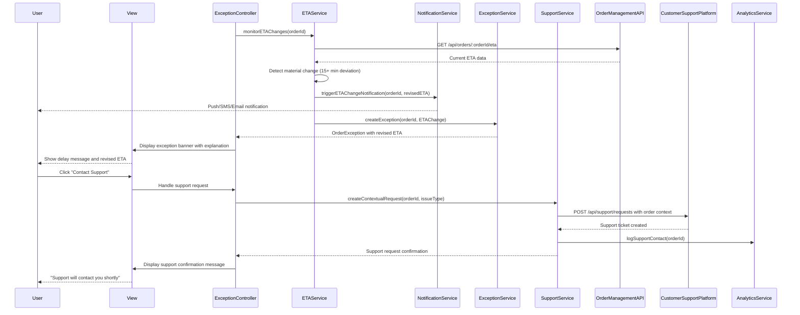

# Low-Level Design: QE-4494 - Exception Handling and Customer Support Integration

## a. Architecture Mapping

**Component to Artifact Mapping:**
- Customer Web/Mobile Client → ExceptionHandlingModule + ExceptionController + exception.html view
- Exception Management Service integration → ExceptionService (Service)
- Order Management Service integration → OrderManagementService (Service)
- ETA Service integration → ETAService (Service)
- Notification Service integration → NotificationService (Service)
- Customer Support Platform integration → SupportService (Service)
- Exception banner display → exceptionBanner Directive
- Order completion and rating → orderCompletion Directive
- Order history display → orderHistory Directive
- State machine validation → OrderStateValidator (Service)

**Recommended Folder Structure:**
```
app/
  exceptionHandling/
    exceptionHandling.module.js
    exception.controller.js
    exception.service.js
    orderManagement.service.js
    eta.service.js
    notification.service.js
    support.service.js
    orderStateValidator.service.js
    exceptionHandling.routes.js
    views/exception.html
  shared/
    directives/exceptionBanner.directive.js
    directives/orderCompletion.directive.js
    directives/orderHistory.directive.js
    services/analytics.service.js
```

## b. Component Specifications

| Name | Artifact Type | Responsibility | Key Dependencies |
|------|---------------|----------------|------------------|
| ExceptionHandlingModule | Module | Groups exception handling and support integration features | ui.router, ngResource |
| ExceptionController | Controller | Manages exception view state, handles delay/cancellation display, coordinates support access | ExceptionService, OrderManagementService, ETAService, SupportService, $scope |
| ExceptionService | Service | Detects and communicates delays, material ETA changes, and cancellations via REST | $http, $q, OrderStateValidator, API_CONFIG |
| OrderManagementService | Service | Fetches order state transitions and cancellation events from Order Management Service | $http, $q, OrderStateValidator |
| ETAService | Service | Detects material ETA changes (15+ min deviation) and provides revised delivery estimates | $http, $q, ETA_CONFIG |
| NotificationService | Service | Triggers push/SMS/email notifications for material ETA changes and exceptions | $http, NOTIFICATION_CONFIG |
| SupportService | Service | Provides contextual routing to Customer Support Platform with order context | $http, SUPPORT_CONFIG, AnalyticsService |
| OrderStateValidator | Service | Validates state transitions against allowed state machine rules to prevent invalid transitions | STATE_MACHINE_CONFIG |
| exceptionBanner | Directive | Displays exception banners with clear explanations for delays, cancellations, and ETA changes | None |
| orderCompletion | Directive | Transitions delivered orders to completed state, exposes rating and review capabilities | None |
| orderHistory | Directive | Maintains and displays order history for completed and cancelled orders | None |
| AnalyticsService | Service | Tracks support contact rates and completion rates for operational measurement | $http, ANALYTICS_CONFIG |

## c. Data Model

```js
OrderException = {
  orderId: String,
  exceptionType: String,
  message: String,
  revisedETA: Date,
  originalETA: Date,
  timestamp: Date,
  severity: String
}

OrderCancellation = {
  orderId: String,
  cancellationReason: String,
  cancelledAt: Date,
  nextSteps: Array<String>,
  refundStatus: String
}

ETAChange = {
  orderId: String,
  originalETA: Date,
  revisedETA: Date,
  deviationMinutes: Number,
  reason: String,
  timestamp: Date
}

SupportRequest = {
  orderId: String,
  customerId: String,
  issueType: String,
  context: Object,
  createdAt: Date
}

OrderCompletion = {
  orderId: String,
  completedAt: Date,
  status: String,
  ratingEnabled: Boolean,
  reviewEnabled: Boolean
}
```

## d. Data Flow

User views order tracking page → ExceptionController monitors order status via OrderManagementService → ETAService detects material ETA change (15+ min deviation) → Service calls NotificationService to trigger push/SMS/email notification → ExceptionService creates OrderException with revised ETA and explanation → Controller updates $scope.exception and renders exceptionBanner directive with clear message → If user clicks support button, Controller calls SupportService.createContextualRequest(orderId) → SupportService routes request to Customer Support Platform with order context and logs event to AnalyticsService → On order cancellation, OrderManagementService fetches OrderCancellation with next steps → Controller stops active tracking, displays cancellation information via exceptionBanner → On delivery, orderCompletion directive transitions order to completed state, exposes rating/review, and adds to order history via orderHistory directive.

## e. Primary Sequence Diagram



## f. Implementation Notes

- Use `$inject` array annotation for minification safety across all Controllers/Services
- Material ETA change threshold configurable via ETA_CONFIG (default 15 minutes), triggers automatic notification
- OrderStateValidator enforces state machine rules; reject invalid transitions at service layer before API call
- Completed and cancelled orders archived in orderHistory but removed from active tracking sessions
- AnalyticsService tracks support contact rates to measure exception handling effectiveness and identify improvement areas

## g. Error Handling

HTTP interceptor catches API failures and displays user-friendly error messages; state transition validation prevents invalid status changes; exception handling remains reliable during peak traffic via retry logic with exponential backoff.

## h. Security Notes

Requires token-based authentication via existing AuthInterceptor; state machine validation enforced server-side to prevent unauthorized status manipulation; support requests include order context but filter sensitive payment data.