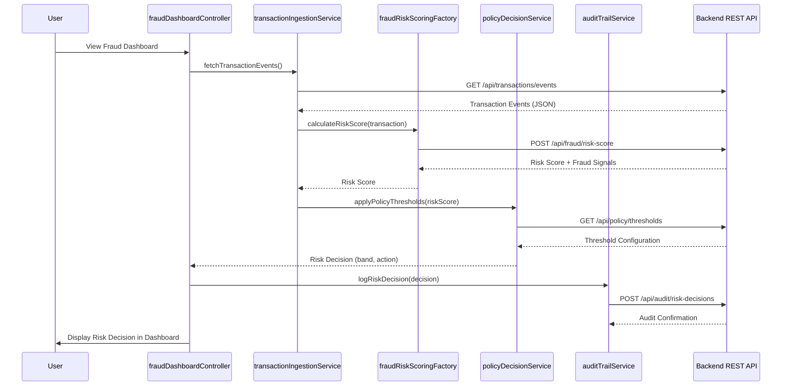

# Low-Level Design: Real-Time Fraud Detection System

**Epic ID:** QE-4495

## a. Architecture Mapping

- **Transaction Event Ingestion** → AngularJS Service (`transactionIngestionService`) + REST API integration
- **Fraud Risk Scoring Engine** → AngularJS Factory (`fraudRiskScoringFactory`) calling backend risk API
- **Policy Decision Engine** → AngularJS Service (`policyDecisionService`) for threshold evaluation and risk band classification
- **Risk Decision Output** → AngularJS Controller (`fraudDashboardController`) displaying risk decisions in UI
- **Audit Trail Storage** → Backend integration via AngularJS Service (`auditTrailService`)
- **Monitoring/Metrics** → Handled via HTTP interceptor and backend telemetry

**Recommended Folder Structure:**
```
/app
  /modules
    /fraud-detection
      /controllers
        - fraudDashboardController.js
      /services
        - transactionIngestionService.js
        - policyDecisionService.js
        - auditTrailService.js
      /factories
        - fraudRiskScoringFactory.js
      /views
        - fraud-dashboard.html
      /models
        - transactionModel.js
        - riskDecisionModel.js
  /shared
    /interceptors
      - httpInterceptor.js
```

## b. Component Specifications

| Component Name | Artifact Type | Responsibility | Key Dependencies |
|----------------|---------------|----------------|------------------|
| fraudDashboardController | Controller | Orchestrates fraud detection workflow, displays risk decisions and metrics | transactionIngestionService, policyDecisionService, $scope |
| transactionIngestionService | Service | Validates, deduplicates, and forwards transaction events to risk scoring | $http, fraudRiskScoringFactory |
| fraudRiskScoringFactory | Factory | Calls backend fraud risk API, returns risk score for transaction | $http, $q |
| policyDecisionService | Service | Applies configurable thresholds to risk scores, classifies into risk bands | auditTrailService |
| auditTrailService | Service | Logs risk decisions, model versions, and transaction metadata to backend audit API | $http |
| httpInterceptor | Interceptor | Handles authentication tokens, error responses, and retry logic | $q, $injector |
| transactionModel | Factory | Defines transaction event structure and validation methods | - |
| riskDecisionModel | Factory | Defines risk decision structure (score, band, timestamp, metadata) | - |

## c. Data Model

**TransactionEvent:**
```javascript
{
  transactionId: String,
  cardIdentifier: String,
  amount: Number,
  currency: String,
  merchantId: String,
  merchantName: String,
  merchantCategory: String,
  location: { latitude: Number, longitude: Number, country: String },
  timestamp: Date,
  authorizationStatus: String
}
```

**RiskDecision:**
```javascript
{
  transactionId: String,
  riskScore: Number,
  riskBand: String, // 'low', 'medium', 'high', 'confirmed_fraud'
  fraudSignals: Array, // ['unusual_amount', 'geographic_inconsistency', etc.]
  modelVersion: String,
  decisionTimestamp: Date,
  policyThresholds: { low: Number, medium: Number, high: Number }
}
```

**PolicyThreshold:**
```javascript
{
  thresholdId: String,
  riskBand: String,
  minScore: Number,
  maxScore: Number,
  action: String // 'allow', 'review', 'block'
}
```

## d. Data Flow

User views the fraud detection dashboard via `fraudDashboardController`, which triggers `transactionIngestionService` to fetch real-time transaction events from the backend REST API. Each transaction is passed to `fraudRiskScoringFactory`, which calls the fraud risk scoring API and returns a risk score. The `policyDecisionService` receives the score, applies configurable thresholds retrieved from the policy engine API, and classifies the transaction into a risk band (low/medium/high/confirmed fraud). The risk decision is sent to `auditTrailService` for persistent logging and simultaneously displayed in the dashboard UI with color-coded risk indicators. All API calls flow through the `httpInterceptor` for authentication, error handling, and retry logic.

## e. Primary Sequence Diagram



## f. Implementation Notes

- Use AngularJS Dependency Injection for all services, factories, and controllers to enable testability and modularity.
- Implement idempotency handling in `transactionIngestionService` using client-side transaction ID tracking (Set/Map) to prevent duplicate processing.
- Use `$http` service with promise-based flow (`$q`) for all REST API calls; handle async operations with `.then()` and `.catch()` chains.
- Configure `httpInterceptor` to attach authorization tokens, handle 401/403 responses, and implement exponential backoff retry for transient failures.
- Apply ES6 features (arrow functions, const/let, template literals, destructuring) in service and factory implementations for cleaner code.

## g. Error Handling

HTTP interceptor-based error handling with try/catch blocks in services; user notifications via Bootstrap modals or toast alerts for API failures and fallback to fail-safe policy when risk scoring engine is unavailable.

## h. Security Notes

Requires token-based authentication via existing SSO; all API calls must include authorization headers; sensitive transaction data encrypted in transit (HTTPS).