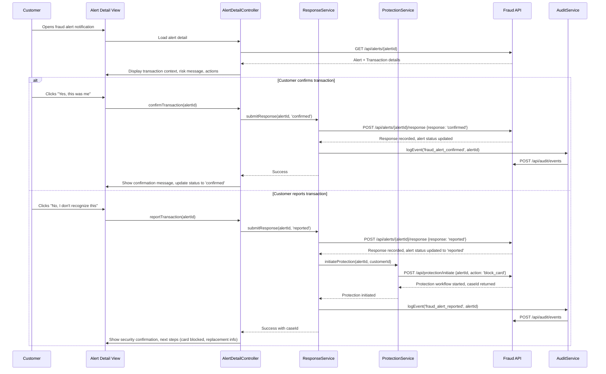

# Low-Level Design: Real-Time Fraud Detection System

**Epic ID:** QE-4505  
**Application Stack:** AngularJS 1.x, JavaScript ES6, HTML5, CSS3, Bootstrap, REST APIs, MVC Architecture

---

## a. Architecture Mapping

| HLD Component | AngularJS Artifact | Mapping |
|---------------|-------------------|----------|
| Transaction Event Ingestion | `fraudDetection.ingestion` Module + `TransactionIngestionService` Factory | Receives and validates transaction events from authorization platform via REST API |
| Fraud Risk Engine | `fraudDetection.riskEngine` Module + `RiskScoringService` Factory | Calculates risk scores using multiple signals (amount, merchant, geography, velocity, device) |
| Policy Decision Engine | `fraudDetection.policy` Module + `PolicyDecisionService` Factory | Maps risk scores to actions (approve, alert, step-up, hold, decline) using configurable thresholds |
| Risk Decision Output | `fraudDetection.alerts` Module + `AlertController` + `AlertService` Factory | Displays fraud alerts and manages customer responses (confirm/report) |
| Audit Trail Store | `fraudDetection.audit` Module + `AuditService` Factory | Records all risk decisions, alert lifecycle events, and customer responses |
| Alert Notification | `fraudDetection.notification` Module + `NotificationService` Factory | Delivers alerts via push/SMS/email with fallback support |
| Customer Response Handler | `AlertResponseController` + `ResponseService` Factory | Processes customer confirm/report actions and triggers protection workflows |
| Protection Workflow | `fraudDetection.protection` Module + `ProtectionService` Factory | Executes card/account security actions for unauthorized transactions |

**Recommended Folder Structure:**
```
app/
├── modules/
│   └── fraud-detection/
│       ├── ingestion/
│       │   ├── transaction-ingestion.service.js
│       │   └── transaction-ingestion.controller.js
│       ├── risk-engine/
│       │   ├── risk-scoring.service.js
│       │   └── risk-signals.factory.js
│       ├── policy/
│       │   ├── policy-decision.service.js
│       │   └── threshold-config.service.js
│       ├── alerts/
│       │   ├── alert.controller.js
│       │   ├── alert.service.js
│       │   ├── alert-list.component.js
│       │   └── alert-detail.component.js
│       ├── notification/
│       │   └── notification.service.js
│       ├── response/
│       │   ├── alert-response.controller.js
│       │   └── response.service.js
│       ├── protection/
│       │   └── protection.service.js
│       ├── audit/
│       │   └── audit.service.js
│       └── fraud-detection.module.js
├── models/
│   └── fraud-models.js
├── views/
│   └── fraud-detection/
│       ├── alert-list.html
│       └── alert-detail.html
└── shared/
    └── interceptors/
        └── fraud-api.interceptor.js
```

---

## b. Component Specifications

| Component Name | Artifact Type | Responsibility | Key Dependencies |
|----------------|---------------|----------------|------------------|
| `fraudDetection` | Module | Root module for fraud detection system | `ngRoute`, `ngResource`, `ui.bootstrap` |
| `TransactionIngestionService` | Factory | Validates, deduplicates (idempotency), and normalizes transaction events from authorization platform | `$http`, `$q`, `IdempotencyService` |
| `RiskScoringService` | Factory | Evaluates transaction risk using amount, merchant, geography, velocity, device signals; returns risk score and level | `$http`, `RiskSignalsFactory`, `$log` |
| `RiskSignalsFactory` | Factory | Extracts and processes individual risk signals (amount anomaly, merchant behavior, geo inconsistency, velocity, device risk) | None |
| `PolicyDecisionService` | Factory | Maps risk score to action (approve/alert/step-up/hold/decline) using configurable thresholds | `$http`, `ThresholdConfigService` |
| `ThresholdConfigService` | Factory | Retrieves and caches configurable risk thresholds from backend | `$http`, `$cacheFactory` |
| `AlertService` | Factory | CRUD operations for fraud alerts; fetches alert list and detail | `$resource`, `API_ENDPOINTS` |
| `AlertController` | Controller | Manages alert list view; filters by status (active/resolved) | `AlertService`, `$scope`, `$location` |
| `AlertDetailController` | Controller | Displays transaction details, risk context, and confirm/report actions | `AlertService`, `ResponseService`, `$routeParams`, `$scope` |
| `AlertListComponent` | Component | Renders list of fraud alerts with status badges and navigation | `AlertService` |
| `AlertDetailComponent` | Component | Renders alert detail card with transaction context and action buttons | `ResponseService` |
| `NotificationService` | Factory | Sends alerts via push/SMS/email with fallback logic and delivery status tracking | `$http`, `$q` |
| `ResponseService` | Factory | Submits customer response (confirm/report) to backend; triggers protection workflow for 'report' | `$http`, `ProtectionService`, `AuditService` |
| `ProtectionService` | Factory | Initiates card/account security workflows (block, replacement, investigation) | `$http`, `$q` |
| `AuditService` | Factory | Logs all fraud events (alert creation, delivery, response, protection action) with model version tracking | `$http` |
| `IdempotencyService` | Factory | Checks and stores idempotency keys to prevent duplicate processing | `$cacheFactory`, `$http` |
| `FraudApiInterceptor` | Factory (Interceptor) | Adds auth tokens, handles API errors, implements retry logic for fraud API calls | `$q`, `AuthService` |

---

## c. Data Model

**Transaction**
```javascript
{
  transactionId: String,
  accountId: String,
  cardId: String,
  merchant: String,
  amount: Number,
  currency: String,
  timestamp: Date,
  channel: String,
  location: { lat: Number, lng: Number, country: String },
  deviceId: String,
  idempotencyKey: String
}
```

**RiskDecision**
```javascript
{
  decisionId: String,
  transactionId: String,
  riskScore: Number,
  riskBand: String, // 'low' | 'medium' | 'high' | 'confirmed_fraud'
  modelVersion: String,
  decision: String, // 'approve' | 'alert' | 'step_up' | 'hold' | 'decline'
  signals: {
    amountAnomaly: Boolean,
    merchantRisk: String,
    geoInconsistency: Boolean,
    velocityAlert: Boolean,
    deviceRisk: String
  },
  timestamp: Date
}
```

**Alert**
```javascript
{
  alertId: String,
  transactionId: String,
  customerId: String,
  severity: String, // 'low' | 'medium' | 'high' | 'critical'
  status: String, // 'created' | 'queued' | 'delivered' | 'viewed' | 'confirmed' | 'reported' | 'resolved' | 'expired'
  transaction: Transaction,
  riskMessage: String,
  createdAt: Date,
  expiresAt: Date,
  viewedAt: Date,
  respondedAt: Date
}
```

**CustomerResponse**
```javascript
{
  responseId: String,
  alertId: String,
  customerId: String,
  response: String, // 'confirmed' | 'reported'
  authenticatedAt: Date,
  timestamp: Date
}
```

**FraudCase**
```javascript
{
  caseId: String,
  alertId: String,
  caseType: String,
  protectionAction: String, // 'block_card' | 'replace_card' | 'investigate' | 'dispute'
  status: String, // 'started' | 'in_progress' | 'completed'
  createdAt: Date,
  completedAt: Date
}
```

**AuditRecord**
```javascript
{
  auditId: String,
  eventType: String,
  alertId: String,
  transactionId: String,
  modelVersion: String,
  payload: Object,
  timestamp: Date
}
```

---

## d. Data Flow

When a credit card transaction occurs, the authorization platform publishes a transaction event to the backend API. The AngularJS `TransactionIngestionService` polls or receives webhook notifications and validates the event, checking idempotency to prevent duplicate processing. The `RiskScoringService` consumes the transaction and calculates a risk score by evaluating multiple signals (amount anomaly, merchant behavior, geographic inconsistency, velocity patterns, device risk). The `PolicyDecisionService` applies configurable thresholds to map the risk score to a specific action (approve, alert, step-up, hold, decline). If an alert is required, the `AlertService` creates an alert record and the `NotificationService` delivers it via push, SMS, or email with fallback support. The customer views the alert in the AngularJS UI via `AlertController` and `AlertDetailController`, which display transaction details and risk context. The customer responds by clicking "Yes, this was me" (confirm) or "No, I don't recognize this" (report). The `ResponseService` submits the response to the backend; if reported, it triggers the `ProtectionService` to initiate card/account security workflows (block, replacement, investigation). All events are logged by the `AuditService` with model version tracking. The UI updates alert status in real-time, and the customer sees confirmation of their action and next steps.

---

## e. Primary Sequence Diagram



---

## f. Implementation Notes

- **Module Organization**: Use feature-based module structure (`fraudDetection.ingestion`, `fraudDetection.riskEngine`, `fraudDetection.alerts`) with lazy-loading where supported by routing configuration.
- **Dependency Injection**: Leverage AngularJS DI for all services/factories; use explicit array annotation for minification safety (e.g., `['$http', '$q', function($http, $q) {...}]`).
- **REST API Integration**: Use `$resource` for CRUD operations on alerts; use `$http` with interceptors for risk scoring, policy decisions, and audit logging; implement retry logic in `FraudApiInterceptor`.
- **Idempotency**: `IdempotencyService` generates and stores unique keys per transaction event; backend validates idempotency keys to prevent duplicate alert creation.
- **Real-Time Updates**: Implement polling (via `$interval`) or WebSocket integration for alert status updates; use `$scope.$apply()` for digest cycle management if using WebSocket callbacks.
- **Configurable Thresholds**: `ThresholdConfigService` caches risk thresholds from backend API; cache invalidation on admin configuration changes; no hardcoded thresholds in client code.
- **Bootstrap UI**: Use `ui.bootstrap` components for alert modals, badges (risk severity), buttons (confirm/report), and responsive card layouts for alert list and detail views.

---

## g. Error Handling

Use `FraudApiInterceptor` for centralized error handling with retry logic for transient failures; display user-friendly error messages via Bootstrap modals or toast notifications; log errors to `AuditService` for operational visibility.

---

## h. Security Notes

Requires token-based authentication via existing SSO; all fraud alert and response endpoints require authenticated session; mask card numbers in UI (show last 4 digits only); use HTTPS for all API calls; implement CSRF protection on state-changing operations.