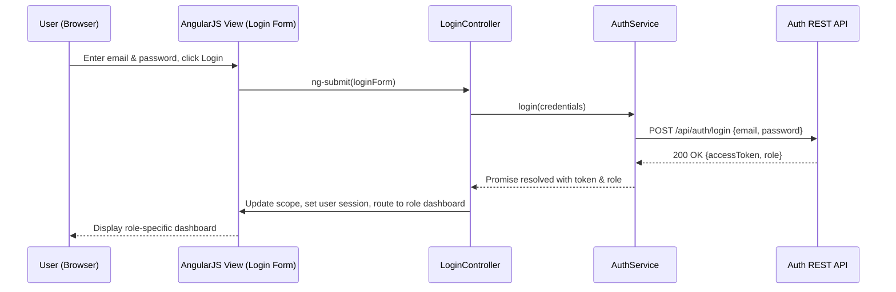

# LLD: User Lifecycle Management (Epic QE-4524)

## a. Architecture Mapping (brief)
- Registration & Onboarding → AngularJS Module `userLifecycleModule`, Controllers `RegistrationController`, `EmailConfirmationController`, Service `UserService`, Service `NotificationService`.
- Authentication & Login → Controller `LoginController`, Service `AuthService`, Factory `TokenStorageFactory`.
- Role-Based Access Control (RBAC) → Service `RbacService`, Directive `rbacVisible`, Constant `ROLE_CONFIG`.
- Password Reset → Controller `PasswordResetController`, Service `PasswordService`, Reuse `NotificationService`.
- User Profile Management → Controller `ProfileController`, Service `UserService` (profile APIs), Directive `userProfileCard`.
- Dashboards (Buyer/Seller/Admin) → Controllers `BuyerDashboardController`, `SellerDashboardController`, `AdminDashboardController`, shared Service `DashboardService`.

**Recommended Folder Structure**
- `/app/modules/user-lifecycle/user-lifecycle.module.js`
- `/app/modules/user-lifecycle/controllers/registration.controller.js`
- `/app/modules/user-lifecycle/controllers/login.controller.js`
- `/app/modules/user-lifecycle/controllers/password-reset.controller.js`
- `/app/modules/user-lifecycle/controllers/profile.controller.js`
- `/app/modules/user-lifecycle/controllers/*.dashboard.controller.js`
- `/app/modules/user-lifecycle/services/auth.service.js`
- `/app/modules/user-lifecycle/services/user.service.js`
- `/app/modules/user-lifecycle/services/notification.service.js`
- `/app/modules/user-lifecycle/services/rbac.service.js`
- `/app/modules/user-lifecycle/factories/token-storage.factory.js`
- `/app/modules/user-lifecycle/directives/rbac-visible.directive.js`
- `/app/modules/user-lifecycle/directives/user-profile-card.directive.js`
- `/app/modules/user-lifecycle/views/*.html`

## b. Component Specifications (table format)

| Name                       | Artifact Type | Responsibility (1 line)                                         | Key Dependencies                          |
|----------------------------|--------------|------------------------------------------------------------------|-------------------------------------------|
| userLifecycleModule        | Module       | Bundle all user lifecycle components and route config.          | ui.router, AuthService, UserService       |
| RegistrationController     | Controller   | Handle registration form, client validation, submit to API.     | UserService, NotificationService          |
| EmailConfirmationController| Controller   | Verify email token and activate account via API.                | UserService, $stateParams                 |
| LoginController            | Controller   | Manage login form and call AuthService for authentication.      | AuthService, TokenStorageFactory          |
| PasswordResetController    | Controller   | Orchestrate reset-request and new-password submission.          | PasswordService, NotificationService      |
| ProfileController          | Controller   | Fetch and update user profile data.                             | UserService                               |
| BuyerDashboardController   | Controller   | Render buyer dashboard summary and actions.                     | DashboardService, RbacService             |
| SellerDashboardController  | Controller   | Render seller dashboard with listings and metrics.              | DashboardService, RbacService             |
| AdminDashboardController   | Controller   | Render admin dashboard for approvals and monitoring.            | DashboardService, RbacService             |
| AuthService                | Service      | Perform login/logout, token issuance/refresh, lockout handling. | $http, TokenStorageFactory                |
| UserService                | Service      | Manage user CRUD (register, activate, profile update).          | $http                                      |
| PasswordService            | Service      | Handle password reset token generation and update.              | $http, NotificationService                |
| NotificationService        | Service      | Abstract email/SMS notification REST calls.                     | $http                                      |
| DashboardService           | Service      | Fetch dashboard widgets per role from backend.                  | $http, RbacService                         |
| RbacService                | Service      | Resolve roles, permissions and guard routes/views.              | AuthService, ROLE_CONFIG                  |
| TokenStorageFactory        | Factory      | Provide wrapper over localStorage/sessionStorage for tokens.    | $window                                   |
| rbacVisible                | Directive    | Show/hide DOM elements based on user role/permission.           | RbacService                               |
| userProfileCard            | Directive    | Reusable profile summary card component.                        |                                           |
| ROLE_CONFIG                | Constant     | Static mapping of roles to permissions.                         |                                           |

## c. Data Model (brief)

- `User` (Object):
  - `id: string`
  - `email: string`
  - `passwordHash: string`
  - `firstName: string`
  - `lastName: string`
  - `role: 'BUYER' | 'SELLER' | 'ADMIN'`
  - `status: 'PENDING_VERIFICATION' | 'ACTIVE' | 'LOCKED'`
  - `createdAt: string` (ISO 8601)
  - `updatedAt: string` (ISO 8601)

- `AuthToken` (Object):
  - `accessToken: string`
  - `expiresIn: number`
  - `refreshToken?: string`
  - `issuedAt: string` (ISO 8601)

- `PasswordResetRequest` (Object):
  - `email: string`
  - `resetToken: string`
  - `expiresAt: string` (ISO 8601)

- `RolePermission` (Object):
  - `role: string`
  - `permissions: string[]`

## d. Data Flow (one paragraph)

When a user interacts with the application, they trigger a UI event in the AngularJS view (HTML5/Bootstrap forms) which is bound via `ng-submit`/`ng-click` to a controller; the controller validates inputs and calls the appropriate service (e.g., `AuthService`, `UserService`) which uses `$http` to invoke REST APIs on the backend, and upon success or failure, the service returns ES6 promises to the controller which then updates scoped models, triggers route transitions, and refreshes the Bootstrap-based UI to reflect the latest user lifecycle state (registered, authenticated, role-routed, or locked).

## e. Primary Sequence Diagram (ONE only)

## f. Implementation Notes (brief)

- Use a dedicated AngularJS module with `ui.router` for state-based routing per role.
- Implement services as ES6 classes wrapped in AngularJS services/factories for DI.
- Use `$http` interceptors to attach JWT tokens from `TokenStorageFactory` to all API calls.
- Centralize role checks in `RbacService` and reuse via route `resolve` and `rbacVisible` directive.
- Ensure all REST calls return promises and are handled with concise success/error callbacks in controllers.

## g. Error Handling (ONE line)

Use an `$http` interceptor to normalize API errors and surface user-friendly messages via a shared notification component.

## h. Security Notes (ONE line)

Standard input validation, secure TLS-backed API calls, and server-issued hashed passwords/JWT tokens are assumed in line with the HLD's security and compliance requirements.