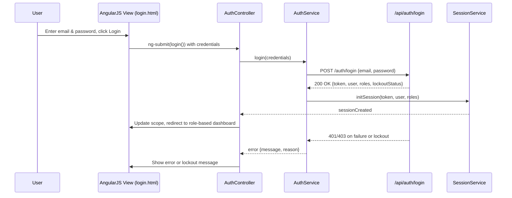

# Epic QE-4524 – User Lifecycle Management LLD (AngularJS/ES6)

## a. Architecture Mapping (brief)

**HLD Components → AngularJS Artifacts**
- Web Application Layer → `userApp` AngularJS module, `AuthController`, `RegistrationController`, `ProfileController`, `RbacController`
- Authentication Service → `AuthService` (service), `AuthInterceptor` (factory), `SessionService` (service)
- User Management Service → `UserService` (service), `RegistrationService` (service)
- Email Notification Service → `NotificationService` (service)
- User Database → REST APIs (`/api/users`, `/api/auth`, `/api/roles`) consumed via AngularJS services

**Recommended Folder Structure (short list)**
- `app/` – AngularJS bootstrap and main module
- `app/controllers/` – `auth.controller.js`, `registration.controller.js`, `profile.controller.js`, `rbac.controller.js`
- `app/services/` – `auth.service.js`, `session.service.js`, `user.service.js`, `registration.service.js`, `notification.service.js`
- `app/factories/` – `auth-interceptor.factory.js`
- `app/views/` – `login.html`, `register.html`, `email-confirmation.html`, `password-reset.html`, `profile.html`, `admin-user-management.html`
- `app/assets/css/` – `styles.css` (Bootstrap overrides)
- `app/config/` – `routes.config.js`, `http.config.js`

## b. Component Specifications (table format)

| Name | Artifact Type | Responsibility (1 line) | Key Dependencies |
|------|---------------|-------------------------|------------------|
| userApp | Module | Root AngularJS module wiring controllers, services, routes, and interceptors. | ngRoute, ngMessages, AuthInterceptor |
| AuthController | Controller | Handle login, logout, token-based session init, and lockout messaging. | AuthService, SessionService |
| RegistrationController | Controller | Manage buyer/seller registration forms, submission, and success/error flows. | RegistrationService, NotificationService |
| ProfileController | Controller | Provide user profile view/edit screens for basic account management. | UserService, SessionService |
| RbacController | Controller | Admin UI for assigning roles (buyer/seller/admin) and activating accounts. | UserService, AuthService |
| AuthService | Service | Call authentication APIs for login, logout, token refresh, and password reset. | $http, SessionService |
| SessionService | Service | Maintain client-side session (JWT, user, roles) in memory/localStorage. | $window, AuthService |
| UserService | Service | Wrap CRUD operations for user accounts, roles, and lockout status. | $http |
| RegistrationService | Service | Orchestrate registration calls, email verification token handling, and flow status. | $http, NotificationService |
| NotificationService | Service | Trigger email notification APIs for confirmation and reset flows. | $http |
| AuthInterceptor | Factory | Attach auth tokens to requests, handle 401/403 responses, and redirect to login. | $q, $injector, SessionService |
| login.html | View | Present login form with email/password, error messages, and lockout notice. | AuthController, styles.css |
| register.html | View | Capture buyer/seller registration data, role preference, and terms acceptance. | RegistrationController, Bootstrap forms |
| email-confirmation.html | View | Display confirmation status when user hits verification link. | RegistrationController |
| password-reset.html | View | Allow requesting reset link and setting new password. | AuthController |
| profile.html | View | Show and edit basic profile attributes and communication preferences. | ProfileController |
| admin-user-management.html | View | Admin grid for searching, activating, and role-managing users. | RbacController, UserService |
| routes.config.js | Config | Configure routes for auth, registration, profile, and admin screens. | $routeProvider |
| http.config.js | Config | Register HTTP interceptor and default headers/security configuration. | $httpProvider, AuthInterceptor |

## c. Data Model (brief)

**User**
- `id`: String
- `email`: String
- `passwordHash`: String
- `firstName`: String
- `lastName`: String
- `role`: String (`'buyer' | 'seller' | 'admin'`)
- `status`: String (`'pending' | 'active' | 'locked'`)
- `failedLoginAttempts`: Number
- `lastLoginAt`: Date

**AuthSession**
- `token`: String
- `userId`: String
- `roles`: Array<String>
- `expiresAt`: Date

**EmailVerificationToken**
- `token`: String
- `userId`: String
- `expiresAt`: Date
- `status`: String (`'issued' | 'used' | 'expired'`)

**PasswordResetToken**
- `token`: String
- `userId`: String
- `expiresAt`: Date
- `status`: String

## d. Data Flow (one paragraph)

User submits registration or login via a Bootstrap-styled AngularJS view bound to an appropriate controller, which validates inputs and invokes the corresponding service; the service issues REST API calls to the backend (user management or authentication endpoints), receives responses containing tokens, statuses, and user data, updates the `SessionService` and scope models, and the controller then triggers UI updates such as navigation to dashboards, showing confirmation messages, or displaying lockout notices based on the API result.

## e. Primary Sequence Diagram (ONE only)

## f. Implementation Notes (brief)

- Use AngularJS 1.x module pattern with dependency injection for controllers, services, and factories.
- Implement ES6 classes where feasible (transpiled) for services to keep logic encapsulated and testable.
- Configure `$httpProvider.interceptors` to register `AuthInterceptor` for attaching JWT and handling auth errors.
- Drive all user/auth operations through REST APIs with JSON payloads, keeping controllers thin and delegating to services.
- Use Bootstrap form components and AngularJS form validation (`ngMessages`) for registration/login UX.

## g. Error Handling (ONE line)

Centralized HTTP interceptor-based error handling with controller-level fallbacks to show concise user notifications.

## h. Security Notes (ONE line)

Passwords and tokens handled via secure REST APIs with TLS, lockout after repeated failures, and standard input validation and secure API calls assumed.