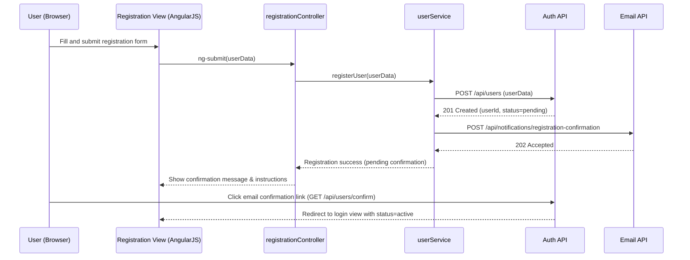

# QE-4524 – User Lifecycle Management LLD

## a. Architecture Mapping (brief)

- Registration & onboarding → `userLifecycleModule`, `registrationController`, `userService`, `emailService` (AngularJS module, controller, services)
- Authentication & login → `authController`, `authService`, `sessionService`
- Role-based access control (RBAC) → `rbacService`, `roleDirective` (show/hide UI by role)
- Password reset → `passwordResetController`, `authService`, `emailService`
- User profile & account management → `profileController`, `userService`

**Recommended folder structure**
- `app/modules/userLifecycle/`
- `app/controllers/` (e.g., `registrationController.js`, `authController.js`, `profileController.js`, `passwordResetController.js`)
- `app/services/` (e.g., `userService.js`, `authService.js`, `emailService.js`, `sessionService.js`, `rbacService.js`)
- `app/directives/` (e.g., `roleDirective.js`)
- `app/views/` (e.g., `registration.html`, `login.html`, `profile.html`, `password-reset.html`)
- `assets/css/user.css`

## b. Component Specifications

| Name                       | Artifact Type  | Responsibility                                       | Key Dependencies                          |
|----------------------------|----------------|------------------------------------------------------|-------------------------------------------|
| `userLifecycleModule`      | AngularJS Module | Configure user lifecycle components & routes         | `ngRoute`, `userService`, `authService`   |
| `registrationController`   | Controller     | Handle user registration form and submit             | `userService`, `emailService`, `$scope`   |
| `authController`           | Controller     | Manage login/logout and authentication state         | `authService`, `sessionService`, `$scope` |
| `profileController`        | Controller     | Display and update user profile and account settings | `userService`, `sessionService`           |
| `passwordResetController`  | Controller     | Orchestrate password reset request and completion    | `authService`, `emailService`, `$scope`   |
| `userService`              | Service        | CRUD operations on user entities via REST APIs       | `$http`, `sessionService`                 |
| `authService`              | Service        | Authentication, token handling, lockout enforcement  | `$http`, `$q`, `sessionService`           |
| `emailService`             | Service        | Trigger email notifications for registration/reset   | `$http` (notification API)                |
| `sessionService`           | Service        | Manage JWT/session token and current user context    | `window.localStorage`, `$rootScope`       |
| `rbacService`             | Service        | Resolve user roles and permissions from server       | `$http`, `sessionService`                 |
| `roleDirective`            | Directive      | Show/hide DOM elements based on current user role    | `rbacService`, `sessionService`           |

## c. Data Model (brief)

**User**
- `id`: String (UUID)
- `email`: String
- `passwordHash`: String
- `firstName`: String
- `lastName`: String
- `role`: String (`"buyer" | "seller" | "admin"`)
- `status`: String (`"pending" | "active" | "locked"`)
- `createdAt`: Date
- `updatedAt`: Date

**AuthToken**
- `token`: String
- `expiresAt`: Date
- `userId`: String
- `roles`: Array<String>

**PasswordResetRequest**
- `id`: String
- `userId`: String
- `resetToken`: String
- `expiresAt`: Date
- `used`: Boolean

## d. Data Flow (one paragraph)

User submits a registration or login form in the Bootstrap-based view, which binds data to the corresponding AngularJS controller; the controller validates input and calls the appropriate service (`userService` for registration, `authService` for login) that issues REST API requests to the backend, receives responses (user record, auth token, role set), updates `sessionService` and scope models, and the view reacts via AngularJS bindings and `roleDirective` to render the appropriate role-based UI while subsequent actions (profile updates, password reset) follow the same View → Controller → Service → API → UI Update cycle.

## e. Primary Sequence Diagram (ONE only)

## f. Implementation Notes (brief)

- Use AngularJS modules and dependency injection to wire controllers, services, and directives for the user lifecycle.
- Implement services with ES6 classes where appropriate, wrapped in AngularJS service/factory definitions.
- Use `$http` with a centralized interceptor to attach auth tokens and handle standard API errors.
- Manage session state (JWT or session token) via `sessionService` using `localStorage` and `$rootScope` events.
- Apply Bootstrap form components and AngularJS validation directives for responsive registration, login, and profile views.

## g. Error Handling (ONE line)

Client-side error handling via `$http` interceptor and controller-level promise rejections with concise user notifications.

## h. Security Notes (ONE line)

Standard input validation, secure TLS REST calls, hashed passwords, account lockout on repeated failures, and compliance with regional data privacy laws assumed.
