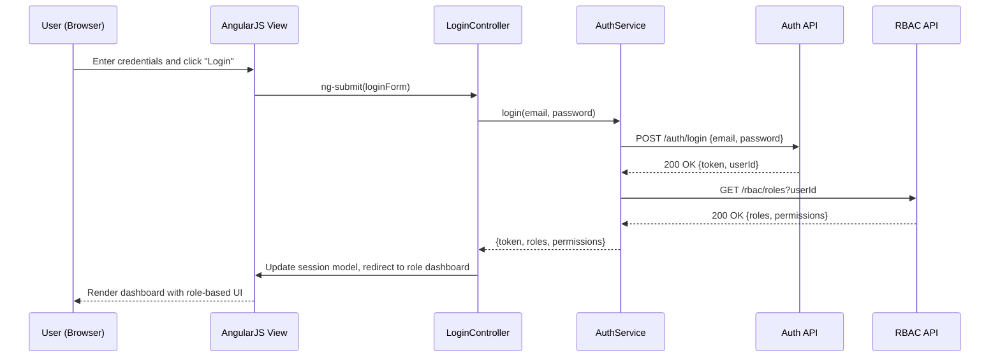

# Low-Level Design (LLD) – Epic QE-4524: User Lifecycle Management

## a. Architecture Mapping (brief)

- **User Registration & Profile Management** → `userModule` (AngularJS module), `RegistrationController`, `UserProfileController`, `UserService`, `NotificationService`.
- **Authentication & Session Handling** → `authModule`, `LoginController`, `AuthService`, `TokenInterceptor`.
- **Role-Based Access Control (RBAC)** → `rbacModule`, `RbacService`, `RoleGuardDirective`.
- **Password Reset Workflow** → `authModule`, `PasswordResetController`, `AuthService`, `NotificationService`.
- **Admin User Management (approve sellers, manage roles)** → `adminModule`, `AdminUserController`, `AdminUserService`.

**Recommended folder structure**
- `app/modules/user/` – controllers, services, views for registration/profile.
- `app/modules/auth/` – login, logout, password reset, token interceptor.
- `app/modules/admin/` – admin dashboards and user management.
- `app/shared/services/` – `UserService`, `AuthService`, `NotificationService`, `RbacService`.
- `app/shared/directives/` – `RoleGuardDirective`, common UI directives.
- `app/shared/models/` – JS models for `User`, `Role`, `Session`, `PasswordResetToken`.
- `assets/css/` – module-level styles, responsive layout.

---

## b. Component Specifications

| Name                     | Artifact Type      | Responsibility                                             | Key Dependencies                         |
|--------------------------|--------------------|------------------------------------------------------------|------------------------------------------|
| userModule               | AngularJS Module   | Bundle user registration and profile features             | `UserService`, `NotificationService`     |
| authModule               | AngularJS Module   | Bundle authentication, session, and password reset flows  | `AuthService`, `TokenInterceptor`        |
| adminModule              | AngularJS Module   | Bundle admin user and role management features            | `AdminUserService`, `RbacService`        |
| rbacModule               | AngularJS Module   | Bundle role and permission handling utilities             | `RbacService`                            |
| RegistrationController   | Controller         | Handle user registration form, validation, submission     | `UserService`, `NotificationService`     |
| UserProfileController    | Controller         | Manage user profile view/edit operations                  | `UserService`, `AuthService`             |
| LoginController          | Controller         | Handle login form, credential submission, error display   | `AuthService`                            |
| PasswordResetController  | Controller         | Orchestrate password reset request and confirmation flows | `AuthService`, `NotificationService`     |
| AdminUserController      | Controller         | Admin dashboard for user listing, approvals, role changes | `AdminUserService`, `RbacService`        |
| UserService              | Service            | CRUD operations on user accounts and profiles             | `$http`, REST `User API`                 |
| AuthService              | Service            | Login, logout, token handling, lockout and password reset | `$http`, REST `Auth API`                 |
| AdminUserService         | Service            | Admin-only operations on users and roles                  | `$http`, REST `Admin User API`           |
| NotificationService      | Service            | Trigger email/SMS notifications via backend APIs          | `$http`, REST `Notification API`         |
| RbacService              | Service            | Resolve roles/permissions and expose checks to UI         | `AuthService`, REST `RBAC API`           |
| TokenInterceptor         | HTTP Interceptor   | Attach JWT/session tokens, handle 401/403 globally        | `$http`, `AuthService`                   |
| RoleGuardDirective       | Directive          | Show/hide elements or routes based on user role          | `RbacService`, `AuthService`             |
| User                     | JS Model           | Represent user entity in client code                     | N/A                                      |
| Role                     | JS Model           | Represent role with permissions for RBAC                 | N/A                                      |
| Session                  | JS Model           | Represent authenticated session/token state              | N/A                                      |
| PasswordResetToken       | JS Model           | Represent password reset request and token metadata      | N/A                                      |

---

## c. Data Model (brief)

- **User** (JS object)
  - `id: String` – unique identifier.
  - `email: String` – validated email address.
  - `passwordHash: String` – server-generated password hash (never plain text).
  - `firstName: String` – given name.
  - `lastName: String` – family name.
  - `role: String` – `"buyer" | "seller" | "admin"`.
  - `status: String` – `"pending" | "active" | "locked" | "disabled"`.
  - `emailVerified: Boolean` – email confirmation flag.
  - `createdAt: Date` – account creation timestamp.
  - `updatedAt: Date` – last profile update timestamp.

- **Role**
  - `name: String` – role key (`buyer`, `seller`, `admin`).
  - `permissions: Array<String>` – list of permission identifiers.

- **Session**
  - `token: String` – JWT/session token.
  - `expiresAt: Date` – expiry timestamp.
  - `userId: String` – associated user id.
  - `roles: Array<String>` – active roles for session.

- **PasswordResetToken**
  - `token: String` – reset token value.
  - `userId: String` – associated user id.
  - `expiresAt: Date` – expiry time.
  - `used: Boolean` – flag indicating token consumption.

---

## d. Data Flow (one paragraph)

The user initiates registration, login, or password reset via an AngularJS view bound to the relevant controller, which validates form inputs and invokes `UserService` or `AuthService` as appropriate; these services call REST APIs (User, Auth, Admin User, Notification, RBAC) to create or authenticate the user, issue tokens, send email notifications, and resolve role permissions, after which the controller updates scoped models and triggers UI changes (navigation to dashboards, role-based view toggling) using Angular bindings so the browser reflects the latest user/session state.

---

## e. Primary Sequence Diagram (ONE only)

---

## f. Implementation Notes (brief)

- Use AngularJS modules per domain (`userModule`, `authModule`, `adminModule`, `rbacModule`) with DI for controllers and services.
- Implement ES6 classes for services and models, transpiled where needed, while keeping AngularJS DI annotations explicit.
- Centralize REST calls via `$http`-based services and handle tokens through `TokenInterceptor` attached to `$httpProvider.interceptors`.
- Use UI-Router or `ngRoute` with route-level guards that consult `AuthService`/`RbacService` for role-based navigation.
- Ensure forms use AngularJS validation directives with minimal custom directives for reusable input patterns.

---

## g. Error Handling (ONE line)

Client-side error handling via `$http` interceptor and controller-level promise rejections that surface concise messages in the views.

---

## h. Security Notes (ONE line)

Standard input validation and secure API calls assumed, with enforced account lockout and TLS-backed communication for all auth-related requests.
