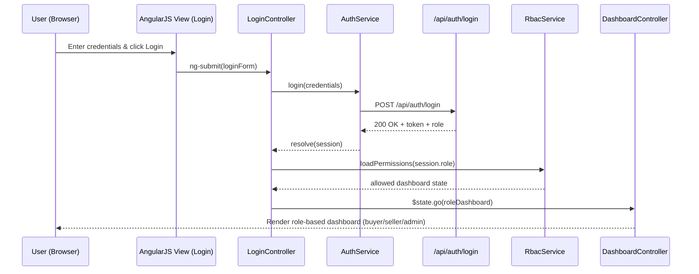

# Low-Level Design (LLD) – Epic QE-4524 – User Lifecycle Management

## a. Architecture Mapping (brief)
- Registration & Onboarding → `userAuthModule` (AngularJS module), `RegistrationController`, `UserService`, `EmailService`.
- Authentication & Session Handling → `userAuthModule`, `LoginController`, `AuthService`, HTTP interceptor.
- Role-Based Access Control (RBAC) → `userAuthModule`, `RbacService`, `DashboardController`, route config.
- Password Reset → `userAuthModule`, `PasswordResetController`, `AuthService`, `EmailService`.
- User Profile Management → `userProfileModule`, `ProfileController`, `UserService`.

**Recommended folder structure (short list)**
- `app/`
  - `modules/user-auth/userAuth.module.js`
  - `modules/user-auth/controllers/registration.controller.js`
  - `modules/user-auth/controllers/login.controller.js`
  - `modules/user-auth/controllers/password-reset.controller.js`
  - `modules/user-auth/services/auth.service.js`
  - `modules/user-auth/services/user.service.js`
  - `modules/user-auth/services/rbac.service.js`
  - `modules/shared/services/email.service.js`
  - `modules/user-profile/profile.module.js`
  - `modules/user-profile/controllers/profile.controller.js`
  - `modules/core/config/routes.config.js`
  - `assets/templates/*.html` (registration, login, dashboard, profile, password reset)

## b. Component Specifications (table)

| Name | Artifact Type | Responsibility (1 line) | Key Dependencies |
|------|---------------|-------------------------|------------------|
| `userAuthModule` | AngularJS Module | Bootstrap auth-related controllers, services, and route configs for user lifecycle flows. | AngularJS, `ui.router`/`ngRoute`, `AuthService`, `UserService`, `RbacService`. |
| `userProfileModule` | AngularJS Module | Encapsulate profile view and update features for buyers, sellers, and admins. | AngularJS, `UserService`. |
| `RegistrationController` | Controller | Handle registration form binding, client-side validation, and call `UserService` to create accounts. | `UserService`, `EmailService`, `$state`/`$location`, `NotificationService`. |
| `LoginController` | Controller | Manage login form, call `AuthService` for authentication, and route to role-specific dashboard. | `AuthService`, `RbacService`, `$state`/`$location`, `NotificationService`. |
| `PasswordResetController` | Controller | Orchestrate password reset request and confirmation flows using `AuthService`. | `AuthService`, `EmailService`, `$state`/`$location`, `NotificationService`. |
| `DashboardController` | Controller | Render dashboard data and navigation based on user role (buyer, seller, admin). | `RbacService`, `UserService`, `$stateParams`. |
| `ProfileController` | Controller | Present and update user profile information including contact details and seller verification metadata. | `UserService`, `NotificationService`. |
| `AuthService` | Service | Perform login, logout, token handling, and lockout logic via REST APIs. | `$http`, `$q`, `SessionService`, backend `/api/auth/*`. |
| `UserService` | Service | Manage user CRUD operations, registration flows, and profile updates via REST APIs. | `$http`, `$q`, backend `/api/users/*`. |
| `RbacService` | Service | Resolve and enforce role-based permissions and route access per user role. | `SessionService`, `AuthService`, route config. |
| `EmailService` | Service | Trigger email-related API calls for confirmations and password reset links. | `$http`, backend `/api/notifications/email`. |
| `SessionService` | Service/Factory | Encapsulate storage of JWT/session token and basic user metadata in `localStorage`/`sessionStorage`. | `$window`, `AuthService`. |
| `NotificationService` | Service | Provide lightweight toast/alert notifications for success and error states. | `angular-toastr`/Bootstrap alerts. |
| `AuthInterceptor` | HTTP Interceptor | Append auth token to outbound requests and route unauthorized responses to login. | `$q`, `$injector`, `SessionService`. |
| `routes.config` | Config Block | Define AngularJS routes/states for registration, login, dashboard, profile, and password reset. | `userAuthModule`, `userProfileModule`, `RbacService`. |

## c. Data Model (brief)

**Core JS Objects / Models**

1. `User`
```js
{
  id: String,              // UUID
  email: String,
  passwordHash: String,    // never exposed to UI; used only in responses where necessary
  firstName: String,
  lastName: String,
  role: String,            // 'buyer' | 'seller' | 'admin'
  status: String,          // 'pending' | 'active' | 'locked'
  emailVerified: Boolean,
  createdAt: Date,
  updatedAt: Date
}
```

2. `AuthSession`
```js
{
  token: String,           // JWT or opaque session token
  userId: String,
  role: String,
  expiresAt: Date,
  lastLoginAt: Date
}
```

3. `RegistrationRequest`
```js
{
  email: String,
  password: String,
  confirmPassword: String,
  roleRequested: String,   // 'buyer' | 'seller'
  sellerMetadata: Object   // optional, e.g., { storeName: String, taxId: String }
}
```

4. `PasswordResetRequest`
```js
{
  email: String,
  resetToken: String,
  newPassword: String,
  confirmPassword: String
}
```

5. `RbacRule`
```js
{
  role: String,
  allowedStates: Array<String>,
  allowedApis: Array<String>
}
```

## d. Data Flow (one paragraph)

When a user initiates a lifecycle action (registration, login, profile update, password reset) from the browser, the corresponding HTML5/Bootstrap view binds form data to the AngularJS controller, which performs basic validation and delegates to a service (`UserService` or `AuthService`); that service issues REST API calls to the backend and, on success, updates the UI via scope/model changes and state transitions (e.g., to the appropriate dashboard), while `RbacService` and `SessionService` ensure role-specific navigation and token persistence for subsequent interactions.

## e. Primary Sequence Diagram (Mermaid)



## f. Implementation Notes (brief)
- Use AngularJS 1.x modules to separate concerns (`userAuthModule`, `userProfileModule`) and configure routes via `ui.router` or `ngRoute`.
- Implement dependency injection for controllers and services using explicit array annotation to avoid minification issues.
- Handle REST API calls using `$http` with promise-based flows (`$q`) and centralize auth headers in `AuthInterceptor`.
- Store auth session tokens and basic user context in `SessionService` backed by `localStorage`/`sessionStorage`.
- Apply Bootstrap-based responsive forms and concise notification patterns using a `NotificationService` for consistent UX.

## g. Error Handling (ONE line)

Client-side error handling is implemented via a centralized `AuthInterceptor` plus controller-level promise rejections that surface concise messages through `NotificationService`.

## h. Security Notes (ONE line)

Standard input validation, secure TLS-protected API calls, hashed passwords, and account lockout enforcement as per HLD NFRs are assumed.
