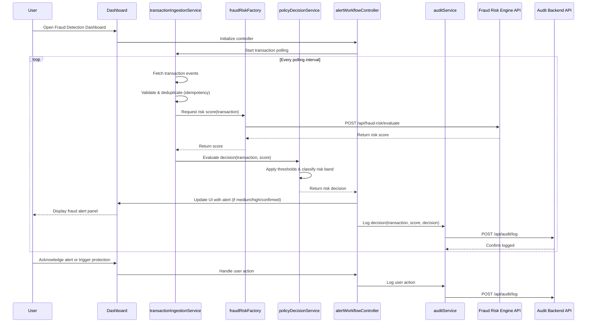

# Low-Level Design: QE-4532

## a. Architecture Mapping

- **Transaction Event Ingestion** → AngularJS Service (`transactionIngestionService`) for API polling/websocket connection
- **Fraud Risk Engine Integration** → AngularJS Factory (`fraudRiskFactory`) for risk score API calls
- **Policy Decision Engine** → AngularJS Service (`policyDecisionService`) for threshold evaluation and risk band classification
- **Alert & Protection Workflows** → AngularJS Controller (`alertWorkflowController`) + Directive (`fraud-alert-panel`) for UI alerts and action triggers
- **Audit & Analytics** → AngularJS Service (`auditService`) for logging decisions and events
- **Main Application** → AngularJS Module (`fraudDetectionApp`) orchestrating all components

**Recommended Folder Structure:**
```
/app
  /modules
    /fraud-detection
      /controllers
        alertWorkflowController.js
      /services
        transactionIngestionService.js
        policyDecisionService.js
        auditService.js
      /factories
        fraudRiskFactory.js
      /directives
        fraudAlertPanel.js
      /views
        fraud-dashboard.html
        alert-panel.html
  /shared
    /interceptors
      errorInterceptor.js
```

## b. Component Specifications

| Component Name | Artifact Type | Responsibility | Key Dependencies |
|----------------|---------------|----------------|------------------|
| fraudDetectionApp | Module | Root module for fraud detection feature | angular, ui.router, ngResource |
| transactionIngestionService | Service | Poll/subscribe to transaction events, validate and deduplicate using idempotency keys | $http, $interval, fraudRiskFactory |
| fraudRiskFactory | Factory | Call fraud-risk engine API to retrieve risk scores for transactions | $resource, API_CONFIG |
| policyDecisionService | Service | Apply configurable thresholds to risk scores and classify into risk bands (low/medium/high/confirmed) | fraudRiskFactory, auditService |
| alertWorkflowController | Controller | Manage alert display, trigger protection workflows based on risk decisions | $scope, policyDecisionService, alertService |
| fraud-alert-panel | Directive | Render real-time fraud alerts with risk band indicators and action buttons | alertWorkflowController |
| auditService | Service | Log all risk decisions, scores, and actions to audit/analytics backend | $http, API_CONFIG |
| errorInterceptor | Interceptor | Handle API failures with fail-safe fallback and user notifications | $q, notificationService |

## c. Data Model

**Transaction Model:**
```javascript
{
  transactionId: String,
  cardIdentifier: String,
  amount: Number,
  merchantName: String,
  merchantCategory: String,
  timestamp: Date,
  location: Object { lat: Number, lng: Number, country: String },
  idempotencyKey: String,
  processed: Boolean
}
```

**RiskScore Model:**
```javascript
{
  transactionId: String,
  score: Number,  // 0-100
  evaluatedAt: Date,
  modelVersion: String
}
```

**RiskDecision Model:**
```javascript
{
  transactionId: String,
  riskBand: String,  // 'low', 'medium', 'high', 'confirmed_fraud'
  riskScore: Number,
  action: String,  // 'allow', 'alert', 'block'
  decidedAt: Date,
  thresholdConfig: Object { low: Number, medium: Number, high: Number }
}
```

**Alert Model:**
```javascript
{
  alertId: String,
  transactionId: String,
  riskBand: String,
  message: String,
  status: String,  // 'pending', 'acknowledged', 'resolved'
  createdAt: Date
}
```

## d. Data Flow

User views the fraud detection dashboard where `alertWorkflowController` initializes and `transactionIngestionService` begins polling the transaction event API. Each incoming transaction is validated, deduplicated via idempotency key, and passed to `fraudRiskFactory` which calls the fraud-risk engine REST API to retrieve a risk score. The score is forwarded to `policyDecisionService`, which applies configurable thresholds to classify the transaction into a risk band (low/medium/high/confirmed fraud) and determines the appropriate action (allow/alert/block). The decision triggers the `fraud-alert-panel` directive to display real-time alerts in the UI for medium/high/confirmed fraud cases, while `auditService` asynchronously logs the complete decision trail (transaction, score, decision, action) to the audit backend API. User acknowledgment or protection actions are captured and sent back through the same service chain for audit closure.

## e. Primary Sequence Diagram



## f. Implementation Notes

- Use AngularJS 1.x dependency injection to inject services/factories into controllers; declare all dependencies explicitly in array notation for minification safety
- Implement `transactionIngestionService` using `$interval` for polling or integrate WebSocket via `angular-websocket` library for real-time event streaming
- Use `$resource` in `fraudRiskFactory` for RESTful API interaction with the fraud-risk engine; configure base URL via `API_CONFIG` constant
- Apply ES6 classes for service definitions where possible; transpile using Babel if targeting older browsers
- Implement idempotency using in-memory Set or IndexedDB to track processed `idempotencyKey` values and prevent duplicate processing

## g. Error Handling

Use HTTP interceptor (`errorInterceptor`) to catch API failures, apply fail-safe policy (default to 'allow' or 'alert' based on configuration), and display user-friendly notifications via `notificationService`.

## h. Security Notes

Requires token-based authentication via existing SSO for all API calls; ensure card identifiers are masked in UI and audit logs per PCI-DSS requirements.