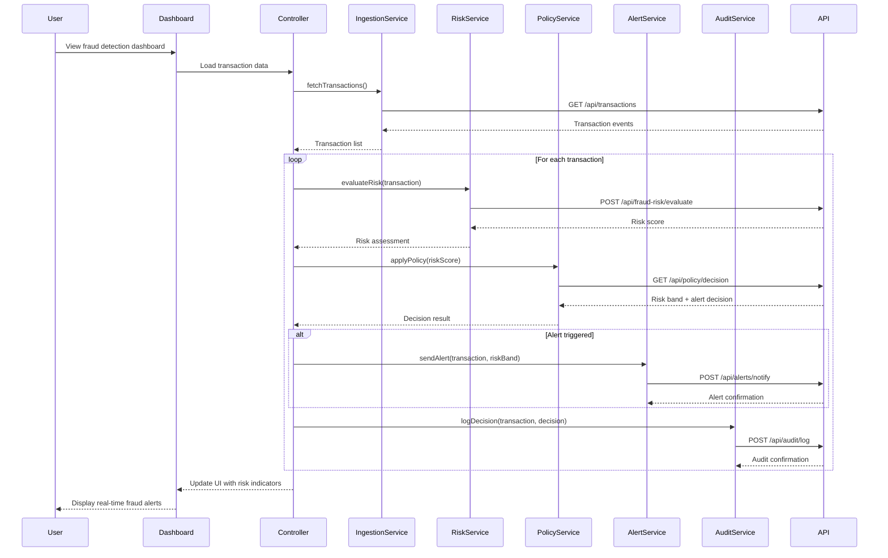

# Low-Level Design: Real-Time Fraud Detection System

**Epic ID**: QE-4539

---

## a. Architecture Mapping

- **Transaction Event Ingestion** → AngularJS Service (`transactionIngestionService`) + REST API client
- **Fraud Risk Engine Interface** → AngularJS Service (`fraudRiskService`) for API integration
- **Policy Decision Engine Interface** → AngularJS Service (`policyDecisionService`) for risk-to-action mapping
- **Alert Service Interface** → AngularJS Service (`alertNotificationService`) for triggering alerts
- **Audit Trail Interface** → AngularJS Service (`auditTrailService`) for logging decisions
- **Dashboard/Monitoring UI** → AngularJS Module (`fraudDetectionModule`) with Controller (`fraudDashboardController`) and Views
- **Configuration Management UI** → AngularJS Controller (`thresholdConfigController`) for managing risk thresholds

**Recommended Folder Structure**:
```
/app
  /modules
    /fraud-detection
      /controllers
      /services
      /directives
      /views
      /models
  /shared
    /services
    /interceptors
```

---

## b. Component Specifications

| Component Name | Artifact Type | Responsibility | Key Dependencies |
|----------------|---------------|----------------|------------------|
| fraudDetectionModule | Module | Root module for fraud detection features | angular, ngRoute, ui.bootstrap |
| fraudDashboardController | Controller | Manages dashboard view, displays real-time alerts and risk scores | fraudRiskService, alertNotificationService, $scope |
| transactionIngestionService | Service | Handles transaction event ingestion with idempotency checks | $http, apiConfig, cacheService |
| fraudRiskService | Service | Calls fraud-risk engine API to evaluate transaction risk scores | $http, $q, apiConfig |
| policyDecisionService | Service | Maps risk scores to risk bands and determines alert actions | $http, configService |
| alertNotificationService | Service | Triggers and manages fraud alerts to customers | $http, notificationService |
| auditTrailService | Service | Records all risk decisions and actions for compliance | $http, loggingService |
| thresholdConfigController | Controller | Manages risk threshold configuration UI | policyDecisionService, configService, $scope |
| transactionListDirective | Directive | Displays paginated transaction list with risk indicators | fraudRiskService |
| riskScoreFilter | Filter | Formats and color-codes risk scores for UI display | None |
| httpInterceptor | Factory | Handles authentication, error handling, and retry logic | $q, authService |

---

## c. Data Model

**Transaction Event Model**:
```javascript
{
  transactionId: String,
  cardNumber: String (masked),
  amount: Number,
  currency: String,
  merchantId: String,
  merchantName: String,
  merchantCategory: String,
  transactionTimestamp: Date,
  location: {
    country: String,
    city: String,
    latitude: Number,
    longitude: Number
  },
  velocityData: {
    transactionCount24h: Number,
    totalAmount24h: Number
  },
  compromisedCardFlag: Boolean
}
```

**Risk Assessment Model**:
```javascript
{
  transactionId: String,
  riskScore: Number,
  riskBand: String, // 'low', 'medium', 'high'
  riskSignals: {
    unusualAmount: Boolean,
    suspiciousMerchant: Boolean,
    geographicAnomaly: Boolean,
    velocityViolation: Boolean,
    compromisedCard: Boolean
  },
  alertTriggered: Boolean,
  evaluationTimestamp: Date
}
```

**Threshold Configuration Model**:
```javascript
{
  configId: String,
  lowRiskThreshold: Number,
  mediumRiskThreshold: Number,
  highRiskThreshold: Number,
  alertEnabled: Boolean,
  lastModified: Date,
  modifiedBy: String
}
```

---

## d. Data Flow

User views the fraud detection dashboard, triggering the `fraudDashboardController` to call `transactionIngestionService` which fetches recent transaction events from the card authorization platform REST API. For each transaction, the controller invokes `fraudRiskService` to send transaction data to the fraud-risk engine API, which returns a risk score. The risk score is passed to `policyDecisionService`, which applies configurable thresholds to classify the transaction into low/medium/high risk bands and determines if an alert should be triggered. If an alert is warranted, `alertNotificationService` is called to notify the customer via REST API. Simultaneously, `auditTrailService` logs the risk decision and action to the audit storage. The dashboard UI updates in real-time to display the risk assessment, color-coded risk indicators, and alert status for each transaction.

---

## e. Primary Sequence Diagram



---

## f. Implementation Notes

- Use AngularJS Dependency Injection to inject all services into controllers and maintain loose coupling between components
- Implement ES6 classes for services with arrow functions for cleaner promise handling and lexical scoping
- Apply HTTP interceptor factory for centralized authentication token injection, error handling, and retry logic for API calls
- Use $q promises for asynchronous operations with proper error propagation and chaining across service layers
- Implement client-side caching in transactionIngestionService using $cacheFactory to reduce redundant API calls for idempotency checks

---

## g. Error Handling

HTTP interceptor-based error handling with try/catch blocks in services, user-friendly error notifications via Bootstrap modals, and fail-safe policy execution when risk engine is unavailable.

---

## h. Security Notes

Requires token-based authentication via existing SSO, with encryption for sensitive transaction data in transit and least privilege access controls enforced at API gateway level.