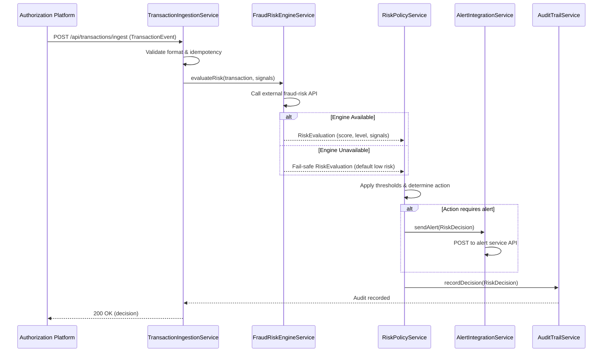

# Low-Level Design: QE-4546 - Fraud Detection and Risk Evaluation

## a. Architecture Mapping

**Component to Artifact Mapping:**
- Transaction Event Ingestion → Module (`app.fraudDetection`) + Service (`TransactionIngestionService`) + Interceptor (idempotency)
- Fraud Risk Engine Integration → Service (`FraudRiskEngineService`)
- Risk Decision Policy Engine → Service (`RiskPolicyService`) + Factory (`RiskThresholdConfigFactory`)
- Alert Service Integration → Service (`AlertIntegrationService`)
- Audit Trail → Service (`AuditTrailService`)
- Monitoring Dashboard → Controller (`FraudMonitoringController`) + View (`fraud-monitoring.html`)

**Recommended Folder Structure:**
```
app/
  fraudDetection/
    fraudDetection.module.js
    services/
      transactionIngestion.service.js
      fraudRiskEngine.service.js
      riskPolicy.service.js
      alertIntegration.service.js
      auditTrail.service.js
    factories/
      riskThresholdConfig.factory.js
    controllers/
      fraudMonitoring.controller.js
    interceptors/
      idempotency.interceptor.js
    views/
      fraud-monitoring.html
```

## b. Component Specifications

| Name | Artifact Type | Responsibility | Key Dependencies |
|------|---------------|----------------|------------------|
| TransactionIngestionService | Service | Receive transaction events from authorization platform, validate format, enforce idempotency, route to risk engine | $http, IdempotencyInterceptor, FraudRiskEngineService |
| FraudRiskEngineService | Service | Call external fraud-risk engine API with transaction + signals, parse risk score/classification, handle engine unavailability with fail-safe policy | $http, $q, RiskPolicyService |
| RiskPolicyService | Service | Apply configurable risk thresholds to risk scores, determine action (approve/alert/step-up/hold/decline), execute decision logic | RiskThresholdConfigFactory, AlertIntegrationService |
| RiskThresholdConfigFactory | Factory | Maintain singleton cache of risk threshold configuration, provide threshold lookup by merchant/amount/velocity | $http |
| AlertIntegrationService | Service | Send risk decisions requiring alerts to downstream alert service API | $http, AuditTrailService |
| AuditTrailService | Service | Record all risk decisions, engine responses, policy actions to audit store with event versioning | $http |
| IdempotencyInterceptor | Interceptor | Attach idempotency keys to transaction ingestion requests, detect and suppress duplicate events | $httpProvider.interceptors |
| FraudMonitoringController | Controller | Present operational dashboard with transaction volume, risk distribution, engine health, alert counts | FraudRiskEngineService, AuditTrailService |

## c. Data Model

```js
TransactionEvent = {
  transactionId: String,
  cardId: String,
  amount: Number,
  currency: String,
  merchantId: String,
  merchantCategory: String,
  timestamp: Date,
  location: Object, // { lat: Number, lon: Number, country: String }
  deviceFingerprint: String,
  authorizationPlatformId: String,
  idempotencyKey: String
}

RiskSignals = {
  amountAnomaly: Boolean,
  merchantBehaviorScore: Number,
  geographicInconsistency: Boolean,
  velocityPattern: String, // 'normal' | 'elevated' | 'suspicious'
  compromisedCardIndicator: Boolean
}

RiskEvaluation = {
  transactionId: String,
  riskScore: Number,
  riskLevel: String, // 'low' | 'medium' | 'high'
  signals: RiskSignals,
  engineVersion: String,
  evaluatedAt: Date
}

RiskDecision = {
  transactionId: String,
  action: String, // 'approve' | 'alert' | 'step-up' | 'hold' | 'decline'
  riskEvaluation: RiskEvaluation,
  policyVersion: String,
  decidedAt: Date
}

RiskThresholdConfig = {
  lowThreshold: Number,
  mediumThreshold: Number,
  highThreshold: Number,
  merchantCategoryOverrides: Object,
  velocityRules: Array<Object>
}
```

## d. Data Flow

When a credit card transaction is authorized, the authorization platform publishes a transaction event to the TransactionIngestionService, which validates the event format and enforces idempotency via the IdempotencyInterceptor. The service then calls FraudRiskEngineService, passing the transaction and extracted risk signals (amount, merchant, location, velocity, compromised-card indicators). The fraud-risk engine evaluates the signals, returns a risk score and classification (low/medium/high), which FraudRiskEngineService handles with fail-safe logic if the engine is unavailable. RiskPolicyService receives the risk evaluation, applies configurable thresholds from RiskThresholdConfigFactory, and determines the appropriate action (approve, alert, step-up, hold, decline). If the decision requires an alert, AlertIntegrationService sends the decision to the downstream alert service API. All risk evaluations and decisions are recorded by AuditTrailService with event versioning for compliance. The FraudMonitoringController queries AuditTrailService and FraudRiskEngineService to display real-time operational metrics on the monitoring dashboard view, enabling fraud analysts to track transaction volume, risk distribution, and system health.

## e. Primary Sequence Diagram



## f. Implementation Notes

- DI: Use constructor injection with `$inject` array annotation for all services/controllers to ensure minification safety.
- API calls: All external API interactions (fraud-risk engine, alert service, audit store) centralized in dedicated Services; Controllers never call `$http` directly.
- Idempotency: Implement as `$httpProvider` interceptor that attaches unique keys to ingestion requests and maintains short-lived cache of processed transaction IDs to suppress duplicates.
- Fail-safe policy: FraudRiskEngineService catches engine timeout/error, returns default low-risk evaluation to prevent transaction blocking, logs engine unavailability for ops alerting.
- Promises: Use `$q` for service method chaining; avoid callback nesting; handle rejections at controller boundary with user-facing error notifications.

## g. Error Handling

Centralized `$http` interceptor catches API failures (engine, alert, audit); critical path errors (ingestion, risk evaluation) return fail-safe decisions to avoid blocking transactions; non-critical errors (audit logging) retry asynchronously; user-facing errors surfaced via shared notification service.

## h. Security Notes

Requires token-based authentication for all API calls; encrypt transaction data and PII in transit (TLS) and at rest; apply least-privilege access controls to fraud-risk engine and audit APIs; never log full card numbers (mask to last 4 digits); enforce rate limiting on ingestion endpoint to prevent abuse.