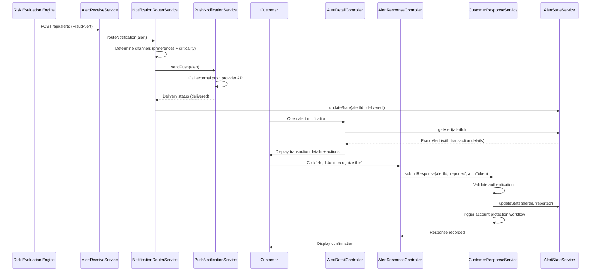

# Low-Level Design: QE-4547 - Customer Alert Notification and Response

## a. Architecture Mapping

**Component to Artifact Mapping:**
- Alert Service Integration → Service (`AlertReceiveService`)
- Multi-Channel Notification Router → Service (`NotificationRouterService`) + Factory (`ChannelProviderFactory`)
- Push/SMS/Email/In-App Providers → Service (`PushNotificationService`, `SmsNotificationService`, `EmailNotificationService`, `InAppNotificationService`)
- Transaction Detail Presentation → Controller (`AlertDetailController`) + View (`alert-detail.html`)
- Customer Response Capture → Controller (`AlertResponseController`) + Service (`CustomerResponseService`)
- Alert Lifecycle Management → Service (`AlertStateService`) + Factory (`AlertHistoryFactory`)
- Authentication → Interceptor (`AuthInterceptor`) + Service (`AuthenticationService`)

**Recommended Folder Structure:**
```
app/
  fraudAlert/
    fraudAlert.module.js
    services/
      alertReceive.service.js
      notificationRouter.service.js
      pushNotification.service.js
      smsNotification.service.js
      emailNotification.service.js
      inAppNotification.service.js
      customerResponse.service.js
      alertState.service.js
      authentication.service.js
    factories/
      channelProvider.factory.js
      alertHistory.factory.js
    controllers/
      alertDetail.controller.js
      alertResponse.controller.js
    interceptors/
      auth.interceptor.js
    views/
      alert-detail.html
      alert-history.html
```

## b. Component Specifications

| Name | Artifact Type | Responsibility | Key Dependencies |
|------|---------------|----------------|------------------|
| AlertReceiveService | Service | Receive fraud alerts from upstream risk evaluation engine, validate alert payload, trigger notification routing | $http, NotificationRouterService |
| NotificationRouterService | Service | Determine delivery channels based on customer preferences and alert criticality, orchestrate multi-channel delivery with fallback logic, track delivery status | ChannelProviderFactory, AlertStateService |
| PushNotificationService | Service | Send push notifications via external push provider API, handle delivery confirmation/failure | $http |
| SmsNotificationService | Service | Send SMS notifications via external SMS provider API, handle delivery confirmation/failure | $http |
| EmailNotificationService | Service | Send email notifications via external email provider API, handle delivery confirmation/failure | $http |
| InAppNotificationService | Service | Store in-app notifications in local notification store, mark as unread for user retrieval | $http, AlertHistoryFactory |
| ChannelProviderFactory | Factory | Maintain singleton mapping of notification channels to provider services, provide channel selection logic | PushNotificationService, SmsNotificationService, EmailNotificationService, InAppNotificationService |
| AlertStateService | Service | Manage alert lifecycle states (created/queued/delivered/viewed/confirmed/reported/resolved/expired), update state transitions, enforce state validation | $http, AlertHistoryFactory |
| AlertHistoryFactory | Factory | Maintain cached alert history for current user session, provide alert lookup by ID and status filter | $http |
| AlertDetailController | Controller | Display transaction details (amount, merchant, time, location, masked card) in plain language, present confirm/report action buttons | AlertStateService, CustomerResponseService |
| AlertResponseController | Controller | Capture customer response (confirm/report), validate authentication, call CustomerResponseService, update UI with response confirmation | AuthenticationService, CustomerResponseService, AlertStateService |
| CustomerResponseService | Service | Submit authenticated customer response (confirm/report) to backend API, update alert state, trigger downstream workflows (account protection if reported) | $http, AlertStateService, AuthenticationService |
| AuthenticationService | Service | Validate user authentication token before sensitive fraud-response actions, refresh token if expired | $http |
| AuthInterceptor | Interceptor | Attach authentication token to all API requests, handle 401 responses by redirecting to login | $httpProvider.interceptors, AuthenticationService |

## c. Data Model

```js
FraudAlert = {
  alertId: String,
  transactionId: String,
  customerId: String,
  amount: Number,
  currency: String,
  merchantName: String,
  merchantCategory: String,
  transactionTime: Date,
  location: String, // human-readable city/country
  maskedCardNumber: String, // last 4 digits only
  riskLevel: String, // 'medium' | 'high'
  state: String, // 'created' | 'queued' | 'delivered' | 'viewed' | 'confirmed' | 'reported' | 'resolved' | 'expired'
  createdAt: Date,
  expiresAt: Date
}

NotificationDelivery = {
  alertId: String,
  channel: String, // 'push' | 'sms' | 'email' | 'in-app'
  provider: String,
  status: String, // 'pending' | 'sent' | 'delivered' | 'failed'
  attemptedAt: Date,
  deliveredAt: Date,
  failureReason: String
}

CustomerResponse = {
  alertId: String,
  transactionId: String,
  customerId: String,
  responseType: String, // 'confirmed' | 'reported'
  respondedAt: Date,
  authToken: String
}

CustomerPreferences = {
  customerId: String,
  enabledChannels: Array<String>, // ['push', 'sms', 'email', 'in-app']
  preferredChannel: String,
  allowSecurityOverride: Boolean // enforce critical alerts even if channel disabled
}
```

## d. Data Flow

When the upstream risk evaluation engine identifies a suspicious transaction, it sends a fraud alert to AlertReceiveService, which validates the alert payload and passes it to NotificationRouterService. The router queries customer preferences and alert criticality, selects appropriate delivery channels (push, SMS, email, in-app) with fallback order, and calls the corresponding provider services (PushNotificationService, SmsNotificationService, etc.) to send notifications. Each provider service calls its external API and reports delivery status back to NotificationRouterService, which updates the alert state via AlertStateService (created → queued → delivered). When the customer opens the alert, AlertDetailController retrieves the alert from AlertHistoryFactory, displays transaction details (amount, merchant, time, location, masked card number) in the view, and presents confirm/report action buttons. If the customer clicks confirm or report, AlertResponseController validates authentication via AuthenticationService, captures the response, and calls CustomerResponseService to submit the authenticated response to the backend API. CustomerResponseService updates the alert state (delivered → confirmed or reported) via AlertStateService and triggers downstream workflows (account protection if reported). The updated alert state is reflected in the alert history view, and the customer receives confirmation of their action.

## e. Primary Sequence Diagram



## f. Implementation Notes

- DI: Use constructor injection with `$inject` array annotation for all services/controllers to ensure minification safety.
- API calls: All external API interactions (push/SMS/email providers, alert backend) centralized in dedicated Services; Controllers never call `$http` directly.
- Fallback logic: NotificationRouterService implements channel fallback array (e.g., [push, SMS, email]); if primary channel fails, retry with next channel in sequence; track all attempts in NotificationDelivery records.
- Authentication: AuthInterceptor attaches token to all requests; AlertResponseController validates token freshness before sensitive actions (report transaction); redirect to login if token expired.
- State management: AlertStateService enforces valid state transitions (created → queued → delivered → viewed → confirmed/reported → resolved); reject invalid transitions with error.

## g. Error Handling

Centralized `$http` interceptor catches notification provider API failures; NotificationRouterService retries failed channels with exponential backoff and falls back to alternative channels; critical delivery failures logged and surfaced to ops monitoring; user-facing errors (authentication failure, invalid response) surfaced via shared notification service.

## h. Security Notes

Requires token-based authentication via existing SSO for all alert access and response actions; never display full card numbers (mask to last 4 digits); protect notification deep links with short-lived tokens and customer ID validation; rate-limit alert response endpoints to prevent abuse; encrypt alert data in transit (TLS).