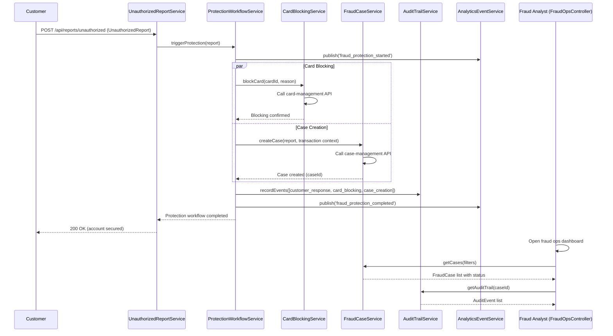

# Low-Level Design: QE-4548 - Account Protection and Fraud Case Management

## a. Architecture Mapping

**Component to Artifact Mapping:**
- Unauthorized Transaction Reporting Workflow → Service (`UnauthorizedReportService`)
- Protection Workflow Orchestrator → Service (`ProtectionWorkflowService`)
- Card Blocking Integration → Service (`CardBlockingService`)
- Fraud Case Management Integration → Service (`FraudCaseService`)
- Audit Trail Recording → Service (`AuditTrailService`)
- Analytics Event Publishing → Service (`AnalyticsEventService`)
- Operations Investigation Interface → Controller (`FraudOpsController`) + View (`fraud-ops-dashboard.html`)
- Fraud Case Status Management → Factory (`FraudCaseStatusFactory`)

**Recommended Folder Structure:**
```
app/
  fraudProtection/
    fraudProtection.module.js
    services/
      unauthorizedReport.service.js
      protectionWorkflow.service.js
      cardBlocking.service.js
      fraudCase.service.js
      auditTrail.service.js
      analyticsEvent.service.js
    factories/
      fraudCaseStatus.factory.js
    controllers/
      fraudOps.controller.js
    views/
      fraud-ops-dashboard.html
```

## b. Component Specifications

| Name | Artifact Type | Responsibility | Key Dependencies |
|------|---------------|----------------|------------------|
| UnauthorizedReportService | Service | Receive customer unauthorized transaction reports, validate report payload, trigger protection workflow orchestration | $http, ProtectionWorkflowService |
| ProtectionWorkflowService | Service | Orchestrate account protection workflow (card blocking, case creation, audit recording, analytics publishing), track workflow completion status, enforce operational SLA | CardBlockingService, FraudCaseService, AuditTrailService, AnalyticsEventService |
| CardBlockingService | Service | Call external card-management API to block card, handle synchronous/near-synchronous blocking operations, return blocking confirmation | $http |
| FraudCaseService | Service | Create fraud case in external case-management system with transaction context, track case lifecycle (created/investigating/resolved), provide case status updates | $http, FraudCaseStatusFactory |
| AuditTrailService | Service | Record comprehensive audit events (alert creation, delivery, customer response, protection actions) with timestamps and actor details | $http |
| AnalyticsEventService | Service | Publish analytics events (fraud_alert_created, fraud_alert_sent, fraud_alert_delivered, fraud_alert_viewed, fraud_alert_confirmed, fraud_alert_reported, fraud_protection_started, fraud_protection_completed, fraud_alert_failed) to event bus | $http |
| FraudCaseStatusFactory | Factory | Maintain cached fraud case status lookup, provide case status by case ID, refresh cache periodically | $http |
| FraudOpsController | Controller | Display operations investigation dashboard with alert outcomes, case status, protection workflow success/failure metrics, analyst investigation tools | FraudCaseService, AuditTrailService, AnalyticsEventService |

## c. Data Model

```js
UnauthorizedReport = {
  reportId: String,
  alertId: String,
  transactionId: String,
  customerId: String,
  cardId: String,
  reportedAt: Date,
  authToken: String
}

ProtectionWorkflow = {
  workflowId: String,
  reportId: String,
  customerId: String,
  cardId: String,
  status: String, // 'started' | 'blocking_card' | 'creating_case' | 'recording_audit' | 'completed' | 'failed'
  startedAt: Date,
  completedAt: Date,
  failureReason: String
}

CardBlockingAction = {
  actionId: String,
  cardId: String,
  blockingReason: String,
  blockedAt: Date,
  blockingStatus: String // 'pending' | 'blocked' | 'failed'
}

FraudCase = {
  caseId: String,
  reportId: String,
  transactionId: String,
  customerId: String,
  cardId: String,
  caseType: String, // 'unauthorized_transaction'
  status: String, // 'created' | 'investigating' | 'resolved'
  assignedAnalyst: String,
  createdAt: Date,
  resolvedAt: Date,
  resolution: String
}

AuditEvent = {
  eventId: String,
  eventType: String, // 'alert_created' | 'alert_delivered' | 'customer_response' | 'protection_action'
  entityId: String, // alertId, reportId, caseId
  actorId: String, // customerId, analystId, systemId
  eventData: Object,
  timestamp: Date
}

AnalyticsEvent = {
  eventName: String, // 'fraud_alert_created' | 'fraud_alert_sent' | 'fraud_alert_delivered' | 'fraud_alert_viewed' | 'fraud_alert_confirmed' | 'fraud_alert_reported' | 'fraud_protection_started' | 'fraud_protection_completed' | 'fraud_alert_failed'
  eventData: Object,
  timestamp: Date,
  customerId: String
}
```

## d. Data Flow

When a customer reports an unauthorized transaction by selecting 'No, I don't recognize this' in the alert response interface, the customer response service sends the report to UnauthorizedReportService, which validates the report payload and triggers ProtectionWorkflowService. The workflow orchestrator immediately starts the account protection workflow by calling CardBlockingService to block the compromised card via the external card-management API, which returns a synchronous or near-synchronous blocking confirmation. Simultaneously, the orchestrator calls FraudCaseService to create a fraud case in the external case-management system with full transaction context (transaction ID, customer ID, card ID, alert details) for fraud analyst investigation. Once card blocking and case creation complete, the orchestrator calls AuditTrailService to record comprehensive audit events (customer response, card blocking action, case creation) with timestamps and actor details, and calls AnalyticsEventService to publish fraud_protection_started and fraud_protection_completed events to the analytics event bus. The workflow status is updated to 'completed' and tracked against the operational SLA. Fraud analysts access the FraudOpsController dashboard view, which queries FraudCaseService and AuditTrailService to display alert outcomes, case status, protection workflow success/failure metrics, and investigation tools. Analysts can view case details, audit trails, and take investigation actions (update case status, add notes, initiate dispute) through the operations interface.

## e. Primary Sequence Diagram



## f. Implementation Notes

- DI: Use constructor injection with `$inject` array annotation for all services/controllers to ensure minification safety.
- API calls: All external API interactions (card-management, case-management, audit store, analytics event bus) centralized in dedicated Services; Controllers never call `$http` directly.
- Workflow orchestration: ProtectionWorkflowService uses `$q.all()` to execute card blocking and case creation in parallel, reducing total workflow time; tracks workflow status and completion time against operational SLA; logs SLA violations for ops alerting.
- Error handling: Workflow orchestrator implements retry logic for transient failures (network timeout, service unavailable) with exponential backoff; if critical step fails (card blocking), marks workflow as 'failed' and alerts ops team; continues non-critical steps (analytics publishing) asynchronously.
- Analytics events: AnalyticsEventService publishes all specified events (fraud_alert_created, fraud_alert_sent, fraud_alert_delivered, fraud_alert_viewed, fraud_alert_confirmed, fraud_alert_reported, fraud_protection_started, fraud_protection_completed, fraud_alert_failed) with consistent schema and timestamps for downstream analytics and model improvement.

## g. Error Handling

Centralized `$http` interceptor catches API failures; ProtectionWorkflowService retries transient failures with exponential backoff; critical failures (card blocking) mark workflow as 'failed' and trigger ops alerts; non-critical failures (analytics publishing) logged and retried asynchronously; user-facing errors (workflow failure) surfaced via shared notification service with guidance to contact support.

## h. Security Notes

Requires strong authentication and authorization for all protection actions; encrypt sensitive data (card ID, customer ID) in transit (TLS) and at rest; apply least-privilege access to card-management and case-management APIs; log security events (unauthorized report, card blocking) without storing full card numbers; enforce retention and deletion policies approved by legal/security teams; zero critical security or privacy defects before GA.