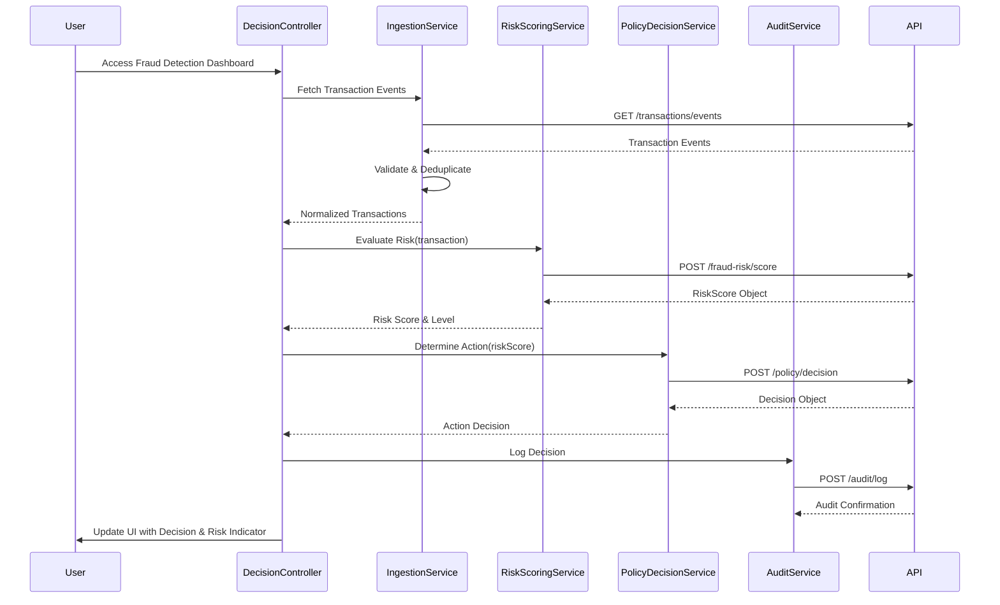

# Low-Level Design: QE-4549

## a. Architecture Mapping

- **Transaction Authorization Platform** → AngularJS Service (TransactionEventService) - handles API polling/webhooks for transaction events
- **Event Ingestion Layer** → AngularJS Service (IngestionService) - validates, normalizes, and deduplicates transaction data client-side
- **Fraud Risk Scoring Engine** → AngularJS Service (RiskScoringService) - invokes REST API for risk evaluation
- **Policy Engine** → AngularJS Service (PolicyDecisionService) - maps risk scores to action decisions via REST API
- **Decision Router** → AngularJS Controller (DecisionController) - orchestrates action execution and UI updates
- **Audit Trail Service** → AngularJS Service (AuditService) - logs decisions and model versions via REST API

**Recommended Folder Structure:**
```
/app
  /modules
    /fraud-detection
      /controllers
      /services
      /directives
      /views
  /shared
    /services
    /filters
  /assets
```

## b. Component Specifications

| Name | Artifact Type | Responsibility | Key Dependencies |
|------|---------------|----------------|------------------|
| FraudDetectionModule | Module | Root module for fraud detection feature | angular, ngRoute, ui.bootstrap |
| TransactionEventService | Service/Factory | Fetches transaction events from authorization platform API | $http, $q |
| IngestionService | Service | Validates, normalizes, deduplicates transaction data | TransactionEventService, LocalStorageService |
| RiskScoringService | Service | Calls fraud-risk engine API with transaction signals | $http, $q, ConfigService |
| PolicyDecisionService | Service | Maps risk scores to actions via policy engine API | $http, RiskScoringService |
| DecisionController | Controller | Orchestrates fraud detection workflow and updates UI | $scope, IngestionService, RiskScoringService, PolicyDecisionService, AuditService |
| AuditService | Service | Logs all decisions and model versions to audit trail API | $http, $q |
| TransactionListDirective | Directive | Displays real-time transaction list with risk indicators | DecisionController |
| RiskIndicatorFilter | Filter | Formats risk level display (low/medium/high/confirmed fraud) | none |
| ConfigService | Service | Manages configurable alert thresholds and feature flags | $http, LocalStorageService |

## c. Data Model

**Transaction Object:**
```javascript
{
  transactionId: String,
  cardNumber: String (masked),
  amount: Number,
  currency: String,
  merchantId: String,
  merchantCategory: String,
  timestamp: Date,
  geoLocation: Object { lat: Number, lon: Number },
  deviceId: String,
  ipAddress: String,
  isCompromised: Boolean
}
```

**RiskScore Object:**
```javascript
{
  transactionId: String,
  score: Number,
  level: String, // 'low', 'medium', 'high', 'confirmed_fraud'
  signals: Object {
    amountAnomaly: Boolean,
    merchantRisk: String,
    geoInconsistency: Boolean,
    velocityAnomaly: Boolean,
    compromisedCard: Boolean
  },
  modelVersion: String
}
```

**Decision Object:**
```javascript
{
  transactionId: String,
  action: String, // 'approve', 'alert', 'step_up', 'hold', 'decline'
  riskLevel: String,
  timestamp: Date,
  modelVersion: String
}
```

## d. Data Flow

User accesses the fraud detection dashboard (View) which is managed by DecisionController. The controller invokes IngestionService to fetch and validate transaction events from TransactionEventService. Normalized transaction data with risk signals is passed to RiskScoringService, which calls the fraud-risk engine REST API and returns a RiskScore object. PolicyDecisionService receives the risk score and invokes the policy engine API to determine the action (approve/alert/step-up/hold/decline). The controller updates the UI with the decision and risk indicator, while AuditService logs the decision and model version to the audit trail API for compliance tracking.

## e. Primary Sequence Diagram



## f. Implementation Notes

- Use AngularJS dependency injection for all services and controllers to enable testability and modularity
- Implement ES6 classes for services with promise-based API calls using $http and $q
- Use AngularJS interceptors for centralized API error handling, authentication token injection, and retry logic
- Apply MVC pattern: controllers orchestrate workflow, services encapsulate business logic and API calls, views bind via ng-model/ng-repeat
- Leverage Bootstrap components (alerts, badges, modals) for risk indicators and action notifications in the UI

## g. Error Handling

Interceptor-based error handling with $http interceptors for API failures, try/catch blocks in services for data validation errors, and user notifications via Bootstrap alerts/modals.

## h. Security Notes

Requires token-based authentication via existing SSO with secure API calls over HTTPS; input validation on all transaction data fields to prevent injection attacks.