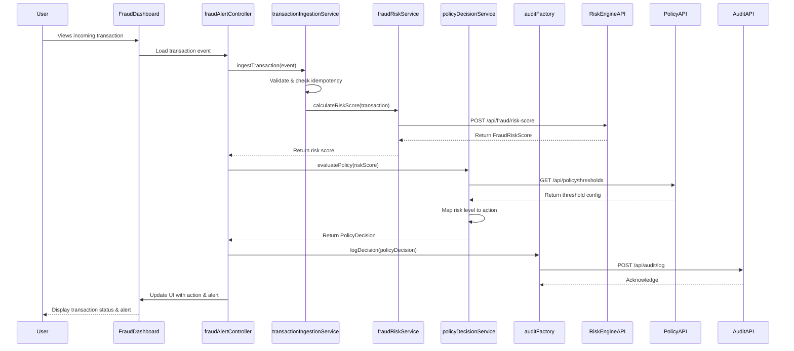

# Low-Level Design: Real-Time Fraud Detection System

**Epic ID:** QE-4549

---

## a. Architecture Mapping

- **Transaction Event Ingestion** → AngularJS Service (`transactionIngestionService`) + REST API endpoint
- **Fraud Risk Engine** → AngularJS Service (`fraudRiskService`) consuming risk scoring API
- **Policy Decision Engine** → AngularJS Service (`policyDecisionService`) for threshold evaluation
- **Action Router** → AngularJS Controller (`fraudAlertController`) coordinating UI actions
- **Audit Service** → AngularJS Factory (`auditFactory`) logging decisions to audit API
- **Admin Configuration UI** → AngularJS Module (`fraudConfigModule`) with Controller/View for threshold management

**Recommended Folder Structure:**
```
app/
├── modules/
│   ├── fraud-detection/
│   │   ├── controllers/
│   │   │   ├── fraudAlertController.js
│   │   │   └── fraudConfigController.js
│   │   ├── services/
│   │   │   ├── transactionIngestionService.js
│   │   │   ├── fraudRiskService.js
│   │   │   └── policyDecisionService.js
│   │   ├── factories/
│   │   │   └── auditFactory.js
│   │   ├── views/
│   │   │   ├── fraud-dashboard.html
│   │   │   └── fraud-config.html
│   │   └── fraud-detection.module.js
├── shared/
│   ├── interceptors/
│   │   └── authInterceptor.js
│   └── constants/
│       └── fraudConstants.js
└── app.js
```

---

## b. Component Specifications

| Component Name | Artifact Type | Responsibility | Key Dependencies |
|----------------|---------------|----------------|------------------|
| fraudDetectionModule | Module | Root module for fraud detection functionality | angular, ngRoute, ui.bootstrap |
| fraudAlertController | Controller | Manages fraud alert dashboard, displays transactions and risk decisions | fraudRiskService, policyDecisionService, auditFactory, $scope |
| fraudConfigController | Controller | Manages threshold configuration UI for risk levels and actions | policyDecisionService, $scope, $http |
| transactionIngestionService | Service | Validates and ingests transaction events with idempotency checks | $http, $q, auditFactory |
| fraudRiskService | Service | Calculates fraud risk scores by calling risk engine API with transaction signals | $http, $q, fraudConstants |
| policyDecisionService | Service | Maps risk scores to actions based on configurable thresholds | $http, $q, fraudConstants |
| auditFactory | Factory | Logs all risk decisions and actions to audit API | $http |
| authInterceptor | Interceptor | Attaches authentication tokens to all outbound API requests | $window, $q |
| fraudConstants | Constant | Defines risk levels, action types, API endpoints, and default thresholds | N/A |

---

## c. Data Model

**TransactionEvent (JS Object):**
```javascript
{
  transactionId: String,
  cardIdentifier: String,
  amount: Number,
  currency: String,
  merchantId: String,
  merchantCategory: String,
  location: { country: String, city: String, coordinates: Object },
  timestamp: Date,
  deviceId: String,
  idempotencyKey: String
}
```

**FraudRiskScore (JS Object):**
```javascript
{
  transactionId: String,
  riskScore: Number,
  riskLevel: String, // 'low', 'medium', 'high', 'confirmed_fraud'
  signals: {
    amountAnomaly: Boolean,
    merchantRisk: String,
    geographicInconsistency: Boolean,
    velocityPattern: String,
    failedAuthAttempts: Number,
    compromisedCardIndicator: Boolean
  },
  evaluatedAt: Date
}
```

**PolicyDecision (JS Object):**
```javascript
{
  transactionId: String,
  riskLevel: String,
  action: String, // 'approve', 'alert', 'step_up', 'hold', 'decline'
  thresholdApplied: Object,
  decidedAt: Date
}
```

**ThresholdConfig (JS Object):**
```javascript
{
  riskLevel: String,
  minScore: Number,
  maxScore: Number,
  action: String,
  isActive: Boolean
}
```

---

## d. Data Flow

When a transaction event is received, the fraud alert dashboard view triggers `fraudAlertController`, which calls `transactionIngestionService` to validate and deduplicate the event using its idempotency key. The service forwards the validated transaction to `fraudRiskService`, which invokes the backend fraud risk engine API to calculate a risk score based on multiple signals (amount, merchant, geography, velocity, compromised-card indicators). The returned `FraudRiskScore` object is passed to `policyDecisionService`, which applies configurable thresholds to map the risk level to an action (approve, alert, step-up, hold, decline). The `PolicyDecision` is executed by the controller, updating the UI with the transaction status and alert details, while `auditFactory` asynchronously logs the complete decision trail to the audit API for compliance and monitoring.

---

## e. Primary Sequence Diagram



---

## f. Implementation Notes

- Use AngularJS Dependency Injection to inject services into controllers; follow singleton pattern for services and factories.
- Implement ES6 Promises ($q) for all asynchronous API calls; chain promises for sequential operations (ingestion → risk scoring → policy decision).
- Use `authInterceptor` to attach JWT tokens to all $http requests; configure in app.config using $httpProvider.interceptors.
- Store API endpoints and risk thresholds in `fraudConstants` for easy configuration and environment-specific overrides.
- Implement idempotency checks in `transactionIngestionService` using in-memory cache or backend API to prevent duplicate event processing.

---

## g. Error Handling

Use `authInterceptor` for global HTTP error handling with try/catch blocks in services; display user-friendly error messages via Bootstrap modals and log errors to audit API.

---

## h. Security Notes

Requires token-based authentication via existing SSO; all API calls must include JWT tokens with role-based authorization enforced on backend; sensitive data encrypted in transit (HTTPS) and at rest.