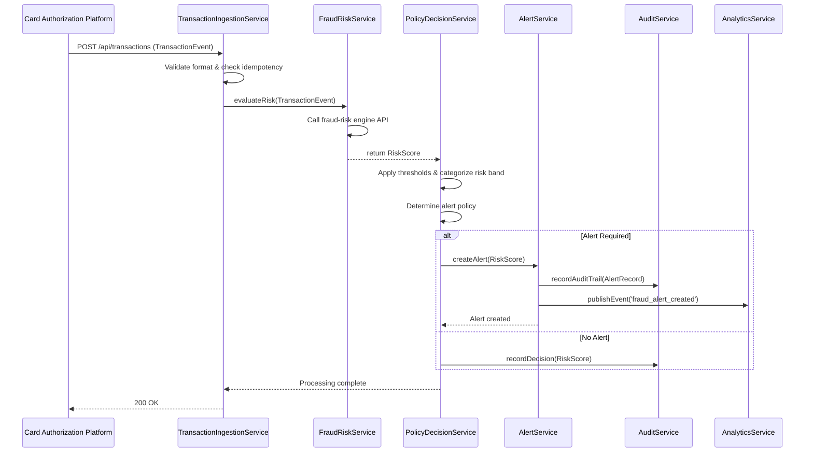

# Low-Level Design: QE-4552 - Real-Time Fraud Detection and Risk Scoring

## a. Architecture Mapping

**Component to Artifact Mapping:**
- Transaction Event Ingestion → Service (`TransactionIngestionService`) + Interceptor (`IdempotencyInterceptor`)
- Fraud Risk Engine → Service (`FraudRiskService`)
- Policy Decision Engine → Service (`PolicyDecisionService`) + Factory (`RiskThresholdConfigFactory`)
- Alert Service → Service (`AlertService`)
- Audit & Analytics → Service (`AuditService`) + Service (`AnalyticsService`)
- Monitoring Dashboard → Controller (`MonitoringDashboardController`) + View (`monitoring-dashboard.html`)

**Recommended Folder Structure:**
```
app/
  fraud-detection/
    fraud-detection.module.js
    transaction-ingestion.service.js
    fraud-risk.service.js
    policy-decision.service.js
    alert.service.js
    audit.service.js
    analytics.service.js
    monitoring-dashboard.controller.js
    views/monitoring-dashboard.html
  shared/
    interceptors/idempotency.interceptor.js
    factories/risk-threshold-config.factory.js
```

## b. Component Specifications

| Component Name | Artifact Type | Responsibility | Key Dependencies |
|---|---|---|---|
| TransactionIngestionService | Service | Receive transaction events from authorization platform, validate format, ensure idempotency, forward to risk engine | $http, IdempotencyInterceptor, FraudRiskService |
| FraudRiskService | Service | Call fraud-risk engine API with transaction signals, handle engine unavailability with fail-safe policy, return risk score | $http, $q, PolicyDecisionService |
| PolicyDecisionService | Service | Apply configurable risk thresholds, categorize transactions into low/medium/high risk bands, map risk to alert policies | RiskThresholdConfigFactory, AlertService |
| AlertService | Service | Create alert records for high-risk transactions, publish fraud_alert_created and fraud_alert_failed events | $http, AnalyticsService, AuditService |
| AuditService | Service | Record durable audit trail for all risk decisions with encryption | $http |
| AnalyticsService | Service | Capture analytics events (fraud_alert_created, fraud_alert_failed) and send to analytics infrastructure | $http |
| MonitoringDashboardController | Controller | Display operational metrics for risk decision latency and error rates | $scope, AnalyticsService |
| IdempotencyInterceptor | Interceptor | Ensure duplicate transaction events are not processed multiple times using event versioning | $q |
| RiskThresholdConfigFactory | Factory | Provide singleton access to risk threshold configurations and policy mappings | $http |

## c. Data Model

```js
TransactionEvent = {
  transactionId: String,
  cardId: String,
  amount: Number,
  merchantCategory: String,
  merchantName: String,
  location: Object, // { lat: Number, lng: Number, country: String }
  deviceRiskSignals: Object, // { deviceId: String, ipAddress: String, riskScore: Number }
  timestamp: Date,
  velocityPatterns: Object, // { transactionsLast24h: Number, amountLast24h: Number }
  eventVersion: String
}

RiskScore = {
  transactionId: String,
  score: Number,
  riskBand: String, // 'low' | 'medium' | 'high'
  signals: Array<String>,
  timestamp: Date
}

AlertRecord = {
  alertId: String,
  transactionId: String,
  riskScore: Number,
  riskBand: String,
  status: String, // 'created' | 'failed'
  createdAt: Date
}

RiskThresholdConfig = {
  lowThreshold: Number,
  mediumThreshold: Number,
  highThreshold: Number,
  policyMappings: Object // { low: String, medium: String, high: String }
}
```

## d. Data Flow

When a credit card transaction occurs, the Card Authorization Platform publishes a transaction event. TransactionIngestionService receives the event via REST API, validates the format, and checks idempotency using IdempotencyInterceptor. The service forwards the transaction to FraudRiskService, which calls the external fraud-risk engine API with transaction signals (amount, merchant category, location, device risk, velocity patterns). FraudRiskService receives the risk score and passes it to PolicyDecisionService, which retrieves risk thresholds from RiskThresholdConfigFactory, categorizes the transaction into a risk band (low/medium/high), and determines if an alert is required based on policy mappings. If an alert is needed, PolicyDecisionService calls AlertService to create the alert record. AlertService publishes fraud_alert_created or fraud_alert_failed events via AnalyticsService and records the decision in AuditService. MonitoringDashboardController displays real-time metrics by querying AnalyticsService for risk decision latency and error rates, updating the view to support operational monitoring.

## e. Primary Sequence Diagram



## f. Implementation Notes

- Use constructor injection with `$inject` array annotation for all services and controllers to ensure minification safety.
- Centralize all API calls (fraud-risk engine, analytics, audit) in dedicated Services; Controllers never call `$http` directly.
- Implement IdempotencyInterceptor using `$httpProvider.interceptors` to attach event version headers and cache processed transaction IDs.
- Use `$q` promises for asynchronous risk evaluation and alert creation; chain `.then()` for sequential processing and `.catch()` for error handling.
- Store RiskThresholdConfigFactory as a singleton Factory to cache threshold configurations and reduce repeated API calls.

## g. Error Handling

Use `$httpProvider.interceptors` to catch API errors globally; FraudRiskService applies fail-safe policy (default to medium risk) when fraud-risk engine is unavailable; all errors are logged to AuditService and published as fraud_alert_failed events.

## h. Security Notes

Requires token-based authentication via existing SSO for all API calls; apply encryption in transit (HTTPS) and at rest for audit records; use secrets management for fraud-risk engine API keys; enforce least-privilege access to risk decision endpoints.