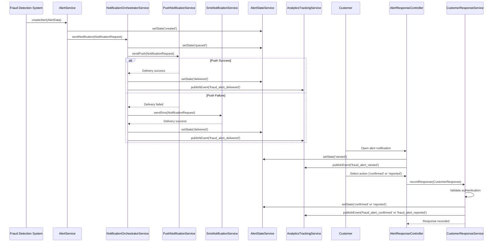

# Low-Level Design: QE-4553 - Multi-Channel Alert Notification and Customer Response

## a. Architecture Mapping

**Component to Artifact Mapping:**
- Alert Service → Service (`AlertService`)
- Notification Orchestrator → Service (`NotificationOrchestratorService`) + Factory (`NotificationPreferenceFactory`)
- Push Provider → Service (`PushNotificationService`)
- SMS Provider → Service (`SmsNotificationService`)
- Email Provider → Service (`EmailNotificationService`)
- In-App Messaging → Service (`InAppMessagingService`)
- Customer Response Handler → Service (`CustomerResponseService`) + Controller (`AlertResponseController`)
- Alert State Manager → Service (`AlertStateService`)
- Analytics & Tracking → Service (`AnalyticsTrackingService`)
- Alert Viewing UI → Controller (`AlertListController`) + View (`alert-list.html`)

**Recommended Folder Structure:**
```
app/
  alert-notification/
    alert-notification.module.js
    notification-orchestrator.service.js
    push-notification.service.js
    sms-notification.service.js
    email-notification.service.js
    in-app-messaging.service.js
    customer-response.service.js
    alert-state.service.js
    analytics-tracking.service.js
    alert-response.controller.js
    alert-list.controller.js
    views/alert-response.html
    views/alert-list.html
  shared/
    factories/notification-preference.factory.js
    services/alert.service.js
```

## b. Component Specifications

| Component Name | Artifact Type | Responsibility | Key Dependencies |
|---|---|---|---|
| AlertService | Service | Receive alert creation requests from fraud detection, create canonical alert records with lifecycle state 'created' | $http, NotificationOrchestratorService |
| NotificationOrchestratorService | Service | Orchestrate multi-channel delivery (push/SMS/email/in-app), apply customer preferences with security overrides, manage fallback logic, track delivery status | PushNotificationService, SmsNotificationService, EmailNotificationService, InAppMessagingService, NotificationPreferenceFactory, AlertStateService |
| PushNotificationService | Service | Send push notifications via external push provider API, handle missing push tokens, return delivery status | $http, $q |
| SmsNotificationService | Service | Send SMS notifications via external SMS provider API, return delivery status | $http, $q |
| EmailNotificationService | Service | Send email notifications via external email provider API, return delivery status | $http, $q |
| InAppMessagingService | Service | Deliver in-app messages to authenticated users, return delivery status | $http |
| CustomerResponseService | Service | Validate customer authentication, record 'Yes, this was me' or 'No, I don't recognize this' responses, trigger state transitions | $http, AlertStateService, AnalyticsTrackingService |
| AlertStateService | Service | Manage alert lifecycle states (created → queued → delivered → viewed → confirmed/reported → resolved/expired), handle expiration logic | $http |
| AnalyticsTrackingService | Service | Publish analytics events (fraud_alert_sent, fraud_alert_delivered, fraud_alert_viewed, fraud_alert_confirmed, fraud_alert_reported) | $http |
| AlertResponseController | Controller | Display alert details with transaction context (amount, merchant, timestamp, location, masked card), capture customer confirmation or reporting action | $scope, CustomerResponseService, AlertStateService |
| AlertListController | Controller | Display active and resolved fraud alerts for authenticated user, support filtering and sorting | $scope, AlertService, AlertStateService |
| NotificationPreferenceFactory | Factory | Provide singleton access to customer notification preferences retrieved from customer profile service | $http |

## c. Data Model

```js
Alert = {
  alertId: String,
  transactionId: String,
  customerId: String,
  amount: Number,
  merchantName: String,
  timestamp: Date,
  location: String,
  maskedCardNumber: String, // e.g., '**** **** **** 1234'
  riskMessage: String,
  state: String, // 'created' | 'queued' | 'delivered' | 'viewed' | 'confirmed' | 'reported' | 'resolved' | 'expired'
  createdAt: Date,
  expiresAt: Date
}

NotificationRequest = {
  alertId: String,
  customerId: String,
  channels: Array<String>, // ['push', 'sms', 'email', 'in-app']
  message: String,
  transactionContext: Object // { amount, merchantName, timestamp, location, maskedCardNumber }
}

NotificationDeliveryStatus = {
  alertId: String,
  channel: String, // 'push' | 'sms' | 'email' | 'in-app'
  status: String, // 'sent' | 'delivered' | 'failed'
  timestamp: Date,
  providerId: String
}

CustomerResponse = {
  alertId: String,
  customerId: String,
  action: String, // 'confirmed' | 'reported'
  timestamp: Date,
  authToken: String
}

NotificationPreference = {
  customerId: String,
  preferredChannels: Array<String>,
  securityOverride: Boolean
}
```

## d. Data Flow

When a fraud alert is created by the fraud detection system, AlertService receives the alert and transitions its state to 'created'. AlertService calls NotificationOrchestratorService, which retrieves customer notification preferences from NotificationPreferenceFactory and determines the delivery channels (push/SMS/email/in-app) with security overrides applied. NotificationOrchestratorService transitions the alert state to 'queued' via AlertStateService and attempts delivery through the primary channel (e.g., PushNotificationService). If the primary channel fails (missing push token or provider unavailability), NotificationOrchestratorService applies fallback logic and retries via secondary channels (SmsNotificationService, EmailNotificationService). Upon successful delivery, the alert state transitions to 'delivered', and AnalyticsTrackingService publishes a fraud_alert_delivered event. When the customer opens the alert, AlertResponseController displays transaction context (amount, merchant, timestamp, location, masked card number, risk message) and transitions the state to 'viewed'. The customer selects 'Yes, this was me' (confirmed) or 'No, I don't recognize this' (reported). CustomerResponseService validates the customer's authentication token, records the response, transitions the alert state to 'confirmed' or 'reported', and publishes fraud_alert_confirmed or fraud_alert_reported events via AnalyticsTrackingService. AlertStateService monitors alert expiration and transitions expired alerts to 'expired' state if no customer response is received within the configured timeout.

## e. Primary Sequence Diagram



## f. Implementation Notes

- Use constructor injection with `$inject` array annotation for all services and controllers to ensure minification safety.
- Centralize all notification provider API calls in dedicated channel Services (PushNotificationService, SmsNotificationService, EmailNotificationService, InAppMessagingService); never call `$http` directly from Controllers.
- Implement NotificationOrchestratorService with `$q.all()` for parallel channel attempts and `.catch()` for fallback logic when primary channels fail.
- Use NotificationPreferenceFactory as a singleton to cache customer preferences and reduce repeated API calls to the customer profile service.
- Apply rate-limiting to CustomerResponseService endpoints using an AngularJS interceptor to prevent abuse of sensitive response actions.

## g. Error Handling

Use `$httpProvider.interceptors` to catch notification provider API errors globally; NotificationOrchestratorService retries failed deliveries with exponential backoff and falls back to secondary channels; all delivery failures are logged and published as fraud_alert_sent events with failure status.

## h. Security Notes

Requires token-based authentication via existing SSO for customer response actions; never display full card numbers (use masked format); protect notification deep links with signed tokens to prevent unauthorized account actions; apply rate-limiting to response endpoints.