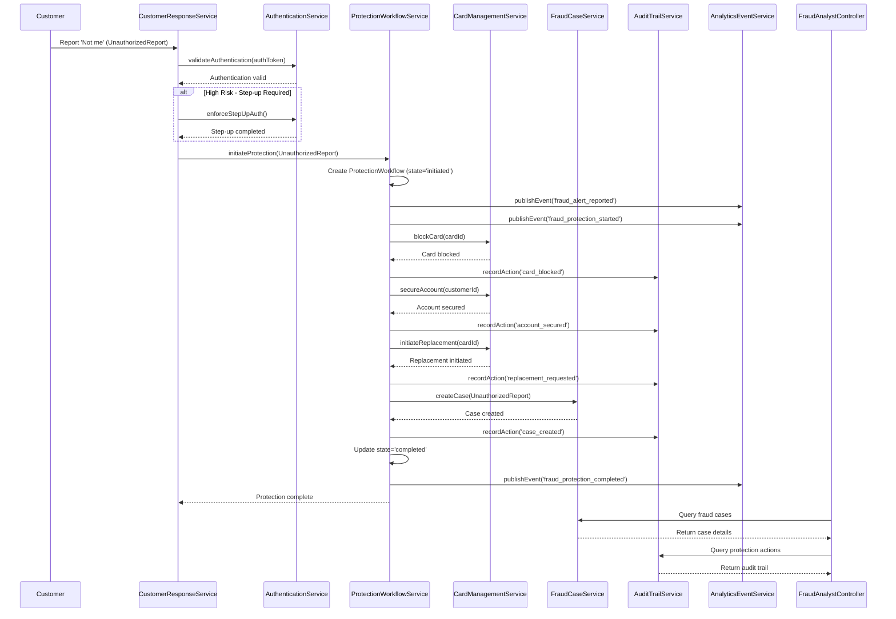

# Low-Level Design: QE-4554 - Account Protection and Fraud Case Management

## a. Architecture Mapping

**Component to Artifact Mapping:**
- Customer Response Handler → Service (`CustomerResponseService`)
- Protection Workflow Orchestrator → Service (`ProtectionWorkflowService`)
- Authentication Service → Service (`AuthenticationService`) + Interceptor (`StepUpAuthInterceptor`)
- Card Management Service → Service (`CardManagementService`)
- Fraud Case Management System → Service (`FraudCaseService`)
- Audit Trail Service → Service (`AuditTrailService`)
- Fraud Analyst Interface → Controller (`FraudAnalystController`) + View (`fraud-analyst-dashboard.html`)
- Analytics & Events → Service (`AnalyticsEventService`)

**Recommended Folder Structure:**
```
app/
  account-protection/
    account-protection.module.js
    protection-workflow.service.js
    card-management.service.js
    fraud-case.service.js
    audit-trail.service.js
    analytics-event.service.js
    fraud-analyst.controller.js
    views/fraud-analyst-dashboard.html
  shared/
    services/customer-response.service.js
    services/authentication.service.js
    interceptors/step-up-auth.interceptor.js
```

## b. Component Specifications

| Component Name | Artifact Type | Responsibility | Key Dependencies |
|---|---|---|---|
| CustomerResponseService | Service | Receive customer 'Not me' responses from alert notification epic, validate authentication, trigger protection workflow | $http, ProtectionWorkflowService, AuthenticationService |
| ProtectionWorkflowService | Service | Orchestrate protection workflow (block card, secure account, initiate replacement, create fraud case), manage workflow state, track completion within SLA | CardManagementService, FraudCaseService, AuditTrailService, AnalyticsEventService, AuthenticationService |
| AuthenticationService | Service | Validate customer authentication tokens, enforce step-up authentication for high-risk scenarios, provide authentication level checks | $http, $q |
| CardManagementService | Service | Call card-management API to block cards, secure accounts, and initiate card replacement processes | $http |
| FraudCaseService | Service | Create fraud investigation cases with alert context, track case status from creation through resolution, provide case visibility for fraud analysts | $http |
| AuditTrailService | Service | Record complete audit trails for all protection actions with encryption, apply retention and deletion policies | $http |
| FraudAnalystController | Controller | Display fraud case investigation interface with alert outcomes, case details, and protection action history for authorized analysts | $scope, FraudCaseService, AuditTrailService |
| AnalyticsEventService | Service | Publish analytics events (fraud_alert_reported, fraud_protection_started, fraud_protection_completed) to analytics infrastructure | $http |
| StepUpAuthInterceptor | Interceptor | Intercept sensitive protection action requests, enforce step-up authentication when risk level exceeds threshold | $q, AuthenticationService |

## c. Data Model

```js
UnauthorizedReport = {
  alertId: String,
  customerId: String,
  transactionId: String,
  reportedAt: Date,
  authToken: String
}

ProtectionWorkflow = {
  workflowId: String,
  alertId: String,
  customerId: String,
  cardId: String,
  state: String, // 'initiated' | 'card_blocked' | 'account_secured' | 'replacement_requested' | 'case_created' | 'completed' | 'failed'
  actions: Array<Object>, // [{ action: String, status: String, timestamp: Date }]
  startedAt: Date,
  completedAt: Date,
  slaTarget: Number // milliseconds
}

CardProtectionAction = {
  actionId: String,
  cardId: String,
  actionType: String, // 'block' | 'secure_account' | 'initiate_replacement'
  status: String, // 'pending' | 'completed' | 'failed'
  timestamp: Date
}

FraudCase = {
  caseId: String,
  alertId: String,
  customerId: String,
  transactionId: String,
  status: String, // 'created' | 'under_investigation' | 'resolved' | 'closed'
  assignedAnalyst: String,
  createdAt: Date,
  resolvedAt: Date,
  notes: Array<String>
}

AuditRecord = {
  recordId: String,
  workflowId: String,
  action: String,
  performedBy: String,
  timestamp: Date,
  details: Object,
  encrypted: Boolean
}

AuthenticationContext = {
  customerId: String,
  authLevel: String, // 'basic' | 'step-up'
  token: String,
  riskLevel: String // 'low' | 'medium' | 'high'
}
```

## d. Data Flow

When a customer reports a transaction as unauthorized by selecting 'No, I don't recognize this', CustomerResponseService receives the UnauthorizedReport and validates the customer's authentication token via AuthenticationService. If the authentication level is insufficient for the risk level, StepUpAuthInterceptor enforces step-up authentication before proceeding. Once authenticated, CustomerResponseService triggers ProtectionWorkflowService, which creates a ProtectionWorkflow record with state 'initiated' and publishes a fraud_alert_reported event via AnalyticsEventService. ProtectionWorkflowService orchestrates the protection sequence: first, it calls CardManagementService to block the card and secure the account, updating the workflow state to 'card_blocked' and 'account_secured'. Next, it calls CardManagementService to initiate card replacement, updating the state to 'replacement_requested'. Then, it calls FraudCaseService to create a fraud investigation case with the alert context, updating the state to 'case_created'. Throughout the workflow, ProtectionWorkflowService records each action in AuditTrailService with encryption. Once all actions complete successfully, the workflow state transitions to 'completed', and AnalyticsEventService publishes a fraud_protection_completed event. FraudAnalystController displays the fraud case details, alert outcomes, and protection action history by querying FraudCaseService and AuditTrailService, enabling authorized fraud analysts to investigate and track cases from creation through resolution. The workflow completion time is monitored against the SLA target to ensure timely customer protection.

## e. Primary Sequence Diagram



## f. Implementation Notes

- Use constructor injection with `$inject` array annotation for all services and controllers to ensure minification safety.
- Centralize all card management and fraud case API calls in dedicated Services (CardManagementService, FraudCaseService); Controllers never call `$http` directly.
- Implement StepUpAuthInterceptor using `$httpProvider.interceptors` to intercept sensitive protection action requests and enforce step-up authentication based on risk level thresholds.
- Use `$q` promises for asynchronous protection workflow orchestration; chain `.then()` for sequential action execution (block → secure → replace → create case) and `.catch()` for error handling with workflow state rollback.
- Track protection workflow SLA compliance by recording startedAt and completedAt timestamps in ProtectionWorkflow records and calculating elapsed time in AnalyticsEventService.

## g. Error Handling

Use `$httpProvider.interceptors` to catch card management and fraud case API errors globally; ProtectionWorkflowService applies retry logic with exponential backoff for transient failures; critical errors transition workflow state to 'failed' and are logged to AuditTrailService with full context.

## h. Security Notes

Requires token-based authentication via existing SSO with step-up authentication for high-risk protection actions; apply least-privilege access to fraud case and customer data endpoints; encrypt audit records in transit (HTTPS) and at rest; use secrets management for card management API keys; high availability for security-critical protection services.